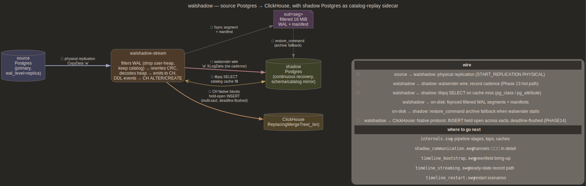
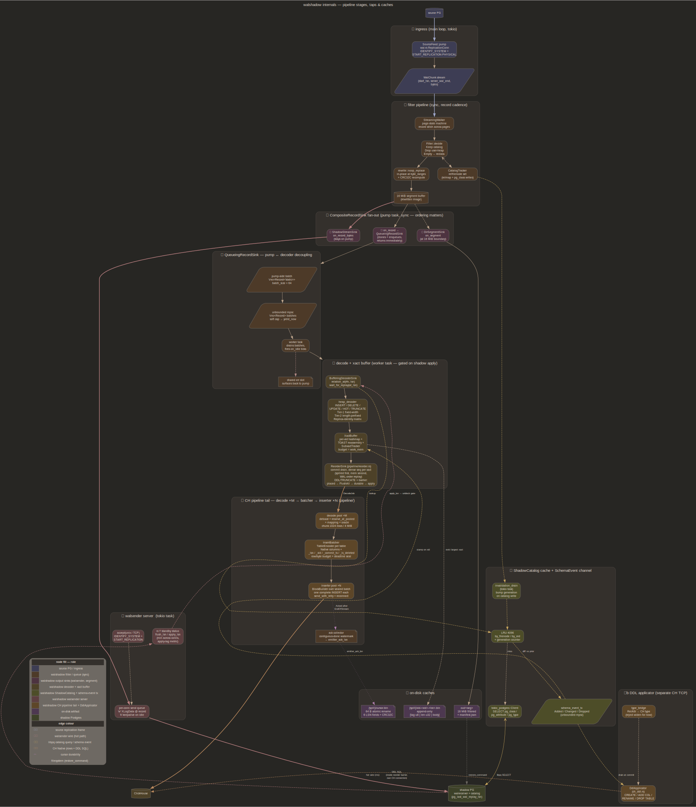
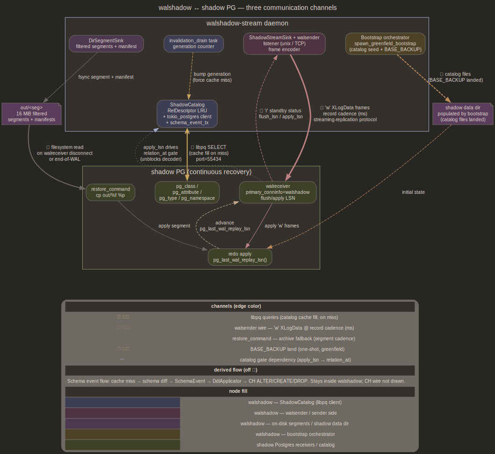
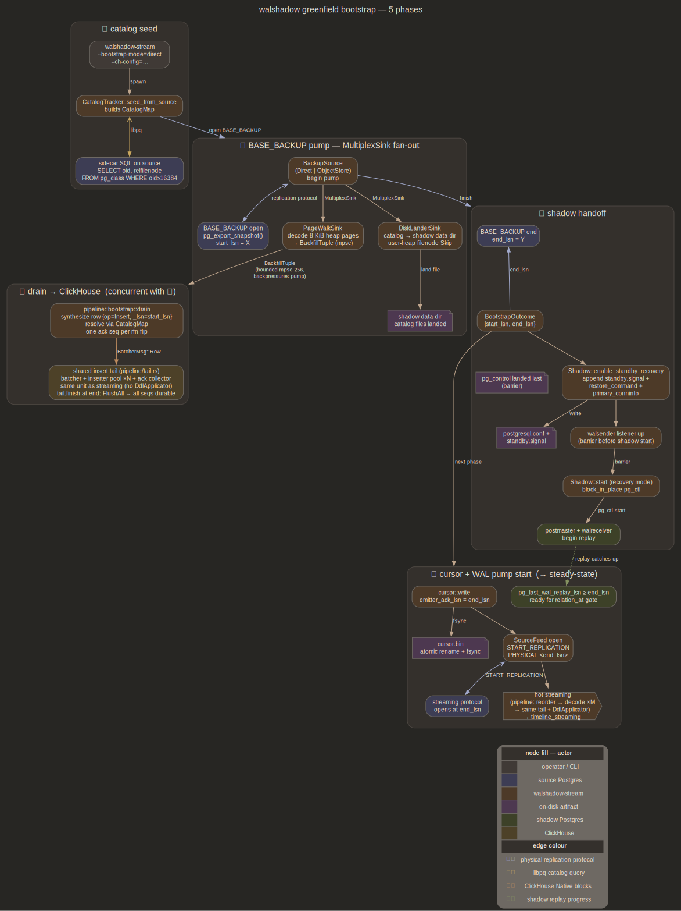
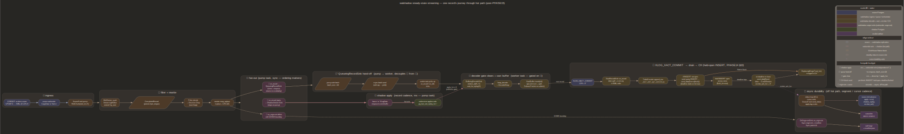
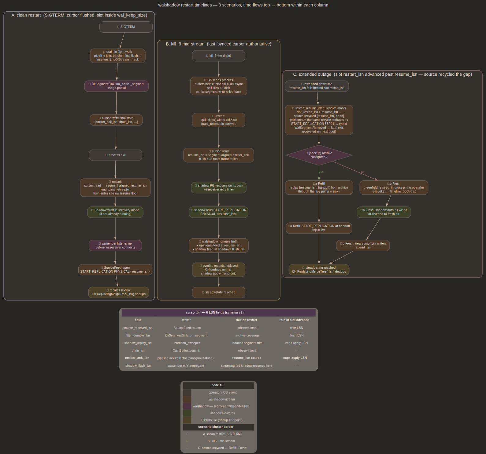

### 1. Overview — Postgres → walshadow → ClickHouse

High-level pipeline. Shadow PG runs as catalog-replay sidecar fed by
walshadow's walsender; filtered segments under `out/` serve as archive
fallback. CH rows buffer across xacts and seal as complete INSERTs
(budget / deadline); walshadow pushes DDL through a second CH connection.



### 2. Internals — pipeline, taps & caches

Hot path runs top→bottom; ancillaries (catalog cache, walsender server,
disk artifacts) sit off to the right with `constraint=false` edges so
they don't pull the main column off axis. `QueueingRecordSink` between
fan-out and decoder keeps the decoder's `wait_for_replay` off the pump
task so the walsender wire never stalls behind it. CH cluster bundles
the steady-state emitter together with `DdlApplicator` (separate CH
TCP) and `type_bridge`.



### 3. Shadow communication — three channels

How walshadow talks to shadow PG: ① libpq catalog queries, ② walsender
wire at record cadence, ③ `restore_command` archive fallback, plus the
one-shot BASE_BACKUP land for greenfield bootstrap. Schema-event flow
derives off channel ① (cache miss → diff → `SchemaEvent` →
`DdlApplicator` → CH) and stays inside walshadow.



### 4. Bootstrap timeline — greenfield in five phases

Catalog seed → BASE_BACKUP pump (MultiplexSink fan-out) → drain to CH →
shadow handoff → cursor + WAL pump start. Bootstrap-time emitter is
transitional: `flush_timeout = 0` seals one INSERT per table (at each
rfn flip) plus budget trips, force-closed at end, no `DdlApplicator`
wired. Each phase is a labelled cluster; node fill colour-codes the
actor.



### 5. Streaming timeline — one record's journey

Steady-state hot path, left→right. Bytes path (③→④) stays on the pump
task; decoder path (③→④'→⑤→⑥) crosses `QueueingRecordSink` so it can
wait on shadow without parking the wire. CH ⑥ buffers rows across xacts
with no open wire; a budget or `flush_timeout` trigger seals one complete
INSERT (`open_wire` → `send_data(Some)` → `send_data(None)` →
`EndOfStream` → clear buffer).



### 6. Restart timelines — three scenarios

Side-by-side columns: A. clean SIGTERM, B. kill -9 mid-stream
(validated by `tests/kill_restart.rs` drill), C. WAL overflow →
re-bootstrap. Includes cursor.bin six-field reference table.



## Component diagrams

One per file under [`../plans/`](../plans/INDEX.md). Embedded inline in
the matching plan doc. Render alongside the six above.

| component | source | embedded in |
|---|---|---|
| filter | [`filter.dot`](filter.dot) | [`plans/filter.md`](../plans/filter.md) |
| source | [`source.dot`](source.dot) | [`plans/source.md`](../plans/source.md) |
| shadow | [`shadow.dot`](shadow.dot) | [`plans/shadow.md`](../plans/shadow.md) |
| decoder | [`decoder.dot`](decoder.dot) | [`plans/decoder.md`](../plans/decoder.md) |
| xact | [`xact.dot`](xact.dot) | [`plans/xact.md`](../plans/xact.md) |
| emitter | [`emitter.dot`](emitter.dot) | [`plans/emitter.md`](../plans/emitter.md) |
| bootstrap | [`bootstrap.dot`](bootstrap.dot) | [`plans/bootstrap.md`](../plans/bootstrap.md) |
| ops | [`ops.dot`](ops.dot) | [`plans/ops.md`](../plans/ops.md) |
| oracle | [`oracle.dot`](oracle.dot) | [`plans/oracle.md`](../plans/oracle.md) |

## Regenerating a diagram

Each `<comp>.dot` carries its own regeneration spec as a header comment
(sources of truth, `plans/` section subsumed, quality bar). Shared style
— palette, edge channels, legend conventions — lives in
[`palette.md`](palette.md).

To regenerate `architecture/<comp>.svg`:
1. read [`palette.md`](palette.md) for shared style invariants
2. read the regen-spec header in `<comp>.dot` (sources of truth, subsumes, quality bar)
3. read `plans/<comp>.md` for current implementation truth, plus the cited `src/` files as accuracy anchor
4. edit `<comp>.dot`, render (below), read the png, iterate until the header quality bar passes
5. if the `.svg` path changed, update the `plans/<comp>.md` embed

System-level diagrams (overview, internals, shadow_communication,
timeline_*) carry no per-comp spec — stable and visually saturated. Add
one only on the next material rewrite.

## Render

```sh
for f in *.dot; do dot -Tsvg "$f" -o "${f%.dot}.svg"; dot -Tpng "$f" -o "${f%.dot}.png"; done
```

## Key references

| diagram detail | source |
|---|---|
| catalog-event channel + CH DDL applicator | [`plans/shadow.md`](../plans/shadow.md), [`plans/emitter.md`](../plans/emitter.md) |
| atomic-seal INSERT, TRUNCATE, subxact rollback, apply-lag | [`plans/emitter.md`](../plans/emitter.md), [`plans/xact.md`](../plans/xact.md), [`plans/ops.md`](../plans/ops.md) |
| `QueueingRecordSink`, pump ↔ decoder decoupling | [`plans/source.md`](../plans/source.md) |
| streaming-fed shadow | [`plans/shadow.md`](../plans/shadow.md), [`plans/source.md`](../plans/source.md) |
| greenfield bootstrap | [`plans/bootstrap.md`](../plans/bootstrap.md) |
| durable cursor | [`plans/ops.md`](../plans/ops.md) |
| xact buffer + disk spill | [`plans/xact.md`](../plans/xact.md) |
