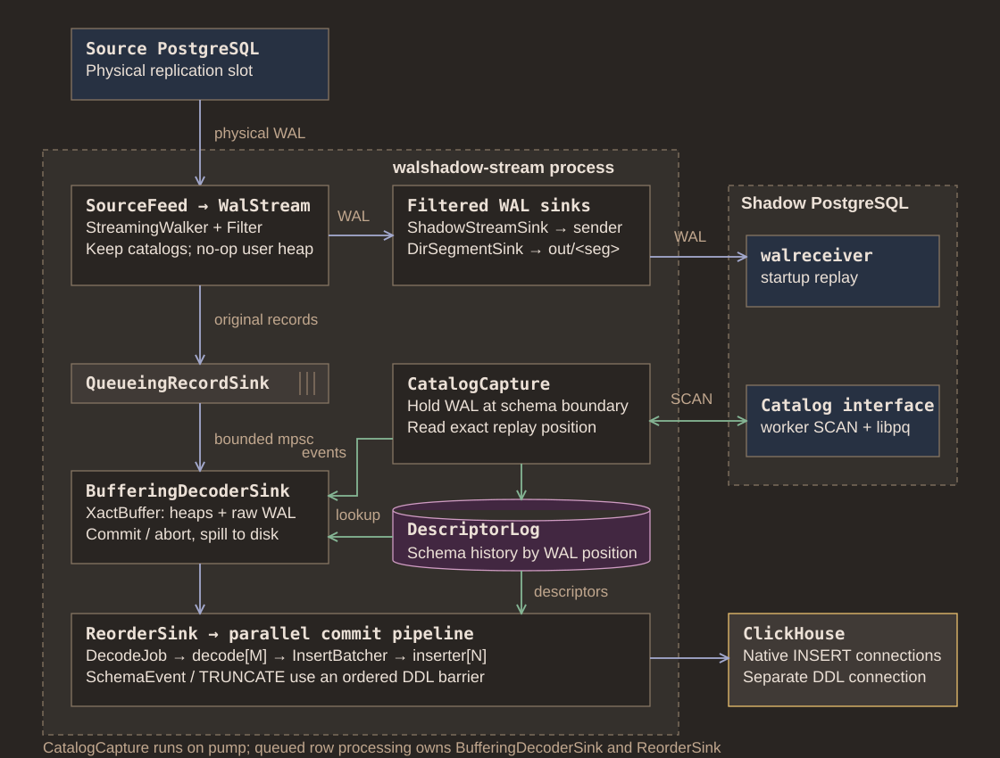
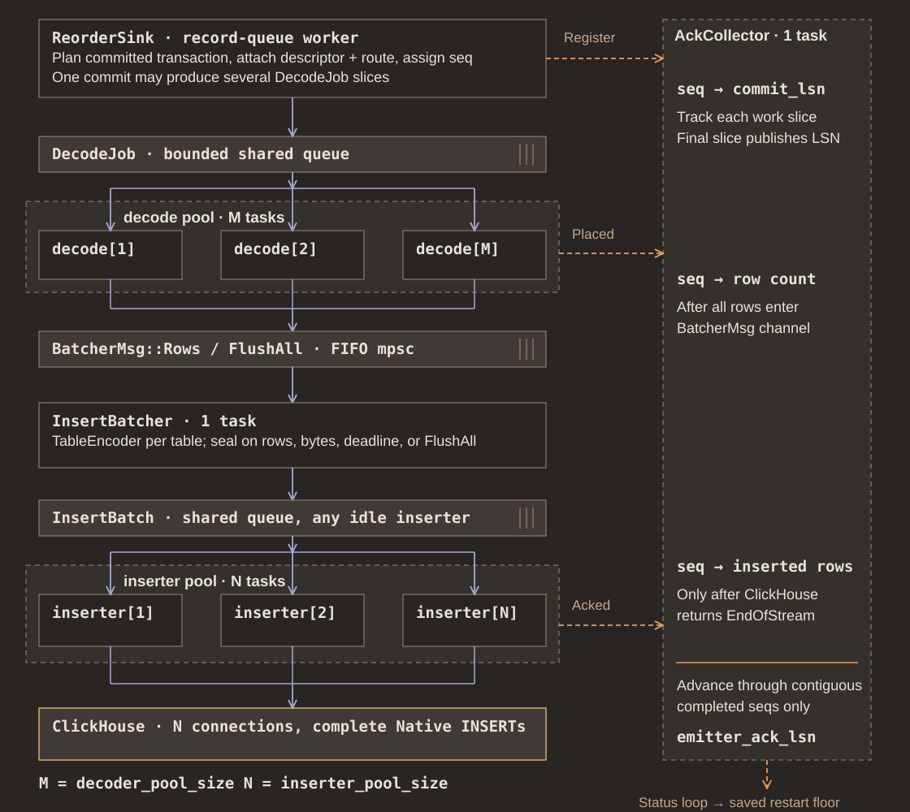

# Architecture

walshadow consumes PostgreSQL physical WAL, replays filtered WAL in a shadow
PostgreSQL process, and reconstructs committed rows for ClickHouse

## Streaming topology

`WalStream` retains original records for decoding and rewrites user-table
records to no-ops for shadow replay. Shadow receives filtered bytes through
walshadow's sender, with local segments as archive fallback

`CatalogCapture` holds publication at schema boundaries, reads shadow at an
exact replay position, persists descriptors, and attaches `SchemaEvent` to
`XactBuffer`. Queued row processing uses that history when decoding and
planning committed transactions

## Commit pipeline

`BufferingDecoderSink` and `ReorderSink` share one record-queue worker
`[ch].decoder_pool_size` and `[ch].inserter_pool_size` size downstream pools
Each inserter owns a ClickHouse connection and can take any sealed batch

Sequence numbers identify work slices, not necessarily whole transactions
Only a commit's final slice publishes its LSN, after all earlier work finishes
Bounded queues and a shared payload budget limit work in flight; transaction
and plan data can spill to disk

## Related paths

| Diagram | Scope | Implementation |
|---|---|---|
| [Catalog capture and DDL](catalog.svg) | Capture on descriptor-log miss, pinned SCAN, persistence, placement/flush/durability barrier | [capture](../src/source/catalog_capture.rs), [reorder](../src/emit/pipeline/reorder.rs) |
| [TOAST and type conversion](values.svg) | Transaction chunks, versioned TOAST mirrors, per-batch shadow conversion, Native block assembly | [resolver](../src/toast/resolver.rs), [oracle](../src/ops/oracle.rs), [inserter](../src/emit/pipeline/inserter.rs) |
| [Bootstrap](bootstrap.svg) | Backup fan-out, visibility gate, concurrent WAL window, separate insert tails, handoff | [backup](../src/backfill/backfill_bootstrap.rs), [window](../src/backfill/bootstrap_window.rs), [daemon](../src/bin/stream.rs) |
| [Restart and cleanup](recovery.svg) | Progress inputs, persisted restart floor, descriptor GC, TOAST retirement, source feedback | [manifest](../src/source/manifest.rs), [status loop](../src/bin/stream.rs) |

Streaming wiring lives in [stream.rs](../src/bin/stream.rs), queue ownership
in [queueing_record_sink.rs](../src/source/queueing_record_sink.rs), and pool
assembly in [pipeline/mod.rs](../src/emit/pipeline/mod.rs)

## Diagram sources

SVGs are editable source. Rectangles identify components, dashed enclosures
identify processes or worker groups, narrow bars identify queues, and cylinders
identify stored state. Solid arrows carry data; dashed arrows carry progress
or control. Labels name messages, protocols, or state transferred

Use dark colors: warm neutral backgrounds and text, blue data paths, orange control
paths, green catalog paths, magenta stored state, and yellow ClickHouse borders

Keep diagrams here and embed them from plans. Check component names and
connections against linked source, then render at full and README widths
