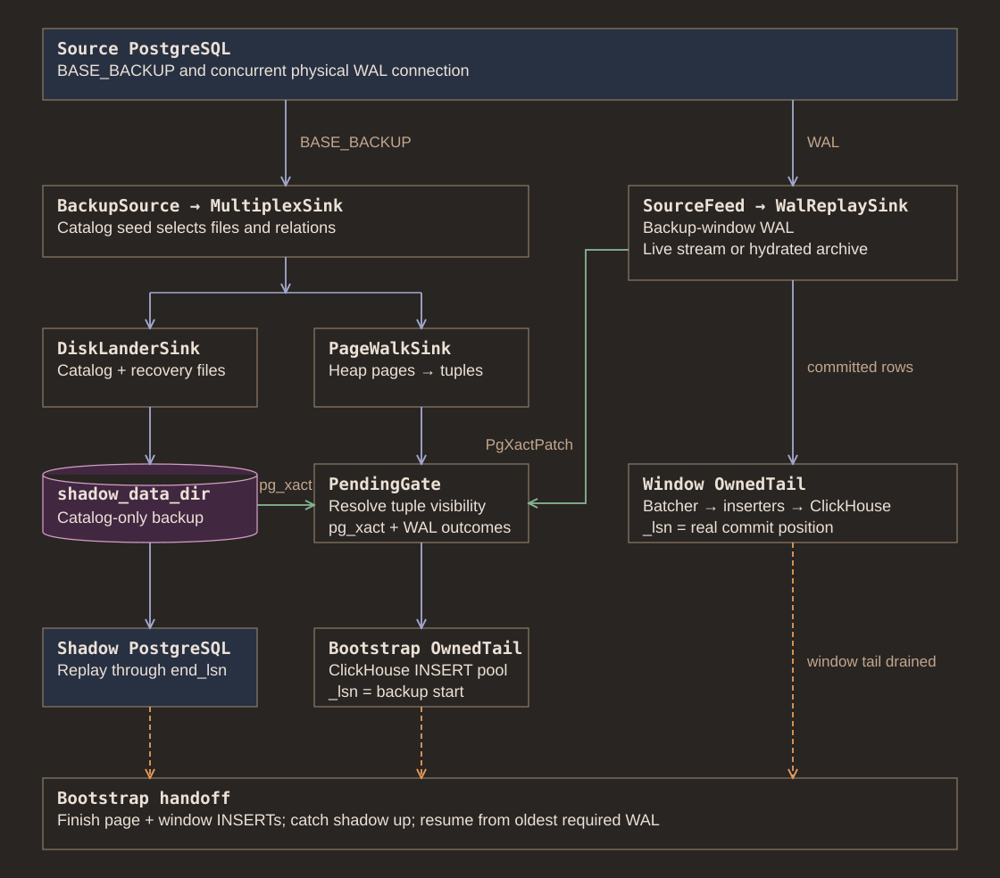

# Initial loads

An initial load combines existing rows with changes arriving while they are
read. A physical backup is a mixture of page states, so walking heap pages alone
cannot produce a consistent destination

## Greenfield bootstrap

Backup files feed two paths: catalog and recovery files build shadow, while
selected user pages become candidate destination rows. A visibility gate uses
tuple hints, backup transaction logs, and backup-window WAL outcomes to decide
which rows belong in initial state

Concurrent WAL replay covers changes during backup. Walked rows carry an older
coverage version so later committed changes win at destination. Bounded channels
and spill constrain memory while backup and insertion proceed independently

Shadow is not ready during this phase. A temporary PostgreSQL instance built
from source schema converts values that need PostgreSQL's type machinery
Relation repair reads source rows when physical pages cannot provide a reliable
visible value

Handoff waits for required insertion and recovery work, then persists restart
position before steady streaming advances it. Transactions still open can lower
resume position into backup window. This does not recover every change before
backup redo, see [remaining visibility work](../plans/bootstrap.md)

## Per-table loads

COPY loads use PostgreSQL's SQL visibility. Backup-based loads use page walk and
WAL replay without replacing existing shadow. Destination staging separates
partial initial state from published table

For backup-based table loads, a durable ledger tracks load and swap progress
After staged rows are ready, table exchange publishes them and live changes are
reconciled. Restart must distinguish a swap that has already happened from one
still pending; otherwise retry can replace newer destination state

Staging changes what destination materialized views observe. See
[table selection](../docs/table-selection.md) and
[initial-load limits](../docs/limitations.md#initial-loads) before deployment

## Implementation

Start in [bootstrap](../src/backfill/backfill_bootstrap.rs),
[window replay](../src/backfill/bootstrap_window.rs),
[visibility gate](../src/backfill/visibility_gate.rs),
[table backfill](../src/backfill/backup_backfill.rs), and
[staging](../src/backfill/backfill_staging.rs)
