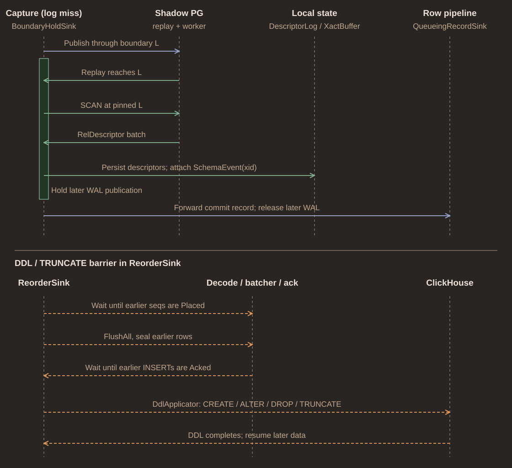

# Catalog history and schema changes

Shadow PostgreSQL supplies catalog state. Durable descriptor history supplies
which state belongs to each physical WAL record. Keeping both avoids decoding
an old tuple with a newer layout simply because replay advanced

## Capture boundaries

Catalog writes identify transactions that may change descriptors. Capture holds
successor WAL while shadow reaches a selected boundary, reads affected catalog
state, and publishes coverage before dependent row work proceeds

Command boundaries allow capture of uncommitted layouts within a transaction
Those layouts remain provisional until commit. Abort discards them; commit
promotes required history into durable descriptor log. When evidence cannot
prove a layout, ambiguity remains explicit and affected decoding stops

Relation identity includes tablespace, database, and filenode. Relation OID ties
successive physical generations together. Neither a name nor a filenode alone
is sufficient across renames and rewrites

## Source history and destination policy

Schema events compare full source descriptors from durable history. Destination
mapping is a separate policy: it can intentionally omit or rename columns
Comparing source only with destination columns would confuse deliberate
exclusion with a newly added source column

Destination DDL is ordered with row work. Barriers prevent rows from crossing
an incompatible schema change or destructive operation. This ordering does not
make every PostgreSQL transition supported, see
[schema-change behavior](../docs/schema-changes.md)

## Implementation

Start in [capture](../src/source/catalog_capture.rs),
[descriptor log](../src/catalog/desc_log.rs),
[pending history](../src/catalog/pending.rs), and
[reorder barriers](../src/emit/pipeline/reorder.rs)
Remaining [capture gaps](../plans/catalog.md) and
[schema transitions](../plans/schema.md) stay in plans
