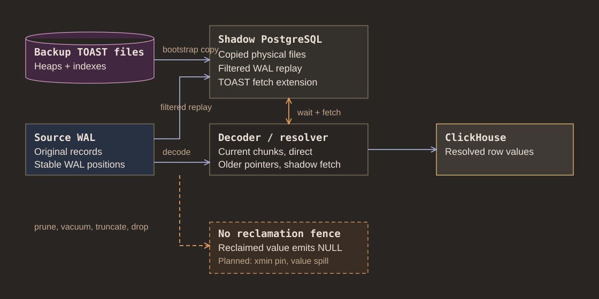

# Shadow TOAST storage

Shadow value mode keeps PostgreSQL TOAST heaps and indexes in shadow instead of
mirroring chunks into ClickHouse. Chunks from same transaction still resolve
from decoded WAL without a shadow lookup

## Bootstrap and replay

Bootstrap copies selected TOAST files into shadow data directory. Shadow then
replays filtered backup WAL through backup boundary, adding concurrent writes
and repairing copied pages through normal PostgreSQL recovery

walshadow keeps original WAL for decoding and sends retained physical records
to shadow. Existing TOAST relations are seeded explicitly. After bootstrap, a
relation begins shadow routing only when its file creation record proves shadow
has physical base file; later records for that relation follow same route. This
also retains ordinary relations created after bootstrap

## Reads and retention

Resolver waits until shadow has replayed referring record, then asks extension
to read and validate stored chunks. Rust side decompresses value and checks raw
size. Shadow is read-only from resolver perspective; decoded chunk writes never
go back into PostgreSQL

PostgreSQL can reclaim chunks through prune, vacuum, truncate, drop, or rewrite
before slower ClickHouse work reads them. Current mode reports such values as
superseded and emits NULL or column default. Planned reclamation fence must hold
destructive WAL until no restartable work can request older chunks, see
[safe reclamation plan](../plans/shadow_toast.md)

## Implementation

Start in [WAL routing](../src/filter/engine.rs),
[bootstrap landing](../src/backfill/backup_sink.rs),
[shadow reader](../src/toast/shadow_store.rs), and
[PostgreSQL extension](../pgext/toast.c)
