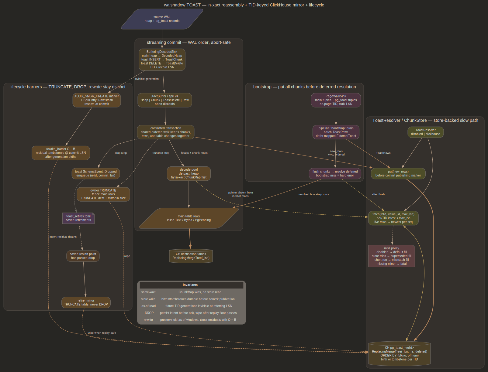

# TOAST support — pg_toast chunks mirrored off the WAL window

Externally-toasted column values are reconstructable in every path, including
values toasted *before* the replication window. Chunks land in a store of
record (`ToastResolver` / `ChunkStore`, `src/toast.rs`), selected by
`[toast] mode`, so reassembly does not depend on a value's chunks coinciding
with the referring tuple in WAL. In-xact WAL reassembly is the fast path — see
[xact.md](xact.md).

## Store — TID-keyed mirror

Each `pg_toast` relation is a replicated table whose ClickHouse mirror is
keyed by heap TID. A chunk INSERT is a row birth at its TID, a chunk DELETE a
tombstone at its TID: the table replicates line-pointer occupancy exactly —
one live tuple per TID at a time, PG's own invariant. Generation identity is
structural (a rewritten heap has different TIDs, a reused line pointer
supersedes its tombstone at a higher version); nothing resolves anything.
Reclamation is `ReplacingMergeTree` merge behavior, not walshadow logic.

- **Modes.** `disabled` (default; NULL/default-fill on miss, counted
  `toast_values_filled_default`, never an error) and `clickhouse`
  (`ClickHouseChunkStore`, one CH table per toast rel). `MemChunkStore` is
  the in-memory test double whose `fetch` is the literal as-of algorithm the
  SQL encodes.
- **Schema.** `pg_toast_<relid>` (`blkno`, `offnum`, `chunk_id`, `chunk_seq`,
  `chunk_data`, `_lsn`, `_is_deleted`), `ReplacingMergeTree(_lsn,
  _is_deleted)` `ORDER BY (blkno, offnum)`, bloom-filter index on `chunk_id`.
  `_lsn` is the *record* LSN (not commit LSN): total order per TID,
  distinguishes same-commit birth+death at one TID, and re-emits produce
  byte-identical rows so `_lsn` dedup stays pure dedup under walshadow's
  eventual-consistency contract. `chunk_id` is payload; key
  order belongs to the hot op (delete application via insert), fetch is the
  cold path (pre-window re-emits, bootstrap deferred resolution).
- **Tombstone.** `(blkno, offnum, 0, 0, '', delete_record_lsn, 1)`. Merge
  keeps the latest version per TID: a tombstone supersedes its data row and
  reclaims the ~2KB `chunk_data`; residual is one ~20B tombstone per dead
  never-reused TID, and a reused line pointer replaces even that. Keys are
  TIDs and TIDs churn, so parts merge under normal background pressure — no
  dead-forever key ranges. `OPTIMIZE … FINAL CLEANUP` (gated on
  `allow_experimental_replacing_merge_with_cleanup`) is the operator lever
  for the residual.
- **Data flow.** Chunk INSERTs and toast DELETEs buffer through the xact
  spill (`SpillEntry::Chunk` / `ToastDelete`, both carrying TID + record
  LSN), so aborts discard them and the drain merge preserves WAL order. The
  drain collects them as `ToastRow`s (gated on `stores_chunks()`, sealed per
  slice in `DrainedBatch.new_rows`); reorder `put`s a slice's rows before the
  commit's publishing ack marker, so a later referrer's fetch finds them
  durable — barrier slices interleave puts with mirror wipes via merge
  cursors sealed with the slice (see Lifecycle). The serial gap-replay path puts its collected rows at commit
  for the same reason. No
  fsync, no journal, no ack coupling: toast rows ride the main-table
  durability story (CH insert ack → emitter ack).
- **Fetch.** `fetch(relid, value_id, max_lsn)` is an as-of query: candidate
  TIDs that ever held the value at or before the bound (bloom-pruned), then
  per-TID `argMax(…, _lsn)` under the primary key, live rows of the value,
  newest per seq. Per-TID latest-≤-LSN is PG visibility at the referring
  record: lagging decode cannot see a future generation, a reused
  `chunk_id`'s dead generation is invisible past its tombstones,
  rewrite-duplicated live copies resolve last-wins per seq (byte-identical
  anyway). The candidate-TID pass makes correctness unconditional — a TID
  whose latest visible row is a tombstone or another value's birth drops
  out without assuming a tombstone interleaves every occupancy change.
- **Miss policy.** As-of correctness depends on history surviving until no
  fetch wants it, but merges collapse history on their own schedule. A
  collapsed generation is only unreachable when a superseding version of
  every referring row already reached CH (tombstone and superseding main-row
  version commit together; replay re-covers through that commit), so a
  store-side miss NULL-fills and counts `toast_values_filled_superseded` —
  end state unaffected under `_lsn` dedup. A store-side dense-but-short run
  fills the same way, counted `toast_values_filled_mismatch`: a tombstone
  part can merge with a subset of a value's birth parts, so partial collapse
  carries the same supersession proof as a full miss (the distinct counter
  keeps generation mixing observable). A key present in the xact's own
  chunk maps but gapped or short is a decode bug: hard error, counted
  `toast_fetch_miss`. Bootstrap deferred misses stay hard errors (the walk
  put those chunks moments earlier; a miss is a walk/store bug).
- **Mirror-absence guard.** Absence is evidence only while the mirror
  exists: `fetch` against a missing table/database is
  `ChunkStoreError::MissingMirror`, fail-fast past the retry loop — a
  dropped mirror or never-run bootstrap is an operator/infra anomaly, and a
  silent fill there would corrupt current head values with no superseding
  version to come. `MemChunkStore` mirrors the semantic (a relid exists once
  a put created it).
- **Chimera guard.** `try_reassemble` validates concatenated length against
  the pointer's stored size, as PG's `toast_fetch_datum` does
  (`src/backend/access/common/detoast.c`) — a full-length value that fails
  decompression is a loud error, never a silent chimera; length mismatches
  route by the miss policy above.
- **WAL path.** Same-xact values reassemble inline from the buffered chunk
  map (`src/xact_buffer.rs`), the fast path. A chunk decoded without a TID
  (unexpected shape; `toast_save_datum` never multi-inserts) still serves
  same-xact resolution but cannot be keyed in the mirror: warned + counted
  `toast_chunks_malformed`, a later referrer superseded-fills.
- **Bootstrap.** Page walk decodes `pg_toast_*` tuples into rows at their
  on-page TID + walk LSN; the drain defers any main-table tuple carrying a
  mapped `ExternalToast` (`Deferred`), `put`s all rows durable, then resolves
  via `resolve_or_fill_toast` (`src/pipeline/bootstrap.rs`). Walk-side rows
  cover dead-at-walk referrers too: a replayed WAL delete supersedes them
  with a higher-LSN tombstone. TID identity makes the walk
  fork/segment-aware: `_fsm`/`_vm` files are skipped, and a `.N` segment's
  pages number from `segno * RELSEG_BLOCKS` (relation block numbers are
  global; per-file numbering would collide segment TIDs at equal walk LSN,
  and WAL tombstones at global blkno would miss walk births past 1 GiB).
- **Mirror-only seed.** A bootstrap run with `[toast] mode = "clickhouse"`
  and no `[table.*]` blocks seeds mirrors without shipping main-table rows:
  chunk persistence precedes the mapping lookup in the drain
  (`src/pipeline/bootstrap.rs`), unmapped rels drop at `lookup_mapping`
  (counted `unsupported_relations`), and with nothing mapped nothing defers,
  so the deferred hard-error path cannot fire. Bootstrap consults the static
  `[table.*]` map only, never `[namespace.*]`. Filtering is at the drain, not
  the walk: catalog seeding is unconditional, main heap pages still decode
  and drop; only `pg_toast_*` decode is config-gated (`store_toast`). Seeds
  every toast rel in the catalog — no per-table filter. A re-seed of a live
  deployment runs as a one-off against a scratch
  `--bootstrap-shadow-data-dir` and separate `--out-dir` so the live cursor
  stays untouched.
- **Decode shape (R2).** Value reassembled before the main-table INSERT,
  stored inline `Bytea`/`Text`; `encode_value` (`src/ch_emitter.rs`) needs no
  toast-specific handling. Tier 3 detoast routing: `detoasted_value` runs
  reassembled bytes back through `varlena_to_value` (`src/heap_decoder.rs`),
  so a detoasted jsonb/array/numeric resolves like an inline one
  (`PgPending` → oracle).
- **Compression.** `chunk_data` holds PG's compressed bytes; the reassembler
  decompresses at ingest from the pointer it already holds, via the shared
  `decompress_varlena` (`src/heap_decoder.rs`, pglz/lz4).

## Lifecycle — TRUNCATE / DROP / rewrite

Physical WAL carries lifecycle operations tuple-level decode cannot see
(relfilenode swaps, no per-tuple deletes; `xl_heap_truncate` lists only
logically-logged rels, never toast):

- **Owner TRUNCATE** wipes the mirror (`TRUNCATE TABLE IF EXISTS`) inside
  the same reorder barrier that truncates the CH dest, resolved via
  `ShadowCatalog::toast_descriptor_for` (TRUNCATE keeps the toast rel's
  oid, so the mirror name is stable). Counted `toast_mirror_truncates`.
  Barrier slices put `DrainedBatch.new_rows` interleaved with applies via
  merge cursors the drain seals per event/truncate (`OrderedEvent::row_idx`,
  `truncate_rows`): pre-truncate births land before the wipe (dead — wiped
  with it), later births land past it. Same-xact post-truncate chunks ride
  the toast rel's new relfilenode, MVCC-invisible in shadow until the
  truncating xact commits — they stash and decode at commit (see Rewrite
  generations), their births ordering past the wipe by record LSN.
- **DROP** (owner DROP, or a rewrite retiring its old toast rel) surfaces
  the toast rel's `Dropped` via `sweep_dropped`; reorder queues the retire
  and executes it — emptied, table kept, counted `toast_mirror_retires` —
  only once the persisted resume cursor's segment passes the dropping
  commit. Deferral is what makes the wipe replay-safe: durability of
  earlier referrer versions is not enough, since a crash before the
  commit's publishing marker replays it, and a pre-drop referrer re-emit
  fetching an emptied mirror would fill NULL at the same `_lsn` as its
  durable original — equal-version rows with different bodies, dedup
  can't arbitrate (a retained dest under `drop_table_strategy=retain`
  keeps whichever merges last). Once the floor's segment passes, no
  restart re-reads any pre-drop referrer, so the wipe is unobservable.
  The queue is durable (`toast_retires.bin` beside `cursor.bin`,
  `toast_retire::RetireLedger`): the entry fsyncs inside the dropping
  xact's barrier apply, strictly before its commit can publish to the
  ack collector, so any persisted cursor whose floor passed the drop
  already holds it. Flushes run at each commit boundary, at idle
  advance, and at pipeline standup — the standup flush is the only
  route to the wipe for an entry whose floor passed before a stop,
  since resume never replays its drop; a replayed drop re-pushes an
  identical entry (deduped), and a crash between wipe and ledger
  removal re-runs an idempotent `TRUNCATE` on the emptied mirror.
  Never a CH DROP — decode detoasts before the mapping
  lookup, so a crash-replay re-emit of a pre-drop referrer still fetches
  this mirror; against a dropped table that's `MissingMirror` (fatal by
  design, a permanent replay wedge). Residual empty `pg_toast_*` tables
  are the operator-drop lever once the slot passes the dropping commit.
  Owner TRUNCATE's wipe needs no deferral: a replayed pre-truncate
  referrer may fill, but the destination TRUNCATE re-applies after it in
  the same replayed barrier order. Sweep
  only surfaces oids in `prev_known`: baseline seeding resolves pinned
  owners' toast rels at boot, so a pinned owner's DROP retires the mirror
  with no post-restart chunk decode; an auto-create rel dropped before any
  post-restart touch keeps its stale mirror (storage-only, the rewrite
  posture below).
- **Rewrite generations** (VACUUM FULL / CLUSTER / rewriting ALTER, and
  the same-xact CREATE/TRUNCATE + INSERT siblings): the new toast heap
  fills through ordinary `XLOG_HEAP_INSERT`s on a filenode whose pg_class
  row is MVCC-invisible until the xact commits (only the main heap is
  FPI-logged, PG `src/backend/access/heap/rewriteheap.c`). The decoder
  stashes those records raw in the xact spill (`SpillEntry::Raw`) —
  admission gated on having seen the filenode's `XLOG_SMGR_CREATE` marker,
  which doubles as completeness proof (records cannot precede creation).
  At commit, `resolve_stash` looks each filenode up via
  `relation_at(rfn, commit_lsn)`: content swap resolves to the original
  toast oid with value ids preserved (`rd_toastoid`), link swap to the
  surviving transient toast oid with fresh ids and the old mirror retiring
  via the DROP path above. Resolved toast records decode in the drain
  merge exactly like live chunks (births + TID tombstones, in-xact map
  included); an insert whose tuple rides only its FPI
  (`HEAP_INSERT_NO_LOGICAL` + mid-rewrite checkpoint) decodes from the
  restored image. Each marker-proven generation closes with a store-side
  residual barrier (`rewrite_barrier`, counted `toast_rewrite_barriers`):
  TIDs live as of the marker with no row past it tombstone at commit LSN —
  `O - B` — after the generation's births are put; replay re-runs insert
  nothing. Never a mirror truncate: pre-rewrite as-of windows stay
  fetchable. Filenodes unresolvable post-commit (created-and-dropped in
  one xact, or rotated by a later replayed commit) discard their records
  (`toast_stash_discarded`) — access-exclusive supersession makes that
  end-state-neutral. Records resolving to ordinary heaps stay fenced off
  (`toast_stash_skipped`): lower-bound `relation_at` could return a later
  same-filenode schema, so main-tuple decode waits on a shadow replay
  fence. A toast resolution without its marker (observation began
  mid-xact) fails closed — fresh snapshot — rather than emitting an
  unauditable partial generation. Physical copies (SET TABLESPACE / SET
  LOGGED) FPI the toast heap verbatim with TIDs, bytes, and value ids
  preserved: the mirror already matches, so those records are ignored.

## Scope limits

- **R1 query-time-JOIN mode.** Out of scope. Would be per-table opt-in: store
  the `ToastPointer` in the main column and reassemble via a CH JOIN on
  `chunk_id = va_valueid` instead of inline at ingest. Wins dedup + defers
  reassembly cost off ingest, costs a CH-side concat + PGLZ path (materialized
  view / UDF / client-side) and a pointer column carrying `va_extinfo` +
  `va_rawsize`. R2 inline is the default.
- **Bounded-memory streaming reassembly.** A multi-MB value is thousands of
  chunks. `fetch` streams the SELECT block-by-block (no unbounded buffered
  result read), but the reassembled value is still fully materialised in memory
  (the `BTreeMap` supplement, then `try_reassemble`'s concat) — R2-inherent,
  same as inline `reassemble`. Streaming reassembly of huge values is out of
  scope.
- **Row/chunk-map byte duplication.** A drained slice holds its toast bytes
  twice: the resolution `ChunkMap` and the store `ToastRow`s. Bounded per
  slice, gauged (`drain_resident_bytes`); shared `Arc<[u8]>` bodies are the
  lever if it measures.

## Rejected alternatives

- **TID death tracking + GC sweep.** A persistent TID→`chunk_id` bridge
  (journal, map, compaction) resolving deletes into value deaths, applied by
  an ack-gated sweep against a value-keyed store. Spends durable state and a
  per-commit fsync to collect an incomplete subset (rewrites, TRUNCATE/DROP,
  pre-journal chunks all leak anyway), must prove physical generation
  identity to avoid false deletes, and gating on the live ack rather than the
  persisted replay floor makes crash replay a deterministic wedge. Keying the
  store by TID makes deletes native data and deletes the whole apparatus.
- **Lightweight `DELETE` mutations per toast delete.** Mutation storm on
  churn; tombstone rows are the CH-native equivalent at insert cost.
- **Value-keyed store with TID columns.** Tombstone insert then needs the
  value id, recreating the TID→value bridge and the tracker.
- **Source anti-join sweep.** Per relid, anti-join store valueids against the
  live source toast rel under WAL-horizon + snapshot-visibility barriers.
  Requires a sidecar SQL session with `pg_toast` schema read (superuser or
  `pg_read_all_data` — replication privileges don't grant it) and cannot
  collect a reused id's dead generations. Worth revisiting only as an
  explicit repair mode for the rewrite/truncate leak classes.
- **Inline reassembly only.** Correct for same-xact WAL, wrong for bootstrap
  (errors at the emitter) and pre-window values (`MissingToastChunk`). This is
  behavior with no `[toast]` store configured.
- **NULL / raw-marker fallback as the resolution.** Lossy: the WAL re-emit of
  the referring tuple does not carry the chunks (PG reuses the old
  `va_valueid`), so the value never resolves. Kept only as the explicit,
  surfaced `disabled`-mode fill, never silent loss.
- **pg_toast in the shadow PG catalog.** Would promote the catalog shadow to a
  full data replica, reintroducing the cross-segment missing-page PANIC class
  [filter rewrite](filter.md#rewrite-path) exists to avoid, and
  coupling every detoast to a replay-LSN wait + the catalog mutex. The CH
  mirror is append-only, walshadow-owned, lifecycle-independent.
