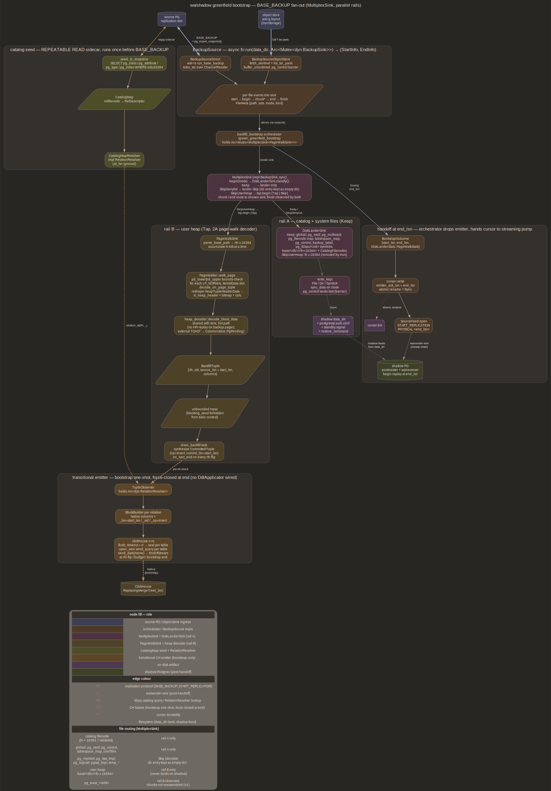

# bootstrap

Greenfield initial-attach. Streams source PG's `BASE_BACKUP` through
one MultiplexSink fanning simultaneously onto shadow PG's data dir
(catalog seed) and the shared pipeline insert tail (heap-data initial
load — see [emitter.md](emitter.md)). Single pass over backup bytes,
no on-disk spool, no second BASE_BACKUP, no shadow-side user-heap
landing

## Purpose

walshadow attaches at source's WAL tail. Catalog mirror & ClickHouse
both need pre-existing state before tail starts moving. Bootstrap
closes both gaps in one pump:

- shadow PG's `data_dir` gets source's catalog filenodes (mapped &
  non-mapped) at source's current values, closing fresh-initdb
  filenode-skew hole `apply_schema_dump` leaves open
- ClickHouse gets one synthetic INSERT per live user-heap tuple at
  `_lsn = start_lsn`, so post-attach WAL records updating same tuple
  ride `ReplacingMergeTree(_lsn)` dedup against populated baseline

Hard invariant: user-heap bytes pass *through* daemon during this pump.
They never settle on shadow's data dir. Shadow stays catalog-scale by
construction; any path landing source-scale user heap on shadow
violates catalog-only constraint at [overview.md](overview.md)

## Five-phase greenfield timeline

See [architecture/timeline_bootstrap.svg](../architecture/timeline_bootstrap.svg)
for rendered diagram. Five clusters top→bottom:

1. **Catalog seed** — `walshadow-stream --bootstrap-mode=direct` opens
   libpq side channel to source PG, runs `seed_catalog_from_source`
   SELECT against `pg_class` + `pg_attribute` + `pg_type` + `pg_index`
   for every `oid >= 16384`, builds `CatalogMap`. REPEATABLE READ
   snapshot via `seed_in_snapshot` so concurrent DDL during seed read
   does not tear
2. **BASE_BACKUP pump** — `BackupSource` (Direct or ObjectStore) opens
   backup; `MultiplexSink` dispatches each `FileMeta`:
   - catalog filenodes & system files → `DiskLanderSink` (Keep) →
     written to shadow `data_dir`
   - user heap → `PageWalkSink` (Tap) → decoded 8 KiB at a time
   - denylist contents → Skip; denylist dir entries themselves → Keep
     as empty dirs
3. **Drain → CH** (concurrent with step 2) — `PageWalkSink` ships
   `BackfillTuple`s through bounded mpsc (`BOOTSTRAP_TUPLE_CHANNEL_CAP
   = 256`, backpressures the tar pump) to
   `pipeline::bootstrap::drain`, which synthesizes rows
   `{ op=Insert, commit_lsn=start_lsn }` against the snapshot
   `CatalogMap` and routes into the shared insert tail (batcher +
   inserter pool + ack collector, same unit as streaming — see
   [emitter.md](emitter.md)). One synthetic ack seq per rfn flip;
   `tail.finish` seals partial batches and waits all seqs durable
   before handoff. Metrics-only runs (no `--ch-config`) instead drain
   through `drain_backfill` into a counting `TupleObserver`
4. **Shadow handoff** — `BootstrapOutcome { start, end }` returned;
   daemon writes `standby.signal`, appends `restore_command` +
   `primary_conninfo` to shadow's `postgresql.auto.conf`,
   `--bootstrap-autospawn-shadow` optionally drives `Shadow::start` +
   `wait_for_replay(end_lsn, timeout)` under `block_in_place`
5. **Cursor + WAL pump start** — `cursor::write` lands
   `emitter_ack_lsn = end_lsn` atomically, `SourceFeed` opens
   `START_REPLICATION PHYSICAL <slot> <end_lsn>`, steady-state emitter
   (now backed by live `ShadowCatalog`) takes over. `bootstrap_end_lsn`
   wins over any prior `cursor.bin` value on start-LSN selection chain
   (`--start-lsn` still wins for recovery drills)

Phases 1-3 run synchronously inside `run_bootstrap`; phases 4-5 hand off
to daemon's main loop

## Boot resume decision

Whether the five-phase greenfield above runs at all is a boot-time choice,
not a boolean. `resume_plan::resolve` (`src/resume_plan.rs`) folds the durable
cursor, the shadow data-dir state, and live source state into one of three
outcomes:

- **`Fresh`** — no usable prior state (no cursor, `--ignore-cursor`, or the
  shadow dir isn't initialized): run the five-phase greenfield.
- **`Resume { start_lsn }`** — a physical slot still pins the WAL we need
  (`restart_lsn <= resume_lsn`): skip bootstrap, plain `START_REPLICATION` at
  the cursor.
- **`Refill { from, to }`** — the source recycled `[resume_lsn, head]` and a
  `[backup]` archive is configured: replay archived WAL through the pump, then
  rejoin live.

A recycled resume point with no archive to refill from falls back to `Fresh`.
There is no automatic partial re-seed — an operator resets explicitly with
`--ignore-cursor`.

Inputs: `resume_lsn` is the durable `cursor.emitter_ack_lsn` as
`Option<NonZeroU64>` (LSN `0/0` is invalid → `None` → no cursor);
`shadow_initialized` is `PG_VERSION` present in the shadow data dir; `head` is
source `IDENTIFY_SYSTEM.xlogpos`; `slot_restart_lsn` is the physical slot's
oldest retained LSN (`SourceFeed::slot_restart_lsn`, see [source.md](source.md));
`archive_configured` is whether `[backup]` is set. `bootstrap_off`
(`--bootstrap-mode off`, shadow externally managed) can never reach `Fresh` —
it degrades to `Resume`/`Refill` only.

`Refill` replays `[from, handoff)` (segment-aligned) from the archive through
the same `stream` + sinks the live loop uses — shadow catches up via
`restore_command`, rows decode to CH — before `START_REPLICATION` picks up
contiguously at the handoff LSN. A missing segment is a hard error → operator
re-seeds. The archive is the `[backup]` config (see [config.md](config.md)).

## BackupSource trait

`src/backup_source.rs`. One async method that pumps every file in
backup through `sink` & returns LSN pair caller needs for shadow
recovery + WAL handoff:

```rust
pub trait BackupSource: Send {
    async fn run(
        self: Box<Self>,
        data_dir: PathBuf,
        sink: Arc<Mutex<dyn BackupSink>>,
    ) -> Result<(StartInfo, EndInfo)>;
}
```

Public types:

- `StartInfo { start_lsn, timeline, tablespaces }` — mirrors
  `walrus::pg::replication::base_backup::StartInfo` so callers wired to
  wal-rus types do not translate. `tablespaces: Vec<Tablespace>`
  re-exports wal-rus's `Tablespace` directly
- `EndInfo { end_lsn, timeline }` — same shape as wal-rus's EndInfo, no
  extra fields
- `FileKind::{File, Dir, Symlink { target: PathBuf }}` — tar entry type
  abstracted above wire format. Tar-driven sources translate; future
  LocalDir reads from inode metadata
- `FileMeta { path, size, mode, kind }` — `path` cluster-relative,
  sanitized against `..` / absolute-root at source-impl boundary
  (`tar_entry_meta` returns `Ok(None)` on parent-dir traversal)
- `FileAction::{Keep, Skip, Tap}` — sink decision per `begin()`. Keep:
  source writes body under `data_dir`; Skip: drain body unread; Tap:
  stream body bytes through `chunk()` callbacks, nothing lands

Per-source guarantees in `src/backup_source.rs` module docs:

1. `start()` fires before any `begin()`, carries `start_lsn`, timeline,
   tablespace list
2. Tablespace symlinks emit as `FileKind::Symlink` before any file
   under their subtree
3. `pg_control` emits last (both wal-rus's `list_tar_parts` & PG's
   BASE_BACKUP protocol honour this)
4. `finish()` fires after the last `end()`, carries `end_lsn`
5. Paths are cluster-relative & traversal-safe

Sink trait surface (`BackupSink`): `#[async_trait]` `start` / `begin`
/ `chunk` / `end` / `finish`, `Send` so ObjectStore worker pool can
share `Arc<Mutex<dyn BackupSink>>`. Async surface is load-bearing:
`chunk` fires inside tokio runtime context source drives, and
PageWalkSink's bounded `mpsc::Sender::send(...).await` there is what
backpressures the tar pump against drain throughput (async surface +
bounded channel exist precisely to get this bound; a sync trait +
unbounded channel would not)

## Two source impls

### BackupSourceDirect

`src/backup_source_direct.rs`. Wraps wal-rus's
`pg::replication::base_backup::run_base_backup`. Issues `BASE_BACKUP`
on replication-protocol connection, drains `BackupEvent` mpsc:

- `Start(s)` → build `StartInfo` from wal-rus's struct, fire
  `sink.start`
- `Archive { body }` → wrap `ChannelReader` in `tokio_tar::Archive`,
  drive `pump_tar_to_sink`. `ChannelReader` is `AsyncRead` already; no
  `SyncIoBridge` / `spawn_blocking` dance needed (`tokio_tar` is
  astral-sh async fork of sync `tar` crate)
- `Finish(e)` → build `EndInfo`, fire `sink.finish`

Source path: replication grant on source. CPU/IO cost on source PG for
BASE_BACKUP duration. Useful for greenfield deployments without wal-g
object-store infra

### BackupSourceObjectStore

`src/backup_source_object_store.rs`. Wraps wal-rus's `pg::backup::fetch`
primitives against `DynStorage` bucket (wal-g-compatible layout):

- `resolve_name` → `fetch_sentinel` builds `StartInfo` / `EndInfo`
  from `BackupSentinelDtoV2`. Timeline parses out of backup name's
  first 8 hex chars via wal-rus's `parse_timeline_from_backup_name`
- `list_tar_parts` returns part keys; data parts run `parallelism`-wide
  (default `min(4, num_cpus)`) via `buffer_unordered`, sharing
  `Arc<Mutex<dyn BackupSink>>`
- `pg_control` parts run as hard barrier after every data part drains
  — `for key in &control_parts` single-task loop. Multiple control
  parts is unusual (wal-g emits exactly one) but loop handles it

V1 constraint: delta chains error out. Incremented files need
disk-resident base to overlay onto via wal-rus's
`apply_increment_in_place`, but `Tap` entries never land on disk to be
incremented. Orchestrator rejects `sentinel.increment_from.is_some()`
with operator-actionable error pointing at full base

Source path: storage credentials only. Zero source PG load for backup
payload (catalog seed still needs source reachable; air-gapped restore
requires source connectivity for the seed)

## Shared helpers

`backup_source.rs` ships tar→file translation + body landing helpers
both source impls call:

- `pump_tar_to_sink` — drive one `tokio_tar::Archive` against a sink,
  emit per-entry callbacks. Called by both Direct & ObjectStore
- `pump_entry` — one tar entry through sink. Factored so non-tar
  sources (future LocalDir) can drive `FileMeta` sequences directly
- `write_kept` — Keep-action body landing. Handles File / Dir /
  Symlink; sets unix permissions; `sync_data` on file close
- `tar_entry_meta` — translate one `tokio_tar::Entry` into `FileMeta`,
  return `None` on parent-dir traversal / hard-link / unknown entry
  type

## DiskLanderSink

`src/backup_sink.rs`. Routes catalog & system files to `Keep` so source
writes them under `data_dir/path`. Classification via `DiskAction`:

- `Keep` — `global/`, `pg_xact/`, `pg_multixact/`, `pg_filenode.map`,
  `tablespace_map`, `pg_control`, `backup_label`, `pg_tblspc/<oid>`
  symlinks, denylist directory entries themselves (empty dir), catalog
  filenodes inside `base/<dbid>/<filenode>` (filenode `< 16384` OR in
  `CatalogFilenodes` whitelist)
- `SkipDenylist` — files & subpaths inside `pg_replslot/`,
  `pg_stat_tmp/`, `pg_logical/`, `pg_dynshmem/`, `pg_subtrans/`,
  `pg_notify/`, `pg_serial/`, `pg_snapshots/`, `pgsql_tmp/`, `temp_*`
- `SkipUserHeap` — `base/<dbid>/<filenode>` with filenode `>= 16384`
  not in catalog whitelist

`SYSTEM_DIRS_DENYLIST` slice lives at top of `backup_sink.rs` rather
than re-exported from wal-rus. BASEBACKUP.md proposed it land in
`pg::backup` upstream; walshadow keeps local copy to avoid coupling
lookup table to wal-rus's build surface, while wal-rus protocol-driven
filter constant remains source of truth on wire side

`CatalogFilenodes` whitelist covers rotated catalogs (`VACUUM FULL` /
`REINDEX` against a catalog table pushed its filenode `>= 16384`).
`(db_node, rel_node)` pairs, `db_node == 0` matching any database
(shared catalogs). Bootstrap leaves this empty in greenfield (`<
16384` rule covers fresh source); `CatalogTracker::seed_from_source`
populates it for re-attach scenarios

Tablespace symlinks ride inside data-dir archive in both protocols, so
`DiskLanderSink::begin` sees them as `FileKind::Symlink` entries &
routes Keep. `write_kept` materializes symlink under
`data_dir/pg_tblspc/<oid>` pointing at source's absolute path.
Operators running shadow in a sandbox where source's `/srv/pg/ts/…`
paths do not exist override via post-BASE_BACKUP `ALTER SYSTEM` (no
`tablespace_mappings` knob plumbed today)

`parse_base_path` strips `.<seg>` segment suffixes & `_fsm` / `_vm`
fork suffixes back to bare filenode so segments past 1 GiB & FSM / VM
forks route identically

## MultiplexSink



`src/backup_sink.rs`. Composes one `DiskLanderSink` with one Tap sink
(always `PageWalkSink` in production); per-file dispatch & file routing
matrix in diagram above. Lander never asks for `chunk()` (only Keeps
or Skips). Tap sink can decline a user-heap entry by returning `Skip`,
in which case body drops unread — `PageWalkSink::begin` does this for
`pg_control` etc that arrive at user-heap-looking paths or for files
whose path does not parse as `base/<db>/<filenode>`

Stats recovery: orchestrator holds two `Arc` clones to same
`Mutex<MultiplexSink<PageWalkSink>>` — one typed for stats teardown &
one erased (`Arc<Mutex<dyn BackupSink>>`) for source call. `Mutex<dyn
?Sized>::into_inner` does not exist (unsized inner); `Arc::try_unwrap`
on typed clone after source returns recovers both inner sinks for
stats reporting

## PageWalkSink

`src/backup_page_walk.rs`. 2A initial-load: Tap user-heap file bodies,
accumulate 8 KiB at a time, walk each full page's `ItemIdData` slots,
decode live tuples through same heap decoder WAL hot path uses

`heap_decoder::decode_block_data` is exposed as `pub(crate)` for this
consumer. On-disk tuple shape carries full `HeapTupleHeaderData` (23
bytes); heap decoder consumes `xl_heap_header`-prefixed shape PG strips
into WAL. `decode_on_page_tuple` reshapes (`HeapTupleHeaderData` →
`xl_heap_header` + bitmap + padding + column data) then dispatches.
Zero codec drift between WAL & backup paths by construction — one
decoder, exercised from two callers

`PageWalker::walk_page`:

- pd_lower / pd_upper bounds-check; empty-page fast path
  (`pd_lower == 24 && pd_upper == 8192`)
- iterate `(pd_lower - 24) / 4` `ItemIdData` slots
- `LP_NORMAL` slots dispatch `decode_on_page_tuple`; other lp_flags
  bump skip stats but do not error
- bad page header bounds return `BadPageHeader`; per-tuple decode
  failures bump `tuples_skipped_truncated` so a single torn page does
  not abort whole bootstrap

`BackfillTuple { rfn, xid, source_lsn, columns }` ships over bounded
mpsc (`BOOTSTRAP_TUPLE_CHANNEL_CAP`) to orchestrator's drain task.
`source_lsn` is `StartInfo::start_lsn` for every emitted row — every
backfill row tags identically

V1 limits:

- **No FPI replay on backup pages.** Pages with `pd_lsn < start_lsn`
  captured mid-write walk as they land in the backup. WAL in
  `[start_lsn, end_lsn]` updating same tuples re-emits at higher `_lsn` &
  `ReplacingMergeTree(_lsn)` collapses duplicate
- **TOAST-spilled columns resolve when a chunk store is configured.**
  Inline varlena decodes through the heap decoder; external pointers
  surface as `ColumnValue::ExternalToast`. With `[toast] mode != disabled`
  the page walk decodes `pg_toast_<relid>` pages into chunks, `put`s them
  to the store, defers the referring tuples into a `DeferredSpool`
  (`bootstrap_deferred.bin` under the spill dir: in-memory prefix to
  `DEFERRED_SPOOL_MEM_MAX`, file past it — gauged
  `walshadow_bootstrap_deferred_{bytes,spool_bytes}`), and replays after
  the walk (`resolve_or_fill_toast`, `src/pipeline/bootstrap.rs`) against
  the mapping frozen at defer time. Resolution runs under a leaf-only
  memory budget sized `resident_payload_max`: each value caps at
  `inline_value_max` (typed reject), permits ride `RoutedRow` to insert
  ack ([emitter.md](emitter.md) Memory budget). With the
  default `mode = disabled` an unresolved value NULL/default-fills and is
  counted, not rejected. Full chunk-storage design in
  [TOAST.md](TOAST.md)
- **No 2C CH-side COPY load.** PageWalkSink (2A) is the sole
  initial-load path; see [Why not 2C](#why-not-2c-ch-side-copy-load) below

Rfn contiguity is load-bearing for ack accounting: `PageWalkSink`
emits all rows for one rfn contiguously before moving on, so
`pipeline::bootstrap::drain` can synthesize one ack-collector seq per
rfn — `register(seq, start_lsn)` at first row, `placed(seq, rows)` at
the flip. Under object-store fan-out interleaved tar parts yield more
seqs and one rfn may span several; per-seq refcount absorbs that. All
seqs share `commit_lsn = start_lsn`, so the contiguous-done frontier
proves durability (`wait_through(K)`) while the published watermark
saturates at `start_lsn`; caller advances resume LSN to `end_lsn`
only after `tail.finish`

## Catalog resolution — two sources, no trait

Bootstrap & steady-state resolve `filenode → descriptor` against
different catalog sources, with no adapter trait between them:

- steady-state decode pool calls
  `shadow_catalog::resolve_at_pooled(&Arc<Mutex<ShadowCatalog>>, rfn,
  at_lsn)` — `at_lsn` flows through to the `pg_last_wal_replay_lsn`
  replay gate
- `pipeline::bootstrap::drain` takes the snapshot `CatalogMap` from
  `seed_catalog_from_source` directly and calls
  `.get(db_node, rel_node)` — no replay gate applies; unknown
  filenodes skip the row (bumps `unsupported_relations`)

A `RelationResolver` trait abstracting the two (one vtable per row) is
not warranted: the bootstrap drain uses a simpler direct path than the
shared tail. Worth revisiting only if a third catalog source appears;
`detoast_heap`'s `ShadowCatalog` dependency is the blocker noted in
[future/pipeline_backpressure_and_scaling.md](future/pipeline_backpressure_and_scaling.md)
(bootstrap decode-pool Option B)

Three buffer shapes are possible: spool to disk, in-mem buffer + sync
block, catalog adapter. Bootstrap uses the catalog adapter because it
is the only shape with bounded memory at scale
(`O(tables × byte_budget)`) & no on-disk format

## Orchestrator

`src/backfill_bootstrap.rs`. Sequences five-phase timeline:

- `seed_in_snapshot(client) -> CatalogMap` — REPEATABLE READ wrapper
  around `seed_catalog_from_source`. Always COMMITs (read-only xact;
  commit-vs-rollback is purely about releasing snapshot)
- `spawn_greenfield_bootstrap(cfg, source, catalog_map) -> (mpsc::Receiver<BackfillTuple>, JoinHandle<Result<BootstrapOutcome>>)` —
  streaming primitive. Caller drains concurrently with source pump;
  bounded channel backpressures pump against drain rate, so memory is
  bounded by `BOOTSTRAP_TUPLE_CHANNEL_CAP`, not source tuple count.
  Drain must run concurrently — a sequential drain-after-pump deadlocks
  once the channel fills
- `run_greenfield_bootstrap` — test-only wrapper collecting every tuple
  into Vec (spawns its own concurrent collector)
- `pipeline::bootstrap::drain` — CH path. Synthesizes
  `{ op=Insert, commit_ts=0, commit_lsn=start_lsn }` per
  `BackfillTuple`, resolves against `CatalogMap`, routes
  `BatcherMsg::Row` into the shared tail; one ack seq per rfn flip.
  Returns `BootstrapDrainOutcome { next_seq, rows_routed }`; caller
  runs `tail.finish(msg_tx, ack, next_seq, fatal)` to seal + wait
  durable. `ColumnValue::ExternalToast` is resolved from the configured
  chunk store (deferred through a disk spool past the walk, then
  `resolve_or_fill_toast`), or NULL/default-filled under
  `[toast] mode = disabled` — [TOAST.md](TOAST.md)
- `drain_backfill` — metrics-only path (no `--ch-config`). Hands
  synthetic `CommittedTuple`s to a `TupleObserver`; `on_xact_end`
  fires on every rfn flip & once after channel close

`BootstrapOutcome { start, end, disk: DiskLanderStats, page_walk:
PageWalkStats }` carries LSN pair plus per-sink counters. CLI logs
one-line summary at INFO; counters do not feed the metrics pipeline

Error handling: source pump errors propagate through JoinHandle; drain
task errors return through `drain_backfill` future. Both must be
`await`ed before daemon transitions to step 4. Typical failure mode
is emitter rejection — `bootstrap drain: emitter rejected tuple`
wraps inner `DecoderSinkError` with context

## Why not 2C CH-side COPY load

BASEBACKUP.md's Use Case 2C is parallel `COPY` from source PG to CH,
coordinated against `pg_export_snapshot()` so COPY snapshot &
BASE_BACKUP's start checkpoint align. Bootstrap does not use it;
PageWalkSink (2A) is the sole initial-load path

Why: 2C's per-OID binary-COPY adapter list (`decode_numeric_pgcopy_binary`
& peers) is a separate codec walshadow would carry forever, growing as
type coverage expands. 2A's outstanding items (FPI replay, TOAST chunk
decode, on-disk page → tuple projection) are WAL-decoder work emitter
needs anyway. One decoder vs two — 2A wins on maintenance cost

PageWalkSink walks pages from BASE_BACKUP tar bytes; does not issue
`COPY` against source PG. Source-side load during bootstrap is purely
BASE_BACKUP duration (when using DirectSource) or zero (when using
ObjectStoreSource + sidecar catalog-seed connection)

## Shadow-as-source rejected

Bootstrap considered using shadow PG itself as COPY source for CH
initial load, since shadow has catalog. Rejected: walshadow exists to
avoid physical-standby latency shape. Any path where shadow holds user
heap so `COPY ... TO STDOUT` can run off shadow violates catalog-only
constraint at top of [overview.md](overview.md). User-heap on shadow
turns shadow into full replica, eliminating walshadow's reason to
exist (one extra postgres process is justified only because shadow
stays MiB-scale). BASEBACKUP.md "What this leaves out" §1 removes the
shape unconditionally

## Bootstrap-then-ADD-COLUMN nullability

Bootstrap walks heap pages at `start_lsn`-state. If source later issues
`ALTER TABLE ... ADD COLUMN c int4`, bootstrap-walked pages have no
slot for attnum `c` — column simply does not exist in on-page tuple.
PageWalkSink's per-attnum decode shorter-than-natts loop fills missing
attnums as `None`, emitter writes NULL for those columns

CH dest must declare any column likely added post-attach as
`Nullable(T)`. `tests/pgbench_acceptance.rs` exercises this:
`pgbench_accounts` gets `ALTER TABLE ... ADD COLUMN c int DEFAULT 7`
mid-workload; bootstrap-walked rows arrive at CH with `c = NULL`,
post-ALTER rows arrive with `c = 7` (via decoder's `attmissingval`
substitution path, read-time defaults). CH dest declares
`c Nullable(Int32)`; ReplacingMergeTree drives surface dedup. Tests
assuming non-nullable post-attach columns fail parity check

Operationally a hard requirement, not default: CH-side schema must
opt into Nullable for post-attach columns. Differential oracle does
not patch this, it is structural shape difference between
bootstrap-time & WAL-time decode

## Operator-facing autospawn shape

`--bootstrap-autospawn-shadow` (default off): daemon drives shadow
lifecycle itself via `Shadow::start` + `Shadow::wait_for_replay(end_lsn,
timeout)`. Off-by-default because production deploys typically run
shadow under systemd / k8s; on-by-default would conflict with
operator-owned supervision

When on, `autospawn_shadow_and_wait` calls
`write_shadow_listener_overrides` to append last-wins `port` /
`unix_socket_directories` / `listen_addresses = ''` keys to cloned data
dir's `postgresql.auto.conf` (BASE_BACKUP shipped source's
`postgresql.conf` verbatim, so without these overrides shadow would
inherit source's port & socket dir & collide with still-running source).
`listen_addresses = ''` disables TCP entirely; shadow is local-only
over socket dir daemon connects to. Operators wanting TCP shadow
override via `ALTER SYSTEM` after first boot

Sync `pg_ctl` + `psql` shells run inside `tokio::task::block_in_place`
so multi-threaded runtime keeps making forward progress on other tasks
while `wait_for_replay` polls. Single-threaded runtime would deadlock
here — hard constraint

`--bootstrap-shadow-replay-timeout` (default 300 s) bounds wait.
Operator-supplied `--shadow-socket-dir` / `--shadow-port` flags double
as autospawn listener config — same socket daemon connects to for
`ShadowCatalog` further down pipeline

## Cross-links

- [shadow.md](shadow.md) — handoff target. Shadow lifecycle, standby
  recovery config, `wait_for_replay` semantics
- [emitter.md](emitter.md) — shared insert tail (batcher + inserter
  pool + ack collector) bootstrap feeds; same shipping path as
  steady-state WAL records
- [decoder.md](decoder.md) — `decode_block_data` dispatch shared with
  WAL hot path
- [ops.md](ops.md) — cursor advance ordering, `bootstrap_end_lsn` wins
  over `cursor.bin` on start-LSN selection
- [future/parked.md](future/parked.md) — deferred bootstrap items:
  TOAST cross-archive reassembly, LocalDir source, delta-chain support
  on `ObjectStoreSource`, per-chunk resume mid-bootstrap, air-gapped
  catalog seed via sidecar `pg_catalog.json`
