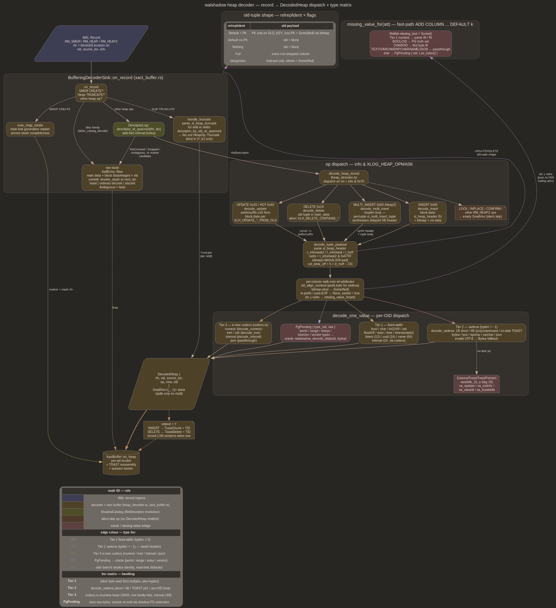

# decoder

Heap-tuple decoder. Walks `RM_HEAP` / `RM_HEAP2` records, projects WAL
payload bytes through per-relation
[`RelDescriptor`](../src/shadow_catalog.rs) snapshots, emits one
`DecodedHeap { rfn, xid, source_lsn, op, new, old }` per logged tuple
into xact buffer. Tier 1/2 types decode inline against on-disk layout;
Tier 3 hot types (numeric, inet, interval, json) decode in-tree;
everything else surfaces as `PgPending` for shadow-PG-side resolution
by oracle. See [shadow.md](shadow.md) for descriptor provenance,
[xact.md](xact.md) for consumer semantics, [oracle.md](oracle.md) for
`PgPending` bridge, [emitter.md](emitter.md) for `ColumnValue -> CH
block`

## Purpose

Turn raw rmgr=Heap/Heap2 record stream into structured per-tuple events
xact buffer groups by xid & emitter ships to CH. Every replica-identity
variant honoured on old-tuple side so DELETE / UPDATE downstream
carries keys CH needs. UPDATE prefix/suffix elision & `ALTER ... ADD
COLUMN ... DEFAULT k` fast-path missing values reconstructed inline;
truly absent bytes flow as `None` columns with `partial = true` for
xact buffer to backfill from previous image



## Entry point

```rust
pub fn decode_heap_record(
    record: &XLogRecord,
    source_lsn: u64,
    rel: &RelDescriptor,
) -> Result<DecodedHeaps, DecodeError>;

pub type DecodedHeaps = SmallVec<[DecodedHeap; 1]>;
```

`SmallVec<[_; 1]>` keeps single-tuple INSERT / UPDATE / HOT_UPDATE /
DELETE stack-allocated; only `XLOG_HEAP2_MULTI_INSERT` with
`ntuples > 1` spills to heap. Caller owns `RelDescriptor` resolution
via the descriptor log's interval lookup
([desc_log.md](desc_log.md)); `TRUNCATE` is intercepted upstream
(`BufferingDecoderSink::handle_truncate`) because its `main_data`
carries pg_class OIDs rather than a relfilenode

## `HeapOp` variants

| variant | source info | tuple shape |
|---|---|---|
| `Insert` | `XLOG_HEAP_INSERT` (`0x00`), `XLOG_HEAP2_MULTI_INSERT` (`0x50`) per row | `new` populated, `old = None` |
| `Update` | `XLOG_HEAP_UPDATE` (`0x20`) | `new` populated; `old` per `relreplident` + `XLH_UPDATE_CONTAINS_*` flags |
| `HotUpdate` | `XLOG_HEAP_HOT_UPDATE` (`0x40`) | same as `Update`; kept distinct so downstream can elide if needed |
| `Delete` | `XLOG_HEAP_DELETE` (`0x10`) | `new = None`; `old` per `relreplident` + `XLH_DELETE_CONTAINS_*` flags |
| `Truncate` | `XLOG_HEAP_TRUNCATE` (`0x30`) | `new = None`, `old = None`; rfn identifies relation |

`Truncate` is unique: `xl_heap_truncate` main_data carries pg_class OIDs
(not relfilenodes) with no block ref, so
[`BufferingDecoderSink::handle_truncate`](../src/xact_buffer.rs)
intercepts pre-decode — parses via
[`main_data::parse_xl_heap_truncate`](../src/main_data.rs),
`wait_for_replay(source_lsn)` so shadow's pg_class fetch sees
post-truncate filenode, resolves each relid through
`ShadowCatalog::relation_by_oid`, fans out one `HeapOp::Truncate` per
relation with `kind in {'r','p'}` (toast/index/sequence skipped)

## Single-tuple path

INSERT / UPDATE / DELETE share `decode_tuple_payload` over

```text
xl_heap_header (5)  // t_infomask2:u16, t_infomask:u16, t_hoff:u8
bitmap [+ MAXALIGN pad to t_hoff]
column data ...
```

Constants: `SIZE_OF_HEAP_HEADER = 5`, `SIZE_OF_HEAP_TUPLE_HEADER = 23`
(stable since PG 7.x). WAL block-data slice elides PG's 23-byte fixed
`HeapTupleHeaderData`; column data starts in slice at `header_off + 5 +
(t_hoff - 23)`. Walshadow accepts `t_hoff ==
SIZE_OF_HEAP_TUPLE_HEADER` as floor; smaller is `DecodeError::BadHoff`

INSERT reads tuple bytes from `block.data` (PG sets `REGBUF_KEEP_DATA`
for logically-logged relations so tuple bytes always ride in
`block.data` even when an FPI also attaches to the page). UPDATE /
HOT_UPDATE read prefix + suffix u16 lengths off `block.data` per
`XLH_UPDATE_PREFIX_FROM_OLD` / `XLH_UPDATE_SUFFIX_FROM_OLD` flags in
`main_data[7]`, then walk same header+bitmap+cols shape with
`prefixlen` / `suffixlen` recorded so column walker marks elided ranges
absent. DELETE has no block-0 tuple; old image (when
`XLH_DELETE_CONTAINS_OLD_TUPLE | XLH_DELETE_CONTAINS_OLD_KEY`) sits in
`main_data` at byte 8 onward

Per-column walk applies PG's `att_align_nominal` (peeks first body byte
for varlena to short-circuit alignment when bit 0 is set, matching
`att_align_pointer`). Null bitmap zero bits surface as
`Some(ColumnValue::Null)`; bytes elided into prefix or past WAL slice
surface as `None` and flip `DecodedTuple::partial = true`. Decode-time
truncation past EOF marks subsequent columns absent, returns partial
tuple rather than erroring

## MULTI_INSERT path

`decode_multi_insert` walks `xl_heap_multi_insert` main_data:

```text
flags:u8        // XLH_INSERT_CONTAINS_NEW_TUPLE etc
pad:u8          // ntuples is 2-byte aligned
ntuples:u16
[offsets[ntuples] u16 each, omitted when XLOG_HEAP_INIT_PAGE]
```

Gate is `XLH_INSERT_CONTAINS_NEW_TUPLE` (bit 3), **not**
`XLH_INSERT_NO_LOGICAL`. PG sets
`CONTAINS_NEW_TUPLE` whenever logical decoding needs payload, and
walshadow's hard `wal_level=logical` floor means bit is effectively
always on; missing-bit treated as "writer stripped payload, skip
record" rather than error. `ntuples == 0` errors loudly as
malformed-stream signal

Block 0 carries `ntuples` tuples back-to-back. Each tuple preceded by
`xl_multi_insert_tuple` (PG `SizeOfMultiInsertTuple = 7`):

```text
datalen:u16
t_infomask2:u16
t_infomask:u16
t_hoff:u8
```

PG strips 5-byte `xl_heap_header` per tuple (three fields above live on
`xl_multi_insert_tuple` instead). Decoder synthesises 5 bytes by
concatenating `t_infomask2 || t_infomask || t_hoff`, feeds synth +
tuple body through same `decode_tuple_payload`. Per-tuple alignment is
2-byte SHORTALIGN'd relative to block-data origin (PG
`heap_xlog_multi_insert`)

Output: one `DecodedHeap { op: Insert, new: Some, old: None }` per
tuple, all stamped with same `xid` and `source_lsn` so xact buffer
coalesces them under one xact bucket

## `main_data` parsers

[`src/main_data.rs`](../src/main_data.rs) carries parsers for records
walshadow needs to read `main_data` for outside `xl_heap_*` shape:

- `parse_xl_heap_truncate(md) -> Option<HeapTruncate>` — extracts
  `(db_oid, flags, Vec<relids>)` from `xl_heap_truncate` (`Oid dbId;
  uint32 nrelids; uint8 flags; Oid relids[]`). Header is
  `SizeOfHeapTruncate = 12` (9 bytes + 3 bytes trailing pad so `Oid
  relids[]` lands 4-byte aligned). Flags: `XLH_TRUNCATE_CASCADE`,
  `XLH_TRUNCATE_RESTART_SEQS`
- `relation_for_empty(record) -> Option<RelFileNode>` — pulls
  `RelFileLocator` from `XLOG_HEAP2_NEW_CID` (offset 16, struct total
  34 bytes) and `XLOG_BTREE_REUSE_PAGE` (offset 0, struct total 25
  bytes). Both records lack block refs; filter relies on these to
  classify reachable Empty-class records that still touch a tracked
  relation

## Type matrix

### Tier 1 — fixed-width

`type_len > 0`, decoded by `decode_one_value` from `body =
buf[abs..abs+len]`:

| OID | type | width | `ColumnValue` |
|---|---|---|---|
| 16 | bool | 1 | `Bool(u8 != 0)` |
| 18 | "char" | 1 | `Char(i8)` |
| 21 / 23 / 20 | int2 / int4 / int8 | 2 / 4 / 8 | `Int2` / `Int4` / `Int8` |
| 26 | oid | 4 | `Oid(u32)` |
| 700 / 701 | float4 / float8 | 4 / 8 | `Float4` / `Float8` |
| 1082 | date | 4 | `Date(i32)` days since 2000-01-01 |
| 1083 | time | 8 | `Time(i64)` microseconds since midnight (no epoch shift) |
| 1114 / 1184 | timestamp / timestamptz | 8 | microseconds since PG epoch |
| 1266 | timetz | 12 | `TimeTz { micros: i64, tz_seconds: i32 }` |
| 2950 | uuid | 16 | `Uuid([u8; 16])` raw, no swap |
| 1186 | interval | 16 | `Interval` via `codecs::decode_interval` (Tier 3 fixed) |

`name` (oid 19, width 64) is **not** wired into `decode_one_value`:
WAL-decoded `name` columns fall through to `Unsupported`.
`ColumnValue::Name` variant exists but nothing constructs it from WAL;
only `missing_value_for` maps `NAMEOID` (as `Text`, attmissingval
defaults). User tables carrying `name` columns are rare; wire the
fixed-width arm (NUL-trimmed NAMEDATALEN) when one shows up

PG built with `--disable-integer-datetimes` was removed in PG 10;
walshadow assumes integer microseconds unconditionally

### Tier 2 — length-prefixed (varlena)

`type_len == -1`. `decode_varlena` walks PG's three header shapes
(`varatt.h`): 1-byte short header (bit 0 set, length in upper 7 bits
including header), 4-byte header (bits [1:0] == 00 uncompressed, 10
in-line compressed), on-disk TOAST pointer `varattrib_1b_e`
(`0x01 0x12 + 16 bytes varatt_external`). Bodies dispatch by type OID:

| OID | type | `ColumnValue` |
|---|---|---|
| 17 | bytea | `Bytea(Vec<u8>)` |
| 25 / 1042 / 1043 | text / bpchar / varchar | `Text(String)` UTF-8 validated (falls back to `Bytea` on invalid bytes with stats bump) |
| 114 | json | `Json(String)` (varlena text on disk, passed through) |

In-line compressed varlenas (`pglz` / `lz4` body inside regular column,
distinct from FPI compression) surface as `Unsupported`; handling them
is scoped to the oracle path. TOAST pointers surface as
`ExternalToast(ToastPointer { va_rawsize, va_extinfo, va_valueid,
va_toastrelid })` for TOAST reassembly to dereference

### Tier 3 — codecs + `PgPending`

In-tree decoders ([`src/codecs.rs`](../src/codecs.rs)):

- `numeric` (1700) — short / long / special header variants, base-10000
  digits, NaN / ±Inf flags; finite values rendered to PG-text form
  matching `numeric_out`
- `inet` (869) / `cidr` (650) — family + prefix + addr bytes
- `interval` (1186) — fixed-width 16 bytes, decoded by Tier 1 path
- `json` (114) — passthrough varlena text

Everything else — `jsonb`, range types, arrays (`typcategory='A'`),
`tsvector`, vendor types — routes through
`ColumnValue::PgPending { type_oid, raw }` carrying on-disk varlena
body. Emitter resolves text form at emit time via
`walshadow_decode_disk(oid, bytea) -> text` SQL call against shadow PG
(`walshadow` extension); falls back to `<oid:N>` placeholder +
`unsupported_values` bump when extension absent. One source of truth
lives on shadow, no per-type codec drift to chase in walshadow itself

## Replica identity

[`ReplIdent`](../src/shadow_catalog.rs) variants and old-tuple shape,
per PG `ExtractReplicaIdentity`:

| variant | wire | decoder behaviour |
|---|---|---|
| `Default { pk_attnums: Some(_) }` | PK columns when `XLH_UPDATE_CONTAINS_OLD_KEY` set, every DELETE | old populated with PK columns; non-PK columns surface as `Some(ColumnValue::Null)` via bitmap |
| `Default { pk_attnums: None }` | nothing (PG never sets OLD_KEY without PK) | `old = None` |
| `Nothing` | empty | `old = None` |
| `Full` | every non-dropped column | every column decoded |
| `UsingIndex { index_oid, key_attnums }` | indexed columns only | indexed columns decoded; non-indexed surface as `Some(ColumnValue::Null)` via bitmap |

`is_replica_identity_attr(replident, attnum)` is per-attnum predicate.
Bitmap-driven NULL is what PG actually writes for non-identity columns
under Default / UsingIndex (PG calls `heap_form_tuple` with NULL
placeholders); decoder mechanically walks the same shape rather than
special-casing each variant

## Read-time defaults

PG's fast-path `ALTER TABLE ADD COLUMN ... DEFAULT k` stamps
`pg_attribute.atthasmissing = true` + `attmissingval[1]` (text form via
`typoutput`) on catalog row. Shadow catalog fetch path
([`shadow_catalog.rs::fetch_attributes`](../src/shadow_catalog.rs))
populates `RelAttr.missing_text: Option<String>`

When WAL writer's `natts` (from `t_infomask2 & HEAP_NATTS_MASK`) is
below catalog's attribute count — a pre-ALTER physical tuple —
trailing catalog attributes don't appear in bitmap or column bytes.
Decoder closes gap via `missing_value_for(att)`:

- `missing_text = None`: `ColumnValue::Null`
- Tier 1 numeric OIDs: `text.parse::<iN>()` or fallback `Null`
- `BOOLOID`: PG's truth-set `t / true / yes / on / 1` -> true, else
  false
- `CHAROID`: first byte cast to `i8`
- `TEXTOID / VARCHAROID / BPCHAROID / NAMEOID / JSONOID`: text
  passthrough
- Anything else: `PgPending { type_oid, raw: text.as_bytes().to_vec() }`
  so shadow's `typinput` recovers bytea via oracle path

Missing-value path uses `RelAttr.missing_text` (PG-text form) and
`missing_value_for(att)`, which routes Tier 3 through `PgPending` rather
than decoding binary array elements in `codecs.rs`

Physical NULL (bitmap bit clear within writer's `natts` window) still
wins: missing-value substitution only fires for trailing attributes
the writer did not log

## FPI handling

[`src/fpi.rs::restore_block_image(block, page_magic) -> [u8; 8192]`](../src/fpi.rs)
reconstructs 8 KiB page from `XLogRecordBlock.image`. Dispatches on
`block.header.image_header.compression_method(page_magic)` returning
`Option<FpiCompressionMethod>`. Page-magic argument selects between PG
14 bimg_info layout (single `BKP_IMAGE_IS_COMPRESSED` bit) and
post-`>= 0xD110` layout (`BKP_IMAGE_COMPRESS_MASK_PG15` carrying PGLZ /
LZ4 / ZSTD as small enum). Per-codec dispatch:

- `None` (uncompressed): `image.len() == BLCKSZ - hole_length` (caller
  rejects on mismatch); plain copy
- `Pglz`: `pglz::decompress_into(..., check_complete = true)`
- `Lz4`: `lz4_flex::block::decompress_into`
- `Zstd`: `zstd::bulk::decompress_to_buffer`

All three verify written length matches `BLCKSZ - hole_length`, return
`FpiError::SizeMismatch` otherwise

Hole splice: image carries `BLCKSZ - hole_length` packed bytes; scratch
decodes flat, then splicer writes `scratch[..hole_offset]` into page
head, zeroes hole region, writes `scratch[hole_offset..]` past hole.
`hole_offset + hole_length > BLCKSZ` is `FpiError::BadHole`

Tuple-bytes path **does not** call `restore_block_image`: PG's
`REGBUF_KEEP_DATA` under `wal_level=logical` keeps tuple bytes in
`block.data` even when an FPI also attaches. FPI restore is for
[bootstrap.md](bootstrap.md) initial-load page walks, TOAST chunk
re-reads, `XLOG_FPI_FOR_HINT` post-checkpoint hot set where no
`block.data` exists alongside image

## pg_class decoder

[`src/pg_class_decoder.rs::decode_pg_class_tuple(record, block_idx) -> DecodeOutcome`](../src/pg_class_decoder.rs)
is a narrow heap-tuple decoder targeting pg_class block data only.
Feeds [`CatalogTracker`](../src/catalog_tracker.rs) so
user-vs-catalog whitelist tracks `relfilenode` rewrites on non-mapped
catalogs (`VACUUM FULL pg_depend`, `REINDEX pg_constraint`, `CLUSTER`).
Mapped catalogs (pg_class, pg_attribute, pg_type, pg_proc, shared
catalogs) ride `XLOG_RELMAP_UPDATE` instead

Pulls `(oid, relfilenode)` from column 1 and column 8 of pg_class row.
Columns 1..=7 occupy 88 bytes (4 + 64 NAMEDATALEN + 4*5), all NOT NULL
by catalog schema, offsets stable across PG 16/17/18. Handles
`XLOG_HEAP_INSERT` (info 0x00) and `XLOG_HEAP_UPDATE /
XLOG_HEAP_HOT_UPDATE` (0x20 / 0x40); INPLACE / DELETE / LOCK / TRUNCATE
skipped via `info_carries_new_tuple_heap`. `XLOG_HEAP2_*` explicitly
false (`info_carries_new_tuple_heap2`) — MULTI_INSERT uses per-tuple
`xl_multi_insert_tuple` shape pg_class isn't written with

UPDATE prefix/suffix handling: reads `prefixlen` (and `suffixlen`)
u16s off block-data front per `XLH_UPDATE_*_FROM_OLD` bits in
`main_data[7]`. `prefixlen > 0` returns `DecodeOutcome::OidInPrefix`
because OID at reconstructed offset 0 of column-data region lives
entirely (or partially when `prefixlen < 4`) inside un-logged prefix —
VACUUM FULL on non-mapped catalogs hits this shape, caller falls back
to `XLOG_RELMAP_UPDATE` or `seed_from_source` to learn rotated filenode

## `DecodedHeap` shape

```rust
pub struct DecodedHeap {
    pub rfn: RelFileNode,    // block 0 location (or relation_by_oid for Truncate)
    pub xid: u32,            // from record header; xact buffer keys on this
    pub source_lsn: u64,     // for manifest + LSN propagation
    pub op: HeapOp,
    pub new: Option<DecodedTuple>,
    pub old: Option<DecodedTuple>,
}

pub struct DecodedTuple {
    pub columns: Vec<Option<ColumnValue>>,  // 0-based by attnum-1
    pub partial: bool,                       // true iff prefix/suffix/EOF elided cols
}
```

`columns` ordering matches `RelDescriptor.attributes` (attnum-1
indexed); length equals catalog `attributes.len()` regardless of WAL
writer's `natts`. `Some(ColumnValue::Null)` is explicit NULL (bitmap
bit clear); `None` is absent-from-WAL — xact buffer reads previous
images keyed on rfn + replica-identity attrs to reconstruct, emitter
treats `None` as "leave CH column untouched" via per-op write path

`commit_ts` / `commit_lsn` arrive on
[`CommittedTuple`](../src/heap_decoder.rs) wrapper from xact buffer's
commit step, not here. Decoder is unaware of xact state — stamps every
record eagerly, leaves abort-then-ghost-row reconciliation to buffer

## Cross-major fixture concerns

MULTI_INSERT and `xl_xact_commit` tail-walk semantics lack per-major
captured fixtures across PG 16/17/18. `tests/classify_fixture.rs` infra
snapshots MULTI_INSERT fixtures; the same fixture gap covers
`XACT_XINFO_HAS_SUBXACTS` layout. Drift in either record's per-major
shape would surface as silent decode mismatch on exactly one major.
Tracked in [future/parked.md](future/parked.md). Structural cousins —
`xl_heap_*` headers, `xl_heap_multi_insert` field order,
`attmissingval` encoding — are stable per WAL alignment memory note +
direct catalog cross-check against PG 16/17/18 source, absent
fixture-level confirmation
