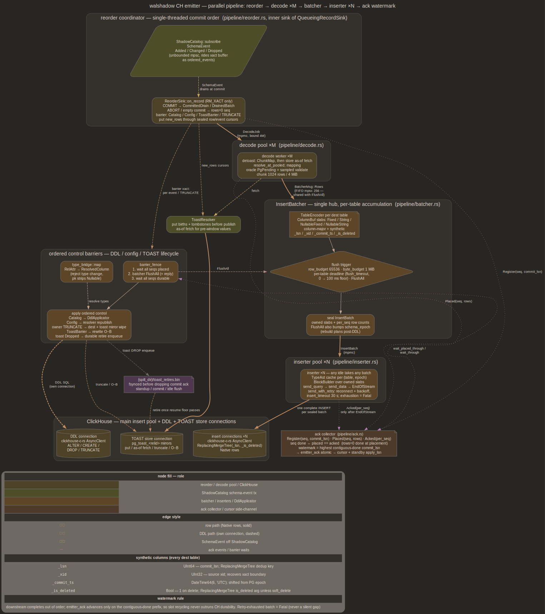

# emitter

CH-side ingest is a parallel decode+insert pipeline (`src/pipeline/`):

```text
pump -> QueueingRecordSink -> reorder -> [decode x M] -> InsertBatcher
           -> [inserter x N] -> ClickHouse
                             \-> ack collector -> emitter_ack_lsn
```

Pipeline stages live in `src/pipeline/{reorder,decode,batcher,inserter,
ack,tail,mod}.rs`; encoding primitives (`EmitterConfig`, `TableEncoder`,
`TablePlan`, `ColumnBuf`, value encode, `EmitterStats`) in
`src/ch_emitter.rs`; DDL in `src/ch_ddl.rs`; PG → CH type mapping in
`src/type_bridge.rs`. Pool sizes M/N come from `--decoder-pool-size` /
`--inserter-pool-size`; size 1 is the degenerate serial case. Design
history + remaining scaling work in
[future/pipeline_backpressure_and_scaling.md](future/pipeline_backpressure_and_scaling.md)

The pipeline stands up only with `--ch-config`. Metrics-only runs keep
the legacy serial path: `XactRecordSink` draining into a
`TupleObserver` (`MetricsTupleObserver`, oracle-wrapped when
`--validate` is up) — counters, no CH

## Purpose

Translate committed-xact tuple streams from xact-buffer drain into
ClickHouse Native blocks buffered per table and sealed as complete
INSERTs, with enough parallelism that CH Cloud RTT + part-commit cost
doesn't bound throughput. DDL applies inside an ordering barrier so
ALTER / CREATE / DROP / TRUNCATE land strictly after all earlier data
is durable. Emitter ack-LSN (contiguous-done watermark) feeds cursor
file + standby `apply_lsn` so restart resumes from highest
commit-record LSN known durable on CH

## Stage walk



### Reorder coordinator — `pipeline/reorder.rs`

Single-threaded commit-order boundary. Runs as inner sink of the
daemon's `QueueingRecordSink` (off the WAL pump task, preserving the
wire-shadow deadlock fix). Only `RM_XACT_ID` records reach its match:

- COMMIT — poll-based DROP sweep (gated on `pg_class_delete_epoch`),
  `XactBuffer::drain_committed`, then assign one dense `seq`,
  `ack.register(seq, commit_lsn)`, dispatch a `DecodeJob` to the
  decode pool. Empty commits register a rows=0 seq so the contiguous
  watermark never gaps
- ABORT — drop buffer state, register + place a rows=0 seq (never a
  direct ack bump; everything moves through the gate)
- ASSIGNMENT — feed `SubxactTracker`
- PREPARE — no seq; `COMMIT PREPARED` drains it later (two-phase gap:
  [future/two_phase_commit.md](future/two_phase_commit.md))

Barrier xacts (any `SchemaEvent` or `HeapOp::Truncate` in the drain)
run synchronously: data segments between catalog ops each get their own
seq, and each DDL / TRUNCATE is preceded by `barrier_fence()` — wait
all dispatched seqs *placed*, `FlushAll` the batcher, wait all seqs
*durable* — then `DdlApplicator::apply` / `truncate`. Barrier
coarseness is deliberate; DDL and TRUNCATE are rare. Trailing data
after the last event flows async, already encoding against the
post-DDL shape

### Decode pool — `pipeline/decode.rs`, ×M

Each worker pulls a `DecodeJob` and per heap: `detoast_heap`, resolve
descriptor via `shadow_catalog::resolve_at_pooled` (read-only pooled
resolve, replay-LSN-gated), mapping lookup, oracle `PgPending`
resolution + sampled validation, then routes `RoutedRow`s to the
batcher in chunks (`DECODE_CHUNK_ROWS = 1024` / `DECODE_CHUNK_BYTES =
4 MiB`, amortizing the channel hop). After the xact's last row it
reports `Placed { seq, rows }`. Decode errors are fatal — a
never-placed seq would pin the watermark forever

Out-of-order completion across workers is fine: rows carry `source_lsn`
as `_lsn`, so `ReplacingMergeTree(_lsn)` converges per PK. At M=1
dispatch order (hence per-table WAL order) is preserved

### InsertBatcher — `pipeline/batcher.rs`

Single hub task owning one `TableEncoder` per destination table.
Encoding happens here, not in decoders, so rows from all M decoders
and all xacts merge into one part per flush window per table. Rows and
`FlushAll` share one FIFO channel (`BatcherMsg`, bound 256) so a
barrier's flush can never seal ahead of rows enqueued before it

Flush triggers, each sealing one `InsertBatch` (complete INSERT's
worth of owned column slabs + `per_seq` row counts for the collector):

- `enc.rows >= row_budget` (default 65536)
- `enc.approx_bytes >= byte_budget` (default 1 MiB)
- per-table deadline armed on first buffered row (`flush_timeout`;
  operator `0` is substituted with a 100 ms pipeline default —
  `DEFAULT_PIPELINE_FLUSH` — else a cold table's rows pin the
  watermark indefinitely)
- `FlushAll` from the DDL/TRUNCATE barrier or shutdown — seals every
  table, drops all encoders, bumps `schema_epoch` so next rows rebuild
  plans against post-DDL descriptors and inserters re-parse cached
  types

`flush_timeout` trades part count against ack latency: pgbench-shaped
4-table xacts coalesce into one MergeTree part per window instead of
one per xact

### Inserter pool — `pipeline/inserter.rs`, ×N

N `AsyncClient` connections. CH Cloud INSERT cost is mostly RTT +
object-store part commit, so throughput comes from keeping many
INSERTs in flight. Each inserter pulls `InsertBatch`es off a shared
mpmc queue — any idle inserter takes any batch, so a hot table can use
more than one connection — rebuilds the Native block over the batch's
owned slabs (`TypeAst` cache keyed on `(table, schema_epoch)`;
`TypeAst` is `Send` not `Sync`, each inserter parses its own), and
runs one `send_query` + `send_data` + `send_data_end` +
drain-to-`EndOfStream`

Durability invariant: `ack.acked(per_seq)` fires **only after** the
drain returns. Until then a connection drop replays the still-owned
batch — CH dedups the resend by `_lsn`. `rows_emitted` /
`blocks_sent` stats bump at the same point, so a long-open window
shows 0 rows until its first seal

### Ack collector — `pipeline/ack.rs`

Refcount-driven contiguous watermark. Downstream completes out of
order; `emitter_ack_lsn` (advertised as standby `apply_lsn`, bounding
source slot recycling) must not. Per seq track rows *placed* (decoder
routed) and *acked* (inserter drained `EndOfStream`); a seq is done
once `placed == acked` (rows=0 seqs done at placement). Watermark is
highest contiguous done seq's `commit_lsn`, published into the
`emitter_ack` atomic the status loop persists to cursor

`Trailing { lsn }` advances past non-commit WAL only when every
registered seq is done and the xact buffer is empty (reorder's
`on_idle_advance` guard). A `placed_frontier` watch channel serves the
barrier's placed-wait. The frontier scan resumes from `placed_frontier`,
not `next_expected` — the O(N²) re-walk variant pegged the collector
at 100% CPU and presented as a chc recv/INSERT hang

`emitter_ack` is seeded at the WAL re-read start (`raw_start`), not 0:
the status loop persists the atomic with no monotonic guard, and a
zero first write would clobber a resumed cursor

### Fatal — `pipeline/mod.rs`

One-shot error signal shared across stages. First message wins (root
cause); pump polls it to exit, the barrier `select`s on it so a CH
outage mid-fence surfaces instead of hanging. Any stage error → fatal
→ daemon exits → cursor file resumes on restart

## Connections

N inserter connections + 1 `DdlApplicator` connection, all built off
the same `EmitterConfig` `(host, port, user, password, database)`.
DDL rides its own connection because CH's client is
single-query-at-a-time — an in-flight INSERT would block an ALTER on
the same wire. Ordering between data and DDL comes from the barrier
fence, not connection discipline

Compression: feature-gated through walshadow's own `lz4` / `zstd`
features which forward to `clickhouse-c-rs`. `CompressionChoice::Lz4`
is default; `build_codec` returns `EmitterError::CompressionUnsupported`
when variant's feature is off. CH wire default is LZ4 so default build
matches CH's own posture

## TableEncoder + ColumnBuf

`TableEncoder` owns one `Vec<ColumnBuf>` per destination column, mapped
+ synthetic. Built lazily on first row via `TablePlan::build` off
descriptor + mapping; cached in the batcher hub keyed on source
`<namespace>.<relname>` until a barrier `FlushAll` clears it. Encoder
is column-major: each column accumulates into its own slab,
`take_block` hands the slabs to an `InsertBatch`, the inserter's
`BlockBuilder` borrows into them at send time

`ColumnBuf` variants:

| variant | shape | source CH kind |
|---|---|---|
| `Fixed { width, bytes }` | packed LE | non-null fixed-width (Int*, Float*, Decimal*, FixedString, DateTime64, Enum) |
| `String { offsets, data }` | varlen + cumulative offsets | non-null String |
| `NullableFixed { width, null_map, inner }` | dense fixed + null-bitmap | Nullable(fixed) |
| `NullableString { offsets, data, null_map }` | varlen + null-bitmap | Nullable(String) |

Width comes from `clickhouse-c-rs`'s `chc_type_elem_size`, not a
walshadow-side type table, so `FixedString(N)`, `DateTime64(p)`,
`Decimal*(p,s)`, `Enum8` etc resolve without walshadow mirroring
upstream surface. `elem_size == 0` means varlen; only varlen shape
today is `String`, anything else dies cleanly at `append`

## Type bridge

`type_bridge::map(att, pk_member) -> ResolvedColumn` maps one
`RelAttr` to CH type expression plus optional `DEFAULT <expr>`.
`pk_member = true` strips `Nullable(_)` wrap because CH refuses
`Nullable` in `ORDER BY`. Matrix is hard-coded in `base_type_for`:

| PG | CH |
|---|---|
| bool | Bool |
| "char" / int2/4/8 | Int8/16/32/64 |
| oid | UInt32 |
| float4/8 | Float32/64 |
| numeric(p,s), 1 ≤ p ≤ 76 | Decimal(p,s); else String |
| text / varchar(n) / bpchar(n) / name / bytea | String |
| date | Date32 |
| time | Time64(6) |
| timetz / interval | String (text form) |
| timestamp(p) / timestamptz(p) | DateTime64(p, 'UTC'), p ≤ 6 |
| uuid | UUID |
| inet / cidr / json / jsonb | String |
| array / unknown | String fallback |

`numeric` needs `1 ≤ p ≤ 76` for `Decimal`; `p = 0`, scale outside
`0 ≤ s ≤ p`, or unconstrained `numeric` (which can carry NaN/±Inf) fall
back to `String`. Into a `Decimal` column `encode_value` ships the value
as a scaled little-endian two's-complement integer (`value * 10^scale`,
U256 arithmetic spanning Decimal128/256 widths); NaN/±Inf into a
`Decimal` column is unrepresentable and errors with `UnsupportedValue`
(map that column to `String` to keep them). A `String`-mapped `numeric`
still ships lossless text including NaN/Inf

`time` → `Time64(6)` ships raw microseconds-since-midnight LE. CH 25.x
gates `Time64` behind `enable_time_time64_type=1`; the dest server's
profile must enable it or auto-create / insert on `time` columns fails.
`timetz` → `String` renders via `codecs::timetz_to_text`, preserving the
UTC offset the old fixed encoding silently dropped

Default expressions reconstruct from `RelAttr.missing_text` (fast-path
`attmissingval[1]` PG plants on `ALTER TABLE ADD COLUMN ... DEFAULT k`).
`render_default` routes through
`heap_decoder::missing_value_for(att) -> ColumnValue`, then
`column_value_to_sql_literal` emits CH literal — booleans land as
`true`/`false`, ints unquoted, strings single-quoted with `'` escaping,
timestamps as `toDateTime64('...', 6, 'UTC')`. Unbridged shapes return
`None` so `ALTER TABLE ADD COLUMN` lands without a `DEFAULT` clause;
CH applies its own zero-init

### Synthetic columns

Every destination table carries four trailing synthetic columns,
non-nullable by construction, encoded in `TableEncoder::new`:

| column | type | purpose |
|---|---|---|
| `_lsn` | `UInt64` | source commit-record LSN. `ReplacingMergeTree(_lsn)` keys dedup on this so restart-and-replay window collapses re-emitted rows to latest LSN per PK |
| `_xid` | `UInt32` | source xid. Lets analytic queries group all rows from one xact, recover xact boundary CH lost when emitter serialised across tables |
| `_commit_ts` | `DateTime64(6, 'UTC')` | xact commit timestamp, shifted from PG's 2000-01-01 epoch to Unix via `DATETIME64_PG_EPOCH_US` |
| `_is_deleted` | `Bool` | 1 on delete, else 0. `Bool` is `UInt8` underneath (1 wire byte), so it satisfies `ReplacingMergeTree`'s `is_deleted` UInt8 requirement. `ReplacingMergeTree(_lsn, _is_deleted)` second arg collapses deletes on FINAL; `WHERE _is_deleted = 0` is the cheap "live rows" filter. `soft_delete` keeps it out of the engine args to retain tombstones |

`_lsn` is dedup key because emitter ack lags actual CH durability by up
to one flush window. On restart cursor's `emitter_ack_lsn` rewinds to
last contiguous-done LSN; everything between that and the crash
re-emits, `ReplacingMergeTree(_lsn)` resolves duplicates server-side
without walshadow having to track which rows already landed

## Mapping config

`EmitterConfig::tables` parses from TOML `[table."<src>"]` blocks:

```toml
[table."public.foo"]
target = "default.foo"
columns = [
  { attnum = 1, target = "id",   type = "UInt64" },
  { attnum = 2, target = "name", type = "Nullable(String)" },
]
```

`MappingHandle = Arc<tokio::sync::RwLock<HashMap<String, TableMapping>>>`
is the live handle the decode pool consults per row. Handle is
cloneable; daemon's SIGHUP task swaps whole inner `HashMap`. Routing
picks up the swap immediately; the batcher's cached `TableEncoder`
keeps its old `TablePlan` until the next barrier `FlushAll` (or
restart) rebuilds it — a SIGHUP retarget therefore fully applies only
at the next DDL/TRUNCATE boundary

### NamespaceMapping (partial)

Per-source-namespace defaults block, `[namespace."public"]`. Three
fields wired today:

```rust
pub struct NamespaceMapping {
    pub target_database: Option<String>,
    pub auto_create: bool,
    pub drop_table_strategy: Option<String>,
}
```

`auto_create = true` lets `DdlApplicator::apply_added` run
`CREATE TABLE IF NOT EXISTS` on first sight of a relation in the
namespace and auto-derive a `TableMapping` via
`derive_columns_for_mapping`. Per-table TOML still wins when both are
configured for the same relation

`target_database` and `drop_table_strategy` resolve per-namespace
through `DdlConfig::{target_database_for, drop_strategy_for}`: the
applicator carries the namespace map and falls back to the global
`target_database` / `drop_table_strategy` when a namespace has no
override. The per-namespace `target_database` drives both the CREATE
and the derived row-routing mapping, so rows and DDL land in the same
database

## NOT yet landed for namespace mapping

`auto_create`, `target_database`, and `drop_table_strategy` ship; the
richer namespace surface the plan called for is still missing:

- `ResolvedConfig` struct: design called for one pre-materialised value
  carrying `tables`, `namespaces`, and a
  `columns: HashMap<(String, String), ColumnMapping>` type-override
  table. Today no such type; mapping lives in
  `Arc<RwLock<HashMap<String, TableMapping>>>` and namespace defaults
  live separately on `EmitterConfig::namespaces`
- `watch::Receiver<Arc<ResolvedConfig>>` emitter wiring:
  runtime-config-from-PG path wants emitter to consume watch stream so
  config changes propagate without SIGHUP. Today's reload channel is
  `RwLock` swap kicked by SIGHUP
- `NamespaceMapping.order_by_default`: `render_create_table` hard-codes
  `ORDER BY (_lsn)` fallback when no PK exists
- `NamespaceMapping.engine_default`: `render_create_table` hard-codes
  `ENGINE = ReplacingMergeTree(_lsn)`. Plan wanted per-namespace
  override (e.g., `MergeTree`, `CollapsingMergeTree`)
- `NamespaceMapping.type_overrides`: plan wanted per-column type
  overrides keyed on `(namespace, src_attname)`. Today only path is
  per-table TOML

See [future/runtime_config_from_pg.md](future/runtime_config_from_pg.md)
— pg-driven config substrate depends on this resolver shape

## DdlApplicator

`ch_ddl.rs::DdlApplicator`, owned by the reorder coordinator. Events
originate at `ShadowCatalog::subscribe`
(`mpsc::UnboundedReceiver<SchemaEvent>` — unbounded so a stalled
consumer never back-pressures the catalog producer), ride the xact
buffer keyed on `(xid, source_lsn)`, and surface in `drain_committed`'s
`ordered_events`; the barrier applies each in source-LSN order. Apply
table:

| `SchemaEvent` | CH SQL |
|---|---|
| `Added { desc }` | `CREATE TABLE IF NOT EXISTS` (in the namespace's `target_database`, else global default) when namespace `auto_create = true` and no pre-pinned mapping. Auto-derives `TableMapping` against that same database post-success so subsequent rows ship against the new table |
| `Changed { diff }` | `ALTER TABLE … RENAME COLUMN` first (so position-match diffs don't trip into drop+add), then `ALTER TABLE … ADD COLUMN IF NOT EXISTS` per added attnum, then `ALTER TABLE … DROP COLUMN IF EXISTS` per dropped attnum |
| `Changed.type_changes` | rejected, logged, `stats.type_changes_rejected += n`. Operator handles via manual CH migration |
| `Dropped { qualified_name }` | gated on the namespace's `DropTableStrategy` (`drop_strategy_for`, else global): `Retain` (default) skips silently, `Warn` skips at WARN, `Drop` runs `DROP TABLE IF EXISTS` |

`render_create_table` builds CREATE off descriptor: attributes through
`type_bridge::map`, PK columns first in `ORDER BY` (else `_lsn`
fallback), engine pinned to `ReplacingMergeTree(_lsn)`. Synthetic
columns appended after mapped columns, same shape as `TablePlan::build`

`apply_changed` also mutates live `MappingHandle` via
`mutate_mapping_for_diff`: renames update `target_name` in place (when
operator's TOML used old source name), drops strip `ColumnMapping`,
adds push new entry derived through `type_bridge::map`. Operator-pinned
overrides survive: only `src_attnum`-matching entries the applicator
could have produced get touched

DDL has no retry: an applicator error trips fatal so the operator sees
it directly. Runtime-config-from-PG work may add bounded reconnect for
the DDL connection

### Baseline seeding (the `Added`-vs-`Changed` discriminator)

Whether a relation's first post-start descriptor fetch surfaces as
`Added` or `Changed` keys on whether `ShadowCatalog::prev_known` already
holds its oid. `prev_known` is the *baseline ledger* (last source shape
CH and source agreed on), not the descriptor cache — cold at every boot,
never reconstructed on a miss. Left cold, a pinned table that sees no DML
before its first `ALTER` records the post-ALTER shape as `Added`, which
`apply_added` skips for pinned dests (operator-managed CH) → CH stays a
column behind.

`ShadowCatalog::seed_baseline(qualified_names)` warms `prev_known` for
every pinned relation before `subscribe()` so the cache never decides the
branch: `bin/stream.rs` calls it after preflight / before
`START_REPLICATION` over `cfg.tables.keys()` (the inproc harness mirrors
it before its own `subscribe`). Pre-subscribe, `send_event` is a no-op,
so seeding emits nothing and does zero CH work. The first post-boot
`ALTER` then diffs the evolved descriptor against the seeded boot shape →
`Changed` → the `apply_changed` path above runs the CH ALTER.

Seeds the *full source* descriptor, never the mapping: a pinned subset's
unmapped columns sit in the baseline and read as "operator-excluded", so
a later `ALTER` adds only genuinely-new columns, never re-adds an
excluded one. Auto-create tables need no seeding — their first-touch
`Added` → `CREATE TABLE` already records a baseline. Open: boot-time
drift (column added while the daemon is down folds silently into the
seeded baseline) — see `plans/future/pinned_ddl_baseline.md` "Deferred".

### Barrier fence (ordering data around DDL)

`ReorderSink::barrier_fence` = `wait_placed_through(next_seq)` (decode
pool routed every earlier row onto the batcher channel) → batcher
`FlushAll` + reply (seals every row enqueued before it — shared FIFO
channel makes the ordering structural) → `wait_through(next_seq)`
(every earlier seq durable on CH). Only then does the applicator run.
Fence is global, not per-table: simpler than the surgical
single-table close the serial emitter did, acceptable because barriers
are DDL/TRUNCATE-rate. `FlushAll` also bumps `schema_epoch`, so
post-DDL rows rebuild `TablePlan`s and inserters re-parse types

## TRUNCATE path

TRUNCATE is a reorder barrier, never a batcher row (`handle_row`
errors on `HeapOp::Truncate` by construction):

1. dispatch pending data segment as its own seq
2. `barrier_fence()` — earlier rows for the relation are durable
3. `DdlApplicator::truncate` runs `TRUNCATE TABLE <dest>` on the DDL
   connection, drains to `EndOfStream` / `Exception`
4. bump `stats.truncates_emitted`; subsequent segments of the same
   xact follow as fresh seqs

Within a barrier xact, data segments between TRUNCATEs each get their
own seq and fence, so a `TRUNCATE` (no `_lsn`, can't ride
`ReplacingMergeTree` reconciliation) orders correctly against
surrounding inserts

`RESTART_SEQS` flag is ignored — sequence state isn't replicated.
PG's `TRUNCATE … RESTART IDENTITY` arrives as same `HeapOp::Truncate`
with no flag distinction at emitter layer; bit lives on PG xlog record
but doesn't propagate through `DecodedHeap`

## Foreign-DB row skip

Physical replication ships the whole cluster's WAL, so the decode pool
sees heap records for relations in other databases. `resolve_at_pooled`
rejects those with `CatalogError::ForeignDatabase` (filenode resolved
to a `db_node` that's neither the shadow DB nor a shared catalog — see
[shadow.md](shadow.md)). Worker skips the row: no route, no poison,
bump `stats.foreign_db_rows_skipped`; the seq's placed count simply
excludes it so the ack advances past it

## Read-time defaults integration

PG's fast-path `ALTER TABLE ADD COLUMN … DEFAULT k` plants
`attmissingval[1]` instead of rewriting heap. `RelAttr.missing_text`
carries typoutput text; resolution tiers:

- Tier 1 (immediate): bool / int / float / numeric / text — decoder
  resolves at parse time via `heap_decoder::missing_value_for(att)`,
  batcher sees fully-decoded `ColumnValue`
- Tier 2 (typmod-aware): timestamp / timestamptz / date — decoder
  resolves with typmod
- Tier 3 (oracle): unsupported / array / domain types — decoder emits
  `ColumnValue::PgPending { raw, type_oid }`. Decode workers run
  `resolve_pending_tuple` against the shadow-side extension; falls
  through to raw bytes when oracle absent

`encode_value` handles a surviving `PgPending` by shipping `raw` as
String — no error, no stat bump, operators handle post-process via
PG-side tooling. See [decoder.md](decoder.md) for tier classification +
[oracle.md](oracle.md) for extension protocol

## Ack-LSN tracking

See [Ack collector](#ack-collector--pipelineackrs) for mechanism. The
operational contract:

- `emitter_ack_lsn` in the cursor file is the contiguous-done
  commit-record LSN — every xact at or below it is fully durable on
  CH. It lags `drain_lsn` by up to one flush window
  (`flush_timeout`); the per-table deadline bounds the lag even on
  cold tables
- rows=0 seqs (aborts, empty commits, fully-filtered xacts) complete
  at placement so they never pin the watermark
- trailing non-commit WAL acks only when the xact buffer is empty and
  every seq is done — a quiescent-tick nudge can't claim rows still in
  flight
- a placed-but-never-acked batch pins the watermark forever by design
  (retry exhaustion is fatal first); the daemon's stall watchdog
  surfaces the oldest incomplete seq

See [ops.md](ops.md) for cursor + recovery contract; replay starts
from `min(shadow_replay_lsn, emitter_ack_lsn)`

## Bootstrap shares the tail

`pipeline/tail.rs` packages batcher + inserter pool + ack collector as
one reusable unit. Greenfield bootstrap
(`pipeline/bootstrap.rs::drain`) feeds the identical tail from the
page walk — bootstrap inherits the N-connection pool, reconnect +
retry, durable watermark, and backpressure for free. One synthetic seq
per rfn; `tail.finish` seals partial batches, waits all seqs durable,
then drains the cascade. No `DdlApplicator` attached (bootstrap
descriptor set is frozen at snapshot time). See
[bootstrap.md](bootstrap.md)

## Retry behaviour

Retry lives at the inserter, around one prepared INSERT
(`send_with_retry`): bounded attempts (`RetryConfig::max_attempts`)
with exponential backoff capped at `max_backoff`, reconnecting between
attempts. The sealed block is unchanged across retries, so a reconnect
just resends — CH dedups by `_lsn`. `insert_timeout` (default 30 s)
wraps the whole send so a connection wedged mid-INSERT surfaces as
retryable `EmitterError::Timeout` instead of pinning the watermark

`is_retryable` classifies `EmitterError::{Io, Client, ServerException,
Timeout}` as transient (network / CH-server / clickhouse-c protocol);
`Config`, `Type`, `Catalog`, `UnsupportedValue` stay fatal because
they encode bugs in daemon or mapping that retry would loop forever on

Budget expiry trips `Fatal` — daemon exits, cursor file resumes on
restart. See [future/ch_bounce_recovery.md](future/ch_bounce_recovery.md)
for deeper "re-emit from spill" story (segment-buffered replay across
extended CH outages) not yet shipped

## Cross-links

- [xact.md](xact.md) — `XactBuffer::drain_committed` merges
  `DecodedHeap` + `SchemaEvent` in source-LSN order; reorder consumes
  the drain
- [shadow.md](shadow.md) — `ShadowCatalog::subscribe` produces
  `SchemaEvent` stream; catalog snapshot drives descriptors
  `TablePlan::build` reads
- [decoder.md](decoder.md) — `HeapDecoder` produces `ColumnValue` /
  `DecodedHeap`. Read-time defaults tier-classify here
- [ops.md](ops.md) — cursor file, stall watchdog, SIGHUP mapping
  reload, slot advance on `min(shadow_replay_lsn, emitter_ack_lsn)`
- [clickhouse-c-rs Safety model](../clickhouse-c-rs/README.md#safety-model)
  — `clickhouse-c-rs` unsafe surface (`BlockBuilder` borrows into
  `ColumnBuf` slabs, `PosixIo` owns fd, `Client` lifetime invariants)
- [bootstrap.md](bootstrap.md) — shared-tail wiring, `tail.finish`
  handshake
- [oracle.md](oracle.md) — Tier 3 default resolution via PG-side
  extension, `PgPending` routing
- [future/pipeline_backpressure_and_scaling.md](future/pipeline_backpressure_and_scaling.md)
  — pipeline design record; remaining: pump wire/record split,
  bootstrap decode pool (Option B), hot-table sharding, M/N sizing
- [future/runtime_config_from_pg.md](future/runtime_config_from_pg.md)
  — runtime-config substrate; `ResolvedConfig` + `watch::Receiver`
  shape partial namespace-mapping work needs to land first
- [future/ch_bounce_recovery.md](future/ch_bounce_recovery.md) —
  spill-buffered re-emit for extended CH outages
