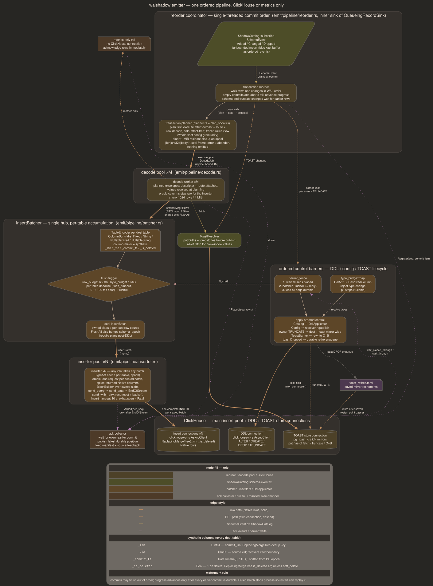

# emitter

CH-side ingest is a parallel decode+insert pipeline (`src/pipeline/`):

```text
pump -> QueueingRecordSink -> reorder (plan -> execute) -> [decode x M]
           -> InsertBatcher -> [inserter x N] -> ClickHouse
                             \-> ack collector -> emitter_ack_lsn
```

Pipeline stages live in `src/pipeline/{reorder,planner,plan_spool,
decode,batcher,inserter,ack,tail,mod}.rs`; encoding primitives
(`EmitterConfig`, `TableEncoder`,
`TablePlan`, `ColumnBuf`, value encode, `EmitterStats`) in
`src/ch_emitter.rs`; DDL in `src/ch_ddl.rs`; PG → CH type mapping in
`src/type_bridge.rs`. Pool sizes M/N come from `--decoder-pool-size` /
`--inserter-pool-size`; size 1 is the degenerate serial case. Design
and scaling axes in
[future/pipeline_backpressure_and_scaling.md](future/pipeline_backpressure_and_scaling.md)

Metrics-only runs (no `--ch-config`) stand up the same pipeline in its
degenerate configuration: `TailKind::Null` swaps batcher + inserters
for a swallow task that acks rows at receipt (zero CH connections), no
`DdlApplicator` (schema events observed, never applied), empty mapping
so planning routes nothing and seqs complete at placement —
watermark, idle advance, and slot semantics identical to a CH run

## Purpose

Translate committed-xact tuple streams from xact-buffer drain into
ClickHouse Native blocks buffered per table and sealed as complete
INSERTs, with enough parallelism that CH Cloud RTT + part-commit cost
doesn't bound throughput. DDL applies inside an ordering barrier so
ALTER / CREATE / DROP / TRUNCATE land strictly after all earlier data
is durable. Emitter ack-LSN (contiguous-done watermark) feeds the
manifest + standby `apply_lsn` so restart resumes from highest
commit-record LSN known durable on CH

## Stage walk



### Reorder coordinator — `pipeline/reorder.rs`

Single-threaded commit-order boundary. Runs as inner sink of the
daemon's `QueueingRecordSink` (off the WAL pump task, so replay gates
never pace wire delivery). Only `RM_XACT_ID` records reach its match:

- COMMIT — stash resolution against the descriptor log at the commit's
  `next_lsn`, then plan-then-execute:
  `XactBuffer::drain_committed` under the drain xid (prepared xid for
  COMMIT PREPARED) streams through the transaction planner into a
  sealed plan (side-effect-free, see Planner below); `execute_plan`
  replays it — heap segments dispatch as `DecodeJob` seqs after
  `ack.register(seq, commit_lsn)`, control entries fence and apply at
  their pinned positions. A plan error abandons the transaction before
  any side effect. Empty commits register a rows=0 seq so the
  contiguous watermark never gaps
- ABORT — drop buffer state, register + place a rows=0 seq (never a
  direct ack bump; everything moves through the gate)
- ASSIGNMENT — feed `SubxactTracker`
- PREPARE — no seq; `COMMIT PREPARED` drains it later (two-phase gap:
  [future/two_phase_commit.md](future/two_phase_commit.md))

Under an active memory budget every slice admits before dispatch, so
budget backpressure lands at the reorder, not mid-decode: newly sealed
chunk generations each admit a permit stored on the generation
(released with its last holder), and a slice permit covering decoded
heap bytes + row-batch metadata rides every routed row to insert ack
(see Memory budget below)

Barrier xacts (any `SchemaEvent` or `HeapOp::Truncate` in the drain)
run synchronously: data segments between catalog ops each get their own
seq, and each DDL / TRUNCATE is preceded by `barrier_fence()` — wait
all dispatched seqs *placed*, `FlushAll` the batcher, wait all seqs
*durable* — then `DdlApplicator::apply` / `truncate`. Toast lifecycle
rides the same applies: owner TRUNCATE wipes the toast mirror in-slice;
a toast rel's `Dropped` only queues its retire (durably, in the
`toast_retires.toml` ledger) — the wipe defers until the persisted
resolved floor passes the dropping commit, flushed at commit
boundaries, idle advance, and pipeline standup ([TOAST.md](TOAST.md)
Lifecycle). The slice's `new_rows` puts interleave with the
applies via sealed merge cursors ([TOAST.md](TOAST.md)
Lifecycle). Barrier
coarseness is deliberate; DDL and TRUNCATE are rare. Trailing data
after the last event flows async, already encoding against the
post-DDL shape

### Transaction planner — `pipeline/planner.rs` + `pipeline/plan_spool.rs`

Side-effect-free planning stage between drain and execution. Consumes
committed-drain batches in walk order and streams them into one plan
per transaction: heaps detoast and route at planning so the executor
never re-resolves, raw stashed records decode under their commit
verdict descriptors ([xact.md](xact.md) Commit-time stash), control
entries pin their walk positions, mirror-row refs and truncate fences
carry through re-based to plan-global indices. Every input-derived
failure — descriptor, decode, toast, route — surfaces before the first
transaction side effect; a plan error drops the writer, the file
unlinks, the transaction emits nothing

Forbidden side effects are unrepresentable, not merely avoided: the
planner holds no ack handle, no batcher channel, no CH client, no
config applicator. Route state folds into a `PlanRouteView` resolving
from frozen versions; in-walk control entries fold into the LOCAL view
only — global mapping/config/CH changes belong to the executor at
replay. This is what makes config changes whole-transaction-granular:
a transaction plans entirely under one route state, never mixes versions.
`route_for` returning `None` is the
deterministic unmapped discard, counted, planned as `route_id =
u32::MAX` — it skips detoast and codec work entirely

The plan itself is a transient validated spool (`plan_spool.rs`):
plans at or below `DEFAULT_PLAN_MEM_MAX` (1 MiB) stay memory-resident
so the common single-statement commit never touches the filesystem;
larger plans stream to a `.plan` file. Frame layout after the `WP`
magic + version header: `[len:u32][crc32c:u32][body]`, body tag 0 =
heap (`dict_id + route_id + heap bytes`, spill codec), tag 1 = seal
(`heap_count`). Bounded metadata — descriptor dictionary, route table,
control entries, row batches — stays resident in the plan header. A
missing seal means planning never finished; trailing bytes mean
corruption; file-backed plans checksum-verify fully before the first
side effect. Files are never durable: source-WAL reconstructible,
unlinked on success and failure alike, swept at startup by
`clean_plan_files` via the spill-dir clear

Validation coverage, one enforcement point per plan-success guarantee:
descriptor Present + unambiguous (stash verdicts at drain), operation
supported with logical tuple data (raw operation policy), decoded xid
owned by the xact family (`ForeignXid`), partial update fails the plan
(`PlanError::PartialUpdate`; no reconstruction path exists), needed
toast values resolve at planning, route snapshot complete by
construction, planned schema transitions carry old + new descriptors
into replay verbatim

### Decode pool — `pipeline/decode.rs`, ×M

Each worker pulls a `DecodeJob` of planned `RoutedHeap` envelopes —
descriptor and route ride each envelope, nothing here resolves catalog
or mapping state. Per heap: `detoast_heap` (values already resolved at
planning, chunks ride empty), oracle `PgPending`
resolution, then routes `RoutedRow`s to the
batcher in chunks (`DECODE_CHUNK_ROWS = 1024` / `DECODE_CHUNK_BYTES =
4 MiB`, amortizing the channel hop). After the xact's last row it
reports `Placed { seq, rows }`. Decode errors are fatal — a
never-placed seq would pin the watermark forever

`detoast_heap` acquires a leaf permit for the heap's aggregate value
peak (`check_value_caps`), shrinks it to retained decoded bytes, and
returns it; the worker attaches it as `RoutedRow.value_permit` beside
the slice admission permit, so decoded values and their encoder slab
copy stay covered to insert ack

Out-of-order completion across workers is fine: rows carry `source_lsn`
as `_lsn`, so `ReplacingMergeTree(_lsn)` converges per PK. At M=1
dispatch order (hence per-table WAL order) is preserved

### InsertBatcher — `pipeline/batcher.rs`

Single hub task owning one `TableEncoder` per destination table.
Encoding happens here, not in decoders, so rows from all M decoders
and all xacts merge into one part per flush window per table. Rows and
`FlushAll` share one FIFO channel (`BatcherMsg`, bound 256) so a
barrier's flush can never seal ahead of rows enqueued before it

Flush triggers, each sealing one `InsertBatch` (complete INSERT's
worth of owned column slabs + `per_seq` row counts for the collector +
the rows' admission/value permits, dropped post-insert-ack):

- `enc.rows >= row_budget` (default 65536)
- `enc.approx_bytes >= byte_budget` (default 1 MiB)
- per-table deadline armed on first buffered row (`flush_timeout`;
  operator `0` is substituted with a 100 ms pipeline default —
  `DEFAULT_PIPELINE_FLUSH` — else a cold table's rows pin the
  watermark indefinitely). Batcher sleeps to the nearest armed
  deadline, so `flush_timeout` is an upper bound on partial-block
  hold time; a `flush_timeout`-period ticker would put real hold
  time in `[flush_timeout, 2 * flush_timeout)`. Rows joining an open
  block do not extend its deadline, and a live `flush_timeout` change
  only affects blocks armed after it
- `FlushAll` from the DDL/TRUNCATE barrier or shutdown — seals every
  table, drops all encoders, bumps `schema_epoch` so next rows rebuild
  plans against post-DDL descriptors and inserters re-parse cached
  types

`flush_timeout` trades part count against ack latency: pgbench-shaped
4-table xacts coalesce into one MergeTree part per window instead of
one per xact

### Inserter pool — `pipeline/inserter.rs`, ×N

N `AsyncClient` connections. CH Cloud INSERT cost is mostly RTT +
object-store part commit, so throughput comes from keeping many
INSERTs in flight. Each inserter pulls `InsertBatch`es off a shared
mpmc queue — any idle inserter takes any batch, so a hot table can use
more than one connection — rebuilds the Native block over the batch's
owned slabs (`TypeAst` cache keyed on `(table, schema_epoch)`;
`TypeAst` is `Send` not `Sync`, each inserter parses its own), and
runs one `send_query` + `send_data` + `send_data_end` +
drain-to-`EndOfStream`

Durability invariant: `ack.acked(per_seq)` fires **only after** the
drain returns. Until then a connection drop replays the still-owned
batch — CH dedups the resend by `_lsn`. The batch (and its memory
permits) drops after the ack, so budget release never precedes
durability. `rows_emitted` / `blocks_sent` stats bump at the same
point, so a long-open window shows 0 rows until its first seal

### Ack collector — `pipeline/ack.rs`

Refcount-driven contiguous watermark. Downstream completes out of
order; `emitter_ack_lsn` (advertised as standby `apply_lsn`, bounding
source slot recycling) must not. Per seq track rows *placed* (decoder
routed) and *acked* (inserter drained `EndOfStream`); a seq is done
once `placed == acked` (rows=0 seqs done at placement). Watermark is
highest contiguous done seq's `commit_lsn`, published into the
`emitter_ack` value the status loop persists to the manifest

Event handlers only update stored state. `AckState::publish` updates the
watermark, both progress values, and the diagnostic snapshot. `apply`
calls it after every event. This ensures each event rechecks all
conditions that can advance progress. Updating these values in separate
event handlers caused a bug where `Trailing` was ignored if it arrived
while a seq was still in flight

`Trailing { lsn }` reports how far the pump has read after all buffered
transactions. Reorder sends it only when the transaction buffer is empty
(`on_idle_advance`). Collector saves this position and publishes it after
all registered seqs finish. `Gate<PlacedFrontier>` lets a barrier wait for
all rows to be routed. `Gate<AckFrontier>` lets it wait for those rows to
be durable. If collector exits, both waits return an error. Both scans
continue from their previous stopping point. Starting over for every
event made this work O(N²), used 100% CPU, and looked like a stuck chc
receive or INSERT

Each seq records how many rows decoder routed and how many ClickHouse
acknowledged. Reporting routed count twice or acknowledging more rows than
routed is an error. Collector counts error instead of leaving seq silently
incomplete. Events below completed frontier are harmless late messages.
Events for unknown seqs at or above frontier can leave work incomplete and
stop watermark. Collector counts these events separately and logs first one
while seq and frontier details are still available

`AckSnapshot` shows why watermark cannot advance: oldest incomplete seq,
reported and acknowledged row counts, saved trailing position, protocol
error count, and late event count. Collector updates snapshot after every
event, and daemon's stall watchdog reads it. Transaction buffer stats
cannot diagnose this case after rows have left buffer

`emitter_ack` is a `Monotone<EmitterAck>` seeded at the WAL re-read
start (`raw_start`), not 0: the status loop persists it and a zero first
write would overwrite progress loaded from a previous run. Updates use
`join`, which keeps larger of current and new values, so watermark cannot
move backward

### Fatal — `pipeline/mod.rs`

One-shot error signal shared across stages. First message wins (root
cause); pump polls it to exit, the barrier `select`s on it so a CH
outage mid-fence surfaces instead of hanging. Any stage error → fatal
→ daemon exits → manifest resumes on restart

## Memory budget

[`src/budget.rs`](../src/budget.rs): one process-wide resident-payload
pool (`[memory] resident_payload_max`, default 512 MiB) of weighted
byte permits. Channels bound item counts; the pool bounds bytes —
decode and insert concurrency divide it instead of multiplying
per-worker allowances. Stages acquire before allocating payload,
attach the permit to the owning value, release on drop; batch hand-off
transfers the permit with the bytes, never re-acquires

Two compartments, one deadlock model:

- **Admission** (`admit`) at pipeline entry points that can block —
  drain slice admission, sealed chunk generations — draws from
  `total - leaf_reserve`
- **Leaf** (`acquire`) for per-value allocations made while holding
  admission — store-fetch assembly, decompress output, body-spool read
  buffers, JIT mirror-row batches — draws from the whole pool

The reserve (`decoder_pool × inline_value_max`) is never consumed by
admission and workers hold at most one leaf, so a leaf under admission
waits only on other leaf holders — never a cycle. `build_budget` /
`leaf_reserve_for` (`pipeline/mod.rs`) validate at spawn that the
reserve fits half the pool (so admission keeps meaningful headroom)
and that admission fits one drain's retained state (body-spool +
index caps + slice headroom, so a mid-drain admit never waits on
units the drain itself holds). Acquisition never fails: a request
above a compartment's satisfiable share proceeds with only that share
metered (overshoot, counted) — a leaf clamps its waited share to the
reserve, an oversized admission passes unmetered — so one pathological
item softens the bound instead of stalling or failing the pipeline

`inline_value_max` (default 64 MiB) is the hard per-value cap:
`check_value_caps` rejects a value whose `va_rawsize` / `va_extsize`
exceeds it (`ValueTooLarge`, typed, non-retryable — replay decodes the
same value) before any assembly or decompress allocation, and sizes
the leaf need as aggregate retained bytes plus largest compressed
transient across the heap's pointers (duplicate old/new uses each
count). Resolution fetches per key on first use, decompresses
immediately, clones only for non-final uses, moves the buffer out on
last use

Gauges/counters: `walshadow_resident_payload_bytes` (+ `_peak_bytes`),
`walshadow_memory_budget_{waits,overshoots}_total`. Backup passes
share the pipeline pool (`PassContext.budget` →
`ToastResolver::with_budget`); the greenfield bootstrap tail runs a
leaf-only pool of the same size — no admission stage, values capped
and held to insert ack ([bootstrap.md](bootstrap.md))

## Connections

N inserter connections + 1 `DdlApplicator` connection, all built off
the same `EmitterConfig` `(host, port, user, password, database)`.
DDL rides its own connection because CH's client is
single-query-at-a-time — an in-flight INSERT would block an ALTER on
the same wire. Ordering between data and DDL comes from the barrier
fence, not connection discipline

Compression: feature-gated through walshadow's own `lz4` / `zstd`
features which forward to `clickhouse-c-rs`. `CompressionChoice::Lz4`
is default; `build_codec` returns `EmitterError::CompressionUnsupported`
when variant's feature is off. CH wire default is LZ4 so default build
matches CH's own posture

## TableEncoder + ColumnBuf

`TableEncoder` owns one `Vec<ColumnBuf>` per destination column, mapped
+ synthetic. Built lazily on first row via `TablePlan::build` off
descriptor + mapping; cached in the batcher hub keyed on source
`<namespace>.<relname>` until a barrier `FlushAll` clears it. Encoder
is column-major: each column accumulates into its own slab,
`take_block` hands the slabs to an `InsertBatch`, the inserter's
`BlockBuilder` borrows into them at send time

`ColumnBuf` variants:

| variant | shape | source CH kind |
|---|---|---|
| `Fixed { width, bytes }` | packed LE | non-null fixed-width (Int*, Float*, Decimal*, FixedString, DateTime64, Enum) |
| `String { offsets, data }` | varlen + cumulative offsets | non-null String |
| `NullableFixed { width, null_map, inner }` | dense fixed + null-bitmap | Nullable(fixed) |
| `NullableString { offsets, data, null_map }` | varlen + null-bitmap | Nullable(String) |

Width comes from `clickhouse-c-rs`'s `chc_type_elem_size`, not a
walshadow-side type table, so `FixedString(N)`, `DateTime64(p)`,
`Decimal*(p,s)`, `Enum8` etc resolve without walshadow mirroring
upstream surface. `elem_size == 0` means varlen; only varlen shape
today is `String`, anything else dies cleanly at `append`

## Type bridge

`type_bridge::map(att, pk_member) -> ResolvedColumn` maps one
`RelAttr` to CH type expression plus optional `DEFAULT <expr>`.
`pk_member = true` strips `Nullable(_)` wrap because CH refuses
`Nullable` in `ORDER BY`. User-visible matrix lives in
[`docs/destination-tables.md`](../docs/destination-tables.md#default-type-mapping),
hard-coded by `base_type_for`

`numeric` needs `1 ≤ p ≤ 76` for `Decimal`; `p = 0`, scale outside
`0 ≤ s ≤ p`, or unconstrained `numeric` (which can carry NaN/±Inf) fall
back to `String`. Into a `Decimal` column `encode_value` ships the value
as a scaled little-endian two's-complement integer (`value * 10^scale`,
U256 arithmetic spanning Decimal128/256 widths); NaN/±Inf into a
`Decimal` column is unrepresentable and errors with `UnsupportedValue`
(map that column to `String` to keep them). A `String`-mapped `numeric`
still ships lossless text including NaN/Inf

`time` → `Time64(6)` ships raw microseconds-since-midnight LE. CH 25.x
gates `Time64` behind `enable_time_time64_type=1`; the dest server's
profile must enable it or auto-create / insert on `time` columns fails.
`timetz` → `String` renders via `codecs::timetz_to_text`, preserving the
UTC offset the old fixed encoding silently dropped

Default expressions reconstruct from `RelAttr.missing_text` (fast-path
`attmissingval[1]` PG plants on `ALTER TABLE ADD COLUMN ... DEFAULT k`).
`render_default` routes through
`heap_decoder::missing_value_for(att) -> ColumnValue`, then
`column_value_to_sql_literal` emits CH literal — booleans land as
`true`/`false`, ints unquoted, strings single-quoted with `'` escaping,
timestamps as `toDateTime64('...', 6, 'UTC')`. Unbridged shapes return
`None` so `ALTER TABLE ADD COLUMN` lands without a `DEFAULT` clause;
CH applies its own zero-init

### Synthetic columns

Destination metadata contract lives in
[`docs/destination-tables.md`](../docs/destination-tables.md). Values stay
non-nullable and append after mapped columns in `TableEncoder::new`. Names come
from the relation's resolved `SystemColumns`, so every site that renders or
encodes a metadata column reads them per relation instead of a constant

The delete marker is optional (`is_deleted = false`). Without it a DELETE would
land as a phantom insert of the old image, so those rows are discarded where the
placed count is taken (`decode_and_route`, and the object-store gap-replay
sink), counted in `walshadow_emitter_deletes_discarded_total`. Dropping them
anywhere later would short the ack collector's per-seq reconcile and pin the
watermark

`_lsn` is dedup key because emitter ack lags actual CH durability by up
to one flush window. On restart the manifest floor rewinds to
last contiguous-done LSN; everything between that and the crash
re-emits, `ReplacingMergeTree(_lsn)` resolves duplicates server-side
without walshadow having to track which rows already landed

## Mapping config

User mapping syntax and behavior live in
[`docs/table-selection.md`](../docs/table-selection.md)

`MappingHandle = Arc<tokio::sync::RwLock<HashMap<RelName, TableMapping>>>`
is the live handle the planner's route view resolves from. Handle is
cloneable; daemon's SIGHUP task swaps whole inner `HashMap`. Routes
freeze into each transaction's plan as `RouteSnapshot`s — a mapping
write after planning can never alter a planned row, and the swap takes
effect at the next transaction's plan. The batcher's cached
`TableEncoder` keeps its old `TablePlan` until the next barrier
`FlushAll` (or restart) rebuilds it — a SIGHUP retarget therefore
fully applies only at the next DDL/TRUNCATE boundary

## Namespace mapping gaps

`auto_create`, `target_database`, and `drop_table_strategy` resolve through
`ResolvedConfig` in [`src/config.rs`](../src/config.rs)
(`tables` + `namespaces` + `columns` type-override table) published on a
`watch::Receiver<Arc<ResolvedConfig>>`, CLI > PG-row > TOML merge, SIGHUP
republish. The planner's route view reads `Arc<RwLock<HashMap>>` when
freezing routes; a refresher bridges the watch snapshot into it. The
richer namespace surface is not covered:

- `NamespaceMapping.order_by_default`: `render_create_table` hard-codes
  `ORDER BY (_lsn)` fallback when no PK exists
- `NamespaceMapping.engine_default`: `render_create_table` hard-codes
  `ENGINE = ReplacingMergeTree(_lsn)`; no per-namespace override (e.g.,
  `MergeTree`, `CollapsingMergeTree`)

See [future/runtime_config_from_pg.md](future/runtime_config_from_pg.md) for
the source-PG-driven work (signals, opt-in + backfill, net-new knobs)

## DdlApplicator

`ch_ddl.rs::DdlApplicator`, owned by the reorder coordinator. Events
originate at descriptor capture ([desc_log.md](desc_log.md)) as log
diffs, ride the xact buffer keyed `(drain_xid, valid_from)`, and
surface in `drain_committed`'s `ordered_events`; the barrier applies
each in LSN order.
`DrainEntry::ToastBarrier` rides the same loop at commit LSN: the
put-cursor flushes the generation's births first, then the barrier runs
the store-side residual insert-select ([TOAST.md](TOAST.md)). Apply
table:

| `SchemaEvent` | CH SQL |
|---|---|
| `Added { desc }` | `CREATE TABLE IF NOT EXISTS` (in the namespace's `target_database`, else global default) when namespace `auto_create = true` and no pre-pinned mapping. Auto-derives `TableMapping` against that same database post-success so subsequent rows ship against the new table. A mapped rel under strategy = drop instead re-creates its dest from the mapping (`render_create_table_from_mapping`) — dest lifecycle follows source DDL, so create → drop → create round-trips; `IF NOT EXISTS` no-ops when the dest still stands |
| `Changed { diff }` | `ALTER TABLE … RENAME COLUMN` first (so position-match diffs don't trip into drop+add), then `ALTER TABLE … ADD COLUMN IF NOT EXISTS` per added attnum, then `ALTER TABLE … DROP COLUMN IF EXISTS` per dropped attnum |
| `Changed.type_changes` | rejected, logged, `stats.type_changes_rejected += n`. Operator handles via manual CH migration |
| `Dropped { rel_name }` | gated on the namespace's `DropTableStrategy` (`drop_strategy_for`, else global): `Retain` (default) skips silently, `Warn` skips at WARN, `Drop` runs `DROP TABLE IF EXISTS` |

`render_create_table` builds CREATE off descriptor: attributes through
`type_bridge::map`, then the sort key — the operator `order_by`
([`docs/destination-tables.md`](../docs/destination-tables.md)) when it names
non-nullable destination columns, else PK columns first (else `_lsn` fallback) —
engine pinned to `ReplacingMergeTree(_lsn)`. Synthetic
columns appended after mapped columns, same shape as `TablePlan::build`.
`render_create_table_from_mapping` builds off the mapping instead (its
columns are the emitter's INSERT contract), resolving `ORDER BY` key
attnums through the mapping and skipping Nullable targets (CH rejects
nullable sort keys)

`apply_changed` also mutates live `MappingHandle` via
`mutate_mapping_for_diff`: renames update `target_name` in place (when
operator's TOML used old source name), drops strip `ColumnMapping`,
adds push new entry derived through `type_bridge::map`. Operator-pinned
overrides survive: only `src_attnum`-matching entries the applicator
could have produced get touched

DDL has no retry: an applicator error trips fatal so the operator sees
it directly. Runtime-config-from-PG work may add bounded reconnect for
the DDL connection

### Baseline (the `Added`-vs-`Changed` discriminator)

Whether a relation's first post-start DDL surfaces as `Added` or
`Changed` keys on the descriptor log's predecessor for its oid
([desc_log.md](desc_log.md)) — durable across restarts, seeded at first
attach with every eligible rel's boot shape. A pinned table's first
post-start `ALTER` therefore always diffs against a real baseline →
`Changed` → the `apply_changed` path above runs the CH ALTER; no warm-up
step exists to forget.

The baseline is the *full source* descriptor, never the mapping: a
pinned subset's unmapped columns sit in the log and read as
"operator-excluded", so a later `ALTER` adds only genuinely-new columns,
never re-adds an excluded one. Auto-create tables and opted-in rels get
an idempotent boot `Added` pass over the log's active Present set each
start (`CREATE TABLE IF NOT EXISTS` no-ops standing dests), so newly
enabled config picks up existing rels at the next boot. Boot-time drift
(column added while the daemon is down) lands as `Changed` at the next
boundary touching the rel — the descriptor log diffs against the stored
shape, not a freshly fetched one.

### Barrier fence (ordering data around DDL)

`ReorderSink::barrier_fence` = `wait_placed_through(next_seq)` (decode
pool routed every earlier row onto the batcher channel) → batcher
`FlushAll` + reply (seals every row enqueued before it — shared FIFO
channel makes the ordering structural) → `wait_through(next_seq)`
(every earlier seq durable on CH). Only then does the applicator run.
Fence is global, not per-table: simpler than the surgical
single-table close the serial emitter did, acceptable because barriers
are DDL/TRUNCATE-rate. `FlushAll` also bumps `schema_epoch`, so
post-DDL rows rebuild `TablePlan`s and inserters re-parse types

## TRUNCATE path

TRUNCATE is a reorder barrier, never a batcher row (`handle_row`
errors on `HeapOp::Truncate` by construction):

1. dispatch pending data segment as its own seq
2. `barrier_fence()` — earlier rows for the relation are durable
3. `DdlApplicator::truncate` runs `TRUNCATE TABLE <dest>` on the DDL
   connection, drains to `EndOfStream` / `Exception`
4. bump `stats.truncates_emitted`; subsequent segments of the same
   xact follow as fresh seqs

Within a barrier xact, data segments between TRUNCATEs each get their
own seq and fence, so a `TRUNCATE` (no `_lsn`, can't ride
`ReplacingMergeTree` reconciliation) orders correctly against
surrounding inserts

`RESTART_SEQS` flag is ignored — sequence state isn't replicated.
PG's `TRUNCATE … RESTART IDENTITY` arrives as same `HeapOp::Truncate`
with no flag distinction at emitter layer; bit lives on PG xlog record
but doesn't propagate through `DecodedHeap`

## Foreign-DB row skip

Physical replication ships the whole cluster's WAL, so heap records
for relations in other databases reach the decoder sink. The
record-time spanned lookup answers `ForeignDb` (filenode's `db_node`
is neither the shadow DB nor a shared catalog — see
[shadow.md](shadow.md)) and the sink skips the record as a counted
`catalog_not_found`; a foreign filenode that reached the commit-time
stash instead resolves `ForeignDb` at `resolve_stash` and counts
`stash_foreign_db_skipped` once per filenode ([xact.md](xact.md)).
Nothing foreign survives to planning or the decode pool

## Read-time defaults integration

PG's fast-path `ALTER TABLE ADD COLUMN … DEFAULT k` plants
`attmissingval[1]` instead of rewriting heap. `RelAttr.missing_text`
carries typoutput text; resolution tiers:

- Tier 1 (immediate): bool / int / float / numeric / text — decoder
  resolves at parse time via `heap_decoder::missing_value_for(att)`,
  batcher sees fully-decoded `ColumnValue`
- Tier 2 (typmod-aware): timestamp / timestamptz / date — decoder
  resolves with typmod
- Tier 3 (oracle): unsupported / array / domain types — decoder emits
  `ColumnValue::PgPending { raw, type_oid }`. Decode workers run
  `resolve_pending_tuple` against the shadow-side extension; falls
  through to raw bytes when oracle absent

`encode_value` handles a surviving `PgPending` by shipping `raw` as
String — no error, no stat bump, operators handle post-process via
PG-side tooling. See [decoder.md](decoder.md) for tier classification +
[oracle.md](oracle.md) for extension protocol

## Ack-LSN tracking

See [Ack collector](#ack-collector--pipelineackrs) for mechanism. The
operational contract:

- `emitter_ack` in the manifest is the contiguous-done
  commit-record LSN — every xact at or below it is fully durable on
  CH. It lags `drain_lsn` by up to one flush window
  (`flush_timeout`); the per-table deadline bounds the lag even on
  cold tables
- rows=0 seqs (aborts, empty commits, fully-filtered xacts) complete
  at placement so they never pin the watermark
- trailing non-commit WAL acks only when the xact buffer is empty and
  every seq is done — a quiescent-tick nudge can't claim rows still in
  flight. The collector holds the highest such position and publishes it
  once the frontier catches up: a source that goes quiet right after its
  last commit sends no second nudge, so a dropped one would pin
  `emitter_ack` at that commit
- a placed-but-never-acked batch pins the watermark forever by design
  (retry exhaustion is fatal first); the daemon's stall watchdog
  surfaces the oldest incomplete seq

See [ops.md](ops.md) for manifest + recovery contract; slot advance
keys on `min(shadow_replay, emitter_ack)`, replay starts at the floor

## Bootstrap shares the tail

`pipeline/tail.rs` packages batcher + inserter pool + ack collector as
one reusable unit. Greenfield bootstrap
(`pipeline/bootstrap.rs::drain`) feeds the identical tail from the
page walk — bootstrap inherits the N-connection pool, reconnect +
retry, durable watermark, and backpressure for free. One synthetic seq
per rfn; `tail.finish` seals partial batches, waits all seqs durable,
then drains the cascade. No `DdlApplicator` attached (bootstrap
descriptor set is frozen at snapshot time). See
[bootstrap.md](bootstrap.md)

## Retry behaviour

Retry lives at the inserter, around one prepared INSERT
(`send_with_retry`): bounded attempts (`RetryConfig::max_attempts`)
with exponential backoff capped at `max_backoff`, reconnecting between
attempts. The sealed block is unchanged across retries, so a reconnect
just resends — CH dedups by `_lsn`. `insert_timeout` (default 30 s)
wraps the whole send so a connection wedged mid-INSERT surfaces as
retryable `EmitterError::Timeout` instead of pinning the watermark

`is_retryable` classifies `EmitterError::{Io, Client, ServerException,
Timeout}` as transient (network / CH-server / clickhouse-c protocol);
`Config`, `Type`, `Catalog`, `UnsupportedValue` stay fatal because
they encode bugs in daemon or mapping that retry would loop forever on

Budget expiry trips `Fatal` — daemon exits, manifest resumes on
restart. See [future/ch_bounce_recovery.md](future/ch_bounce_recovery.md)
for the deeper "re-emit from spill" design (segment-buffered replay across
extended CH outages)

## Cross-links

- [xact.md](xact.md) — `XactBuffer::drain_committed` merges
  `DecodedHeap` + `SchemaEvent` in source-LSN order; reorder consumes
  the drain
- [shadow.md](shadow.md) — `ShadowCatalog::subscribe` produces
  `SchemaEvent` stream; catalog snapshot drives descriptors
  `TablePlan::build` reads
- [decoder.md](decoder.md) — `HeapDecoder` produces `ColumnValue` /
  `DecodedHeap`. Read-time defaults tier-classify here
- [ops.md](ops.md) — manifest, stall watchdog, SIGHUP mapping
  reload, slot advance on `min(shadow_replay_lsn, emitter_ack_lsn)`
- [bootstrap.md](bootstrap.md) — shared-tail wiring, `tail.finish`
  handshake
- [oracle.md](oracle.md) — Tier 3 default resolution via PG-side
  extension, `PgPending` routing
- [future/pipeline_backpressure_and_scaling.md](future/pipeline_backpressure_and_scaling.md)
  — pipeline design record; remaining: pump wire/record split,
  bootstrap decode pool (Option B), hot-table sharding, M/N sizing
- [`src/config.rs`](../src/config.rs) — resolver substrate,
  `ResolvedConfig`, snapshot publication, and precedence
- [future/runtime_config_from_pg.md](future/runtime_config_from_pg.md)
  — pg-driven config overlay building on the resolver substrate
- [future/ch_bounce_recovery.md](future/ch_bounce_recovery.md) —
  spill-buffered re-emit for extended CH outages
