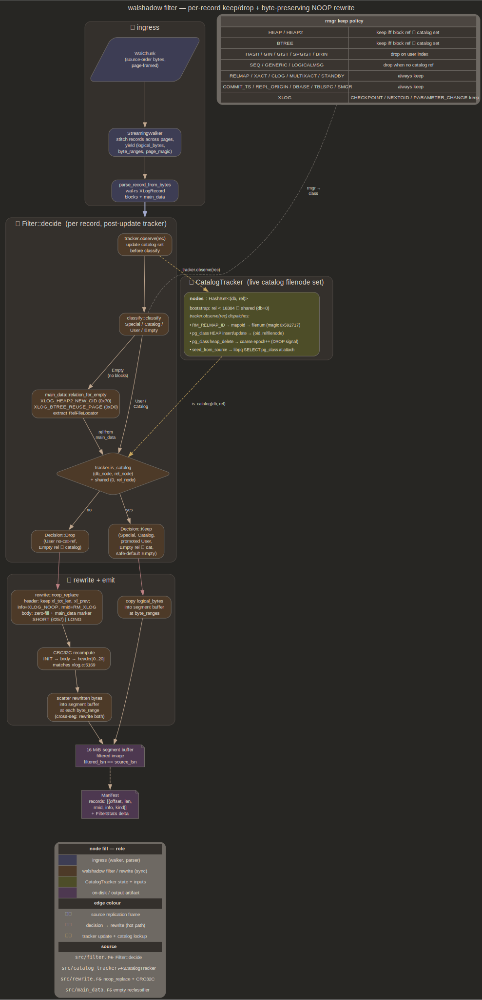

# filter

Per-WAL-record keep/drop decision, byte-preserving NOOP rewrite. Filter
consumes parsed `XLogRecord`s in source order, returns `Keep` or `Drop`,
mutates drop bytes in-place into `XLOG_NOOP` of identical `xl_tot_len`
with CRC32C recomputed. Output re-parses through wal-rs `WalParser`;
`xl_prev` chain stays intact so shadow PG's recovery never sees a gap

`filtered_lsn == source_lsn` per byte offset, no LSN translation
downstream. Manifest sidecar indexes byte positions, not LSN pairs



## Classifier

`src/classify.rs::classify` buckets per record into Special, Catalog,
User, Empty (see diagram cluster ② + rmgr keep-policy subtable). User
upgrades to Keep when tracker holds the block ref; Empty falls back to
Keep when `main_data` carries no recognised locator

Catalog detection: `rel_node < FirstNormalObjectId` (16384, see
`~/s/postgresql/src/include/access/transam.h`). Fresh-initdb shadow has
every system catalog (mapped + non-mapped) at oid < 16384, so bootstrap
rule covers static catalog set without runtime state

Shared catalogs (`pg_database`, `pg_authid`, `pg_tablespace`,
`pg_shdepend`, …) live in `global/`, marked `dbNode = 0`.
`CatalogTracker::is_catalog` consults both `(db_node, rel_node)` and
`(0, rel_node)` so per-db records match shared-catalog entries.
`rel_node == 0` is non-catalog (InvalidOid sentinel)

Mixed-block records (any block ref touching catalog) classify as
`Catalog`, never `User`. PG occasionally emits records touching a
catalog index plus a user relation in the same record; prefer
false-keep to false-drop

`rmgr_label` returns human-readable rmgr name for diagnostics; unknown
ids stringify as `rmgr_N` for forward compat with future PG majors

## CatalogTracker

`src/catalog_tracker.rs`. Live set of post-bootstrap catalog filenodes
plus per-db `pg_class` filenode map. Survives VACUUM FULL / CLUSTER /
REINDEX / SET TABLESPACE on mapped + non-mapped catalogs

State:

- `nodes: HashSet<(u32, u32)>` — `(db_node, rel_node)` for every
  catalog filenode learned at runtime. `db_node = 0` entries shadow all
  per-db queries
- `pg_class_filenode: HashMap<u32, u32>` — current `pg_class` filenode
  per database. Empty bootstrap falls through to `rel == 1259` (initial
  mapped relfilenode)
- `relmap_updates`, `pg_class_writes_{decoded,undecoded,oid_in_prefix}`,
  `seeded_from_source` — diagnostic counters in the manifest

Inputs:

- `RM_RELMAP_ID / XLOG_RELMAP_UPDATE` — authoritative for mapped
  catalogs. Body is `xl_relmap_update` (dbid+tsid+nbytes) plus 524-byte
  `RelMapFile` (magic `0x592717`, n, 64 mappings, CRC, see
  `~/s/postgresql/src/backend/utils/cache/relmapper.c`). Each non-zero
  `(mapoid, mapfilenumber)` adds `mapfilenumber` under record's `dbid`
  (or shared set if `dbid == 0`). Malformed bodies bump counter, apply
  nothing
- Heap writes to `pg_class` — `pg_class_decoder` extracts
  `(oid, relfilenode)` from `XLOG_HEAP_INSERT` / `HEAP_UPDATE` /
  `HEAP_HOT_UPDATE`. Filtered on `oid < FirstNormalObjectId` so
  user-table inserts into pg_class never pollute. VACUUM FULL on a
  non-mapped catalog often prefix-compresses past the OID column with
  `XLH_UPDATE_PREFIX_FROM_OLD`, hitting `oid_in_prefix` counter,
  closed later by snapshot seeding
- `seed_from_source(client)` — queries source PG once at attach time
  for every `(catalog_oid, current_filenode)` pair under `oid < 16384`.
  Closes the "long-running source already rotated a mapped catalog
  before walshadow attached" hole. Shared catalogs seed under
  `db_node = 0`, per-db under `current_database()` oid
- DROP TABLE coarse signal — `heap_delete` against current `pg_class`
  filenode bumps invalidation epoch so ShadowCatalog drops cached
  descriptors. No tuple decode (system catalogs default to
  `relreplident = 'n'`, WAL omits dying tuple)

`set_invalidation_epoch` / `set_pg_class_delete_epoch` attach
`Arc<AtomicU64>` counters shared with `ShadowCatalog::sweep_dropped`.
Senderless trackers (CLI, batch tests) leave both `None`, signal is a
no-op

## Rewrite path

`src/rewrite.rs::noop_replace` takes complete record buffer (header +
body, no page-header interruptions) and rewrites in-place:

- Header: preserve `xl_tot_len` (0..4) and `xl_prev` (8..16), zero
  `xl_xid`, set `info = XLOG_NOOP (0x20)`, `rmid = RM_XLOG`, zero
  2-byte pad + 4-byte CRC placeholder
- Body: zero-fill, plant SHORT (`XLR_BLOCK_ID_DATA_SHORT` + 1-byte
  length) or LONG (`XLR_BLOCK_ID_DATA_LONG` + 4-byte length) main_data
  marker per body size. Threshold 257 bytes (SHORT max)
- CRC32C: body bytes via `crc32c::crc32c_append` seeded at 0, then
  header[0..20]. Matches PG `INIT_CRC32C` / `COMP_CRC32C(body)` /
  `COMP_CRC32C(header_pre_crc)` / `FIN_CRC32C` exactly. Got wrong on
  first attempt by including `xl_crc` in input; round-trip parse caught

`src/filter_segment.rs::filter_segment` orchestrates one segment:

1. `SegmentWalker` (`src/segment.rs`) yields every complete record
   with `(logical_bytes, byte_ranges, start_offset, page_magic)`.
   Handles records straddling 2+ pages and headers split across page
   boundary (`Pending::total_len` resolves lazily once 24 header bytes
   accumulate)
2. `parse_record_from_bytes(logical_bytes, page_magic)` builds wal-rs
   `XLogRecord` so Filter sees populated block refs + main_data. Page
   magic threads through so FPI bit semantics match source PG major
3. `Filter::decide` updates tracker, returns Keep/Drop
4. Drops: `noop_replace` on clone of `logical_bytes`, scatter rewritten
   bytes back into output buffer at each `byte_range` (cross-segment
   records re-stitch across page boundaries, both segs must
   NOOP-rewrite or shadow PG PANICs on missing pages)
5. Emit `Manifest { records: [Entry { offset, len, rmid, info, kind }],
   stats }` plus parsed records so downstream sinks parse once

Per-segment `ManifestStats` come from `FilterStats::delta_from` against
entry snapshot; long-lived `Filter` accumulates cumulative stats across
every segment in the stream

## Filter binary

`src/bin/filter.rs` is `walshadow-filter`: one-shot CLI for offline
filtering of one segment file. Usage:

```text
walshadow-filter --in seg.wal --out-dir filtered/ [--manifest <path>]
```

Reads segment via wal-rs `segment_file::open_segment_file` (suffix-keyed
codec: `.zst` / `.lz4` / `.gz` / `.lzma` / `.br`, `.partial` peel,
`Method::None` fallthrough), constructs local `Filter::new()`, calls
`filter_segment`, writes `filtered/<basename>` + JSON manifest sidecar.
Per-invocation filter is fine here, CLI takes one segment at a time;
multi-segment correctness lives in `walshadow-stream` which owns
long-lived `Filter` on `WalStream`

wal-rs supplies on-wire constants via `pg::walparser` exports —
`X_LOG_RECORD_HEADER_SIZE`, `X_LOG_RECORD_ALIGNMENT`,
`XLR_BLOCK_ID_DATA_SHORT/LONG`, `XLP_LONG_HEADER`,
`XLP_PAGE_MAGIC_PG15` (kept under that name even though it's the
universal "minimum walshadow accepts" magic, PG 15 is FPI-layout floor)

`src/bin/classify.rs` is `walshadow-classify`: early-iteration holdover
walking segments through `WalParser` + `Summary::observe`, printing
per-class and per-rmgr counts. Does not rewrite, pure observability

## Per-stream Filter

`Filter` is a field on `WalStream`, not constructed per segment. Every
relmap update, every decoded pg_class heap write, every
bootstrap-seeded filenode must survive across segment boundaries.
Per-segment construction was masked by single-segment fixtures, broke
at first rotation in a live stream

`flush_current` / `close` thread `&mut self.filter` into
`filter_segment`. `tests/multi_segment_filter.rs` covers regression:
seg 1 carries `XLOG_RELMAP_UPDATE` mapping `pg_class` to filenode
50000, seg 2 carries heap write at that filenode; filter must keep
seg 2's record

Per-segment manifest stats stay correct because `FilterStats: Copy +
delta_from(prev)`; `filter_segment` snapshots cumulative stats on
entry, reports difference

## What gets dropped

User-data drops, never reach shadow PG:

- `RM_HEAP` / `RM_HEAP2` against user relations (rel_node ≥ 16384, not
  in tracker): INSERT, UPDATE, HOT_UPDATE, DELETE, LOCK, INPLACE,
  MULTI_INSERT, FREEZE_PAGE, VISIBLE, PRUNE, VACUUM, CONFIRM,
  LOCK_UPDATED
- `RM_BTREE` against user indexes: INSERT_LEAF/UPPER/META, SPLIT_L/R,
  DEDUP, VACUUM, DELETE, MARK_PAGE_HALFDEAD, UNLINK_PAGE, NEWROOT,
  REUSE_PAGE
- `RM_HASH`, `RM_GIN`, `RM_GIST`, `RM_SPGIST`, `RM_BRIN` against user
  indexes: all info bytes when no block ref hits a tracked catalog
  filenode
- `RM_SEQ` against user sequences
- `RM_GENERIC` / `RM_LOGICALMSG` user-data variants when no block ref
  hits catalog set

Special rmgrs always pass through verbatim (xlog, xact, clog,
multixact, standby, relmap, commit_ts, repl_origin, dbase, tblspc,
smgr). `XLOG_SWITCH` is a special-rmgr record, byte-identical across
rewrite (`filter_segment_tests::xlog_switch_record_passes_through_filter`)

Steady-state OLTP keep-fraction on `fixtures/wal/filter/` capture is
~0.04% (17 kept of 42,091 records, no DDL). DDL-heavy windows shift
toward 8%+ as schema setup dominates WAL

## Alternative considered: PG fork with relfilenode whitelist

Other path was a patched PostgreSQL where `redo` consults a whitelist
before each record, skips user-data redo entirely. Rejected. CRC
rewrite wins: walshadow's per-record CRC32C on hardware-accelerated
SSE4.2 path is roughly 1 ns/byte single-core, one-time spend on records
already parsed once anyway. PG fork ties releases to PostgreSQL branch
cadence, requires re-validating recovery invariants per minor bump,
leaks complexity into operator's deploy story. Byte-preserving rewrite
keeps shadow PG unmodified and lets walshadow ship independently

Future budget for >1 GB/s WAL throughput would push CRC into
parallel-segment-pipeline regime; cross-link
[future/risks.md](future/risks.md) for throughput measurement question

## Cross-links

- [source.md](source.md) — `SourceFeed` / `WalStream` pump handing
  parsed records via `Filter::decide`, streaming pipeline ownership,
  `RecordSink` fan-out, `DirSegmentSink`
- [shadow.md](shadow.md) — consumer of filtered bytes via shadow PG
  recovery, parsed-record hand-off feeding CH Native emitter without
  re-parse
- [overview.md](overview.md) — system shape, filter contract, why
  rewrite over fork
- [future/risks.md](future/risks.md) — throughput measurement for
  parallel CRC
