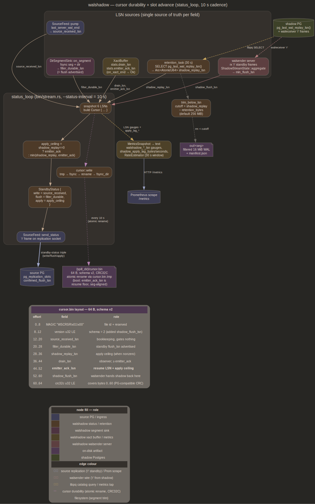

# ops

Operational scaffolding for production deployment. Four sibling
surfaces: preflight validators, HTTP/Prom metrics, filtered-segment
retention, durable resume manifest. None touches decoder fidelity; job
is to make long-running daemon survivable, observable, resumable

## Purpose

- Validate environment at boot so misconfiguration surfaces as one
  aggregated report instead of "fix one issue, restart, hit next"
- Expose every load-bearing LSN + per-rmgr filter counter + xact buffer
  occupancy as Prom text so operators see lag before CH does
- Retain filtered segments below shadow's replay head for configurable
  debug window, drop older ones to bound disk
- Persist resume state (six LSNs + resolved floor + source identity)
  across `kill -9` so daemon restart hands source's slot byte-identical
  write/flush/apply triple, and `cargo test --test kill_restart` proves
  end-state parity over 15 seeded kill/restart cycles

## Preflight validators

[`src/preflight.rs`](../src/preflight.rs). Aggregates every finding
into one [`PreflightReport`] before failing, so greenfield deployments
hitting 3-4 setup issues see them all at once. Checks driven from
`Inputs { source_sql, shadow_sql, slot, ch_config }`:

- `server_version_num >= MIN_SERVER_VERSION_NUM` (160_000). Catalog
  accessors assume PG-16 column layouts
- `source_major == shadow_major`. Same-physical-WAL standby cannot span
  major versions, PG's catalog layout diverges across them
- `wal_level = 'logical'`. Physical-only WAL omits old-tuple bytes
  UPDATE / DELETE need
- `--slot` resolves in `pg_replication_slots` when set
- Every `--ch-config` mapped relation has a usable row key:
  `relreplident` ∈ {`'f'`, `'i'`}, or `'d'` with a primary key. `'n'` and
  keyless `'d'` are rejected — DELETE needs a key to mark the row, cleared
  non-key values are fine. `FULL` is accepted, not required. Uses
  `to_regclass(text)` so missing relations land as `MappedRelMissing`
  (NULL row), not `SqlState::UNDEFINED_TABLE` SQL error. `quote_ident`
  alternative rejected, doesn't handle `"namespace.relname"` form

Each finding renders to a precise variant with operator-actionable text
(add a PRIMARY KEY, or `ALTER TABLE foo REPLICA IDENTITY USING INDEX / FULL`
on the source). No
silent-skip fall-throughs. `--skip-preflight` exists for development
work, not production. Daemon prints report and exits non-zero on any
finding

## Metrics endpoint

[`src/metrics.rs`](../src/metrics.rs). Hand-rolled Prometheus text
format over tokio TCP loop. No `prometheus` crate dep, ~80 LOC of
`writeln!` against `MetricsSnapshot`. `--metrics-bind 127.0.0.1:PORT`
opens listener; `:0` picks ephemeral port. HTTP server returns same
body for any path so `curl http://host:port/` works alongside `/metrics`

Endpoint doubles as bootstrap-readiness gate: integration tests poll
`fx::wait_for_listen(metrics_addr)` to detect that preflight +
bootstrap finished before driving workload

Inventory by category:

### LSN gauges

- `walshadow_source_received_lsn` — highest `server_wal_end` on
  replication socket
- `walshadow_filter_lsn` — last segment-boundary filter dispatched
- `walshadow_shadow_replay_lsn` — `pg_last_wal_replay_lsn()`, polled
  shared with retention sweeper via one `Arc<AtomicU64>`
- `walshadow_decoder_commit_lsn` — wired to `XactBufferStats.drain_lsn`
- `walshadow_emitter_ack_lsn` — pipeline ack collector's atomic
  (contiguous-done watermark, see [emitter.md](emitter.md))

### Counters

- `walshadow_filter_records_total{rmgr,route}` — labelled per
  (rmgr name, "to_shadow"|"to_decoder")
- `walshadow_xacts_{committed,aborted}_total`
- `walshadow_decoder_{decoded,partial,toast_chunks,toast_malformed}_total`
- `walshadow_emitter_{rows,blocks,xacts,unsupported_relations}_total`
- `walshadow_decode_{resolved,fallback_raw,validate_sampled,validate_mismatches,errors}_total`
  (oracle path, see [shadow.md](shadow.md))
- `walshadow_spill_evictions_total`, `walshadow_uptime_seconds`

### Buffer gauges

`walshadow_xact_{active,bytes_in_memory}`,
`walshadow_spill_{xacts_active,bytes_active}`,
`walshadow_drain_resident_bytes` + `walshadow_drain_{chunk,row}_resident_bytes`
ownership shares (held until the last drain consumer drops, see
[TOAST.md](TOAST.md) Drain payload residency),
`walshadow_toast_xact_spool_bytes` (body-spool disk, not resident),
`walshadow_bootstrap_deferred_{bytes,spool_bytes}` (deferred-spool
memory prefix / file)

### Memory budget

`walshadow_resident_payload_bytes` / `_peak_bytes` — bytes held by live
budget permits across pipeline stages;
`walshadow_memory_budget_{waits,overshoots}_total` — acquisitions that
waited for a release / requests above a compartment admitted with only
the satisfiable share metered. See [emitter.md](emitter.md) Memory
budget

### Shadow apply lag

- `walshadow_shadow_apply_lag_bytes` (gauge):
  `source_received_lsn - min_apply_lsn` across active shadow
  walreceivers. Caller saturates to 0 when shadow is ahead. When no
  shadow is connected, caller passes `source_received_lsn` so
  disconnect surfaces as max lag, not silently absent
- `walshadow_shadow_apply_lag_seconds` (gauge): bytes divided by
  rolling 30 s rate estimate. `+Inf` when denominator is unknown
  (Prom convention for "no data point"); zero when lag is zero
- `walshadow_shadow_stream_active_connections` (gauge): count of
  attached walreceivers
- `walshadow_shadow_stream_dropped_connections_total` (counter):
  bumped when `ShadowStreamState::cutoff_slow_connections` drops a
  socket past `slow_threshold`. `!c.closing` gate guards against
  double-count

Render emits `# HELP` + `# TYPE` per metric. Counters use `_total`
suffix per Prom naming. `f64::INFINITY` → `+Inf`; finite floats use
`{:.3}` precision

## RateEstimator

[`RateEstimator`](../src/metrics.rs) in `src/metrics.rs`, driven from
status-loop tick in `src/bin/stream.rs`. 30-second rolling
`VecDeque<(Instant, source_received_lsn)>`; `observe` pushes + prunes
entries older than `window`; `rate()` returns
`(back_lsn - front_lsn) / elapsed_secs` or `None` when fewer than two
samples, zero elapsed, or zero delta

`seconds_for(lag_bytes)` is gauge feeder:

- `lag_bytes == 0` → `0.0`
- `rate().is_some()` → `lag_bytes / rate`
- otherwise → `f64::INFINITY` (renders as `+Inf`)

Rate window pinned at 30 s. 5 s window swings wildly under bursty write
traffic; 60 s lags too far behind step changes. No history persisted,
restart resets

## Tracing

`tracing_subscriber::fmt().with_env_filter(...)` initialised once at
[`bin/stream.rs`](../src/bin/stream.rs) entry. `RUST_LOG` honoured;
default `warn` + per-crate overrides. Surfaces wal-rus's frame-level
debug calls alongside walshadow's own status-line events

Status line per tick includes `shadow_apply=<lsn>` alongside
`dispatched=<lsn>` + `drain_lsn=<lsn>`. Diverging pair is the
at-a-glance signal shadow has fallen behind. CI runs set
`RUST_LOG=warn,walshadow=info`; artifact-emitting CI flips to
`walshadow::xact_buffer=trace` so stalled commits surface in captured
stderr log without re-runs

OpenTelemetry / Jaeger export deferred; single-daemon +
stderr-to-journal deployments don't need it

## SIGHUP reload

[`bin/stream.rs::install_sighup`](../src/bin/stream.rs). Re-reads
`--ch-config` TOML, parses through `EmitterConfig::from_toml_str`,
atomically swaps emitter's
`Arc<RwLock<HashMap<String, TableMapping>>>`
([`MappingHandle`](../src/ch_emitter.rs)) via
`*handle.write().await = new`. Decode pool consults the handle per
row, so routing picks up the swap immediately; the batcher's cached
`TableEncoder` keeps its old `TablePlan` until the next DDL/TRUNCATE
barrier `FlushAll` (or restart) rebuilds it — a retarget fully lands
at the next barrier, not the next xact

Mid-xact application rejected: would change CH dest of
already-buffered rows mid-flush, requiring CH-server-side "redirect"
semantic that doesn't exist

SIGHUP without `--ch-config` is no-op tap. Runtime-config-from-PG work
narrows TOML scope but doesn't remove it; cross-link
[emitter.md](emitter.md),
[future/runtime_config_from_pg.md](future/runtime_config_from_pg.md)

## Filtered segment retention

[`src/retention.rs`](../src/retention.rs). Shadow's `restore_command`
copies (not moves) every segment out of filter's output dir; originals
accumulate forever without intervention

`trim_below_lsn(dir, cutoff_lsn)` walks dir, parses each filename
through `SegmentName::parse`, removes any segment whose end LSN
(`start_lsn + WAL_SEG_SIZE`) sits at or below `cutoff_lsn`. Segment
containing `cutoff_lsn` is preserved (shadow may still be reading it).
`.partial` files (crash residue) and `.manifest.json` sidecars (plus
`.partial.manifest.json`) are removed alongside their segment. Unknown
files left alone — trimmer is conservative on purpose so sibling
system writing into same dir doesn't lose unrelated files

Sweeper task in `bin/stream.rs` runs every
`DEFAULT_TRIM_INTERVAL = 30s`. It reads replay LSN from
`pg_last_wal_replay_lsn()` and last restartpoint REDO LSN from
`pg_control_checkpoint()`, then computes
`cutoff_lsn = manifest::retention_cutoff(replay, retention_bytes, redo)
= min(replay_lsn - retention_bytes, redo)` — shadow-recovery domain,
distinct from the manifest floor but owned by the same module so every
LSN-cut rule lives on one page. Restarted
shadow recovers from restartpoint, not current replay position, so
`restore_command` must still find those segments. A failed query
closes client and reconnects on next cycle because daemon may restart
shadow. Status loop and sweeper share one `Arc<AtomicU64>`, so one
query updates both metrics gauge and sweeper

`--retention-bytes` default `DEFAULT_RETENTION_BYTES = 256 MiB` (~16 ×
16 MiB segments). `--retention-bytes 0` disables sweeper outright.
Bytes (not seconds) because daemon lives in LSN space: "how far behind
can shadow lag" is exactly LSN delta. Operator tuning "1h at 2 MB/s"
maps to bytes once

`TrimReport { segments_removed, manifests_removed, partials_removed,
bytes_freed }` surfaces at status line

## Manifest durability + slot advance



`status_loop` in [`bin/stream.rs`](../src/bin/stream.rs) is single
choke point: snapshots all six LSNs at `--status-interval` cadence
(default 10 s), writes `manifest.toml` via atomic rename, publishes the
persisted floor to pruners, emits standby-status triple on replication
socket. Diagram covers producer-of-each-field wiring; sections below
pin load-bearing semantics

## Standby-status triple

[`StandbyStatus { write, flush, apply }`](../src/source_feed.rs)
threads through `SourceFeed::next_chunk`/`send_status`:

- `write_lsn = source_received_lsn`
- `flush_lsn = filter_durable_lsn` (segment fsync via
  `DirSegmentSink::on_segment`'s
  `OpenOptions+write_all+sync_all+rename+dir_sync` chain)
- `apply_lsn = min(shadow_replay_lsn, emitter_ack_lsn)` with carve-out:
  treat `shadow_replay_lsn == 0` as "no constraint from shadow"
  (sweeper hasn't reported, or `--retention-bytes 0`) and use
  `emitter_ack_lsn` alone, otherwise source's slot freezes at 0

Source's `pg_replication_slots.confirmed_flush_lsn` advances against
this triple; slot recycle keys on `apply_lsn`. Per-field producer
cross-links: [filter.md](filter.md) (`filter_durable_lsn`),
[shadow.md](shadow.md) (`shadow_replay_lsn`, `shadow_flush_lsn`),
[xact.md](xact.md) (`drain_lsn`, `emitter_ack_lsn`),
[emitter.md](emitter.md) (`on_xact_end → Ok` signal advancing
`emitter_ack_lsn`)

## Manifest

[`src/source/manifest.rs`](../src/source/manifest.rs).
`{spill_dir}/manifest.toml`, schema version 1:

```toml
version = 1
# resume LSN = decode floor = GC cut; segment-aligned, archive-clamped
floor = "0/6A000000"

[source]           # identity gate for every spill-dir artifact
system_id = 7334001234567890123
timeline = 1

[lsn]              # pg_lsn text form; six roles
source_received = "0/6A2B3C4D"
filter_durable = "0/6A000000"
shadow_replay = "0/69FF0120"
drain = "0/69FE0000"
emitter_ack = "0/69FD8000"
shadow_flush = "0/69FC0000"
```

`floor` is the one durable floor: `manifest::resolved_floor(emitter_ack,
filter_durable) = align_down(emitter_ack).min(filter_durable)`.
`filter_durable` is the fsynced sealed-segment boundary — a
crash-durable lower bound on the sealed archive end — so the archive
clamp folds in at write time. Restart resumes AT the persisted floor
and every pruner cuts against it, published to the shared atomic only
after each persist: cut ≤ resume by construction, never by test. An
operator `--start-lsn` rewind below the floor bypasses that guarantee
(same contract as wiped spill)

`[source]` gates every nonvolatile spill-dir artifact: reusing a spill
dir against a different cluster must not load foreign resume LSNs,
retire oids, or backfill state. `system_id` mismatch is fatal (remedy:
wipe the spill dir or point at the old one). Timeline-only mismatch is
fatal too; `--ignore-cursor` adopts the live timeline (promoted source)
and greenfields the LSNs, keeping the ledgers — same cluster, oids and
LSNs stay valid

Writer is [`crate::fs::write_atomic`]: write+fsync `manifest.toml.tmp`,
rename, fsync dir. `kill -9` mid-write leaves a stale `.tmp` no boot
path reads. No CRC field — rename discipline yields old-complete or
new-complete. Missing manifest = greenfield; unreadable, unsupported,
or corrupt manifest is fatal unless `--ignore-cursor` or `--start-lsn`
authorizes discarding it

`--ignore-cursor` discards resume LSNs even with a valid manifest on
disk (identity gate still applies). Picked over `rm manifest.toml`
because `rm` between manifest write + daemon launch races a
still-running daemon; flag is atomic with boot sequence and leaves the
prior manifest on disk for forensics

Write cadence equals `--status-interval` (default 10 s). Per-xact
manifest write rejected on cost grounds — 1k writes/sec worth of
disk+fsync+dir-fsync on busy OLTP workload; PLAN §5 acceptance doesn't
require per-xact granularity

Manifest lives at `{spill_dir}/manifest.toml`, not a standalone path
flag, so `mv` of working dir keeps spill files + manifest coherent.
`manifest::manifest_path` is single choke point for any future HA knob

### TOAST retirement ledger

[`src/toast/toast_retire.rs`](../src/toast/toast_retire.rs) persists
`{spill_dir}/toast_retires.toml` beside the manifest (`version` +
`[[retire]] {toast_relid, commit_lsn}`; corrupt ledger is a hard
error, never an empty fallback). Enqueue fsyncs
inside dropping xact's barrier before commit can publish; removal
fsyncs after mirror wipe. Startup spill cleanup removes only
`xid-*.bin`, never ledger

`flush_due_retires` runs at pipeline standup, commit boundaries, and
idle advance. Entry becomes due once the persisted resolved floor
passes dropping commit — the flush consumes the published floor
verbatim, no local recompute. Then resolver truncates mirror and
removes entry. Crash between wipe and removal repeats idempotent
truncate. Flush no-ops without a chunk store (metrics-only runs):
disabled-resolver retires would drop entries without wiping mirrors,
leaking them for a later CH run over the same spill dir. See
[TOAST.md](TOAST.md) for replay-safety proof

## Resume semantics

Boot order ([`bin/stream.rs`](../src/bin/stream.rs)):
`IDENTIFY_SYSTEM` → manifest load (identity gate) →
resolve start LSN → preflight → `START_REPLICATION`

Start-LSN precedence (`manifest::resolve_resume_lsn` +
`manifest::resolve_start`):

1. `--start-lsn <hex>` — explicit operator override, aligned down
2. fresh bootstrap `end_lsn` (aligned), because shadow catalog already
   includes earlier WAL
3. manifest `floor` when nonzero — already aligned + archive-clamped
4. greenfield: source's current write LSN aligned down, clamped back to
   end of last sealed segment in `out/` (`retention::max_segment_end`).
   Shadow alternates between `primary_conninfo` and `restore_command`,
   so archive must stay continuous until live streaming begins;
   starting after archive end would leave a missing segment. CH removes
   re-read duplicates by `_lsn`

`emitter_ack` still seeds the ack atomic (unaligned; see the code
comment at the seed site) and feeds precedence 3's floor via the status
loop. `shadow_flush` lets streaming-fed shadow's resume position
survive daemon bounce without re-archiving from `out/`.
Bookkeeping-only fields (`source_received`, `drain`) gate nothing on
restart but surface as metrics

Dual-artifact contract for `kill -9` + restart: spill dir + manifest
persist between kill and restart

## Kill-restart drill

[`tests/kill_restart.rs`](../tests/kill_restart.rs). Three cutoff
strategies × five seeded windows = 15 daemon spawn/kill/restart cycles
per CI invocation. Source PG + CH server + basebackup-cloned shadow
stand up once, daemon cycles inside

Strategies:

1. **mid-segment** — kill before in-flight segment reaches 16 MiB seal.
   Walshadow's manifest resumes the stream; streaming-fed
   shadow re-streams unsealed bytes via wire, archive path catches up
   via partial-segment re-fetch
2. **mid-xact** — kill while at least one large xact is open (sized to
   spill via `XactBuffer` largest-first eviction; `BEGIN; INSERT ×
   10000; COMMIT` of ~250 B/row alongside small-write loop)
3. **post-commit / pre-CH-ack** — kill the moment
   `walshadow_xacts_committed_total > 0`. Fallback shape in place of
   originally-planned CH-side artificial-delay shim; same intent,
   simpler harness

Per-cycle: spawn daemon, wait for metrics endpoint (post-preflight
readiness gate), drive small_insert_loop, fire strategy trigger,
SIGKILL via `std::process::Child::kill()`, snapshot source's
`pg_current_wal_lsn`, restart with identical flags (same `--spill-dir`,
same `--walsender-bind`, SO_REUSEADDR on listener), no
`--ignore-cursor`, poll `walshadow_emitter_ack_lsn` until catchup,
assert CH `count + sum(id) + md5(string_agg(name, ',' ORDER BY id))`
matches source

`WALSHADOW_KILL_SEED` env (default `0xC11AC11A`) seeds inline
splitmix-style LCG so CI is reproducible. Per-(strategy, run) seed
derivative shifts 250-750 ms kill window within each strategy. Nightly
rotation across seeds surfaces rare-window bugs

Test is NOT `#[ignore]`. Uses runtime skip-gates checking
`fx::pg_available()` / `fx::pg_basebackup_available()` /
`fx::clickhouse_available()` — silently `return` when binaries are
absent, panics on actual failure when present (switched away from
`#[ignore]` so default `cargo test` exercises drill on any dev box with
PG + CH on PATH)

Source pins `wal_keep_size = '128MB'` so 250-750 ms of WAL stays
inside slot-less retention window (no `--slot` set in this drill)

## pgbench acceptance drill

[`tests/pgbench_acceptance.rs`](../tests/pgbench_acceptance.rs).
v1.0 acceptance §1 end-to-end

Pipeline: `initdb` source PG `wal_level=logical` → `pgbench -i -s 1`
(100k `pgbench_accounts`, 1 branch, 10 tellers, 0 history) →
`REPLICA IDENTITY FULL` on all four pgbench tables (keyless
`pgbench_history` requires FULL or an index; the PK tables would also
pass under DEFAULT) → spawn CH + dest tables ReplacingMergeTree(_lsn) → spawn
`walshadow-stream --bootstrap-mode=direct
--bootstrap-shadow-data-dir <path>` → wait for metrics endpoint
(bootstrap-finished gate, ~100k rows land via the shared insert tail) → `pgbench -T 6 -c 4 -j 2` background (CI uses 6
s, plan called for 30 s) → +2 s `ALTER TABLE pgbench_accounts ADD
COLUMN c int DEFAULT 7` (exercises read-time defaults via
`attmissingval`) → +4 s `CREATE INDEX CONCURRENTLY ON pgbench_history
(bid)` (catalog-cache + non-blocking-DDL exercise) → drain via
`pg_switch_wal` + `--max-segments=1`, or poll
`walshadow_emitter_ack_lsn` to source's post-switch
`pg_current_wal_lsn` → `OPTIMIZE TABLE <dest> FINAL` per table, parity
oracle on count + sum

`c` column on CH is **`Nullable(Int32)`** not `Int32`. Bootstrap walks
heap pages where `attnum=5` doesn't yet exist (ALTER fires
post-bootstrap), emitter writes NULL for missing-attnum mapping
columns. Non-nullable rejects bootstrap inserts. Assertion adjusted to
(a) ≥ 1 row reaches CH with `c=7` via read-time-default path, (b) no
row has c set to anything other than 7 or NULL. Pre-ALTER bootstrap
rows never touched by pgbench stay at `c=NULL`. See
[bootstrap.md](bootstrap.md) for bootstrap-then-DDL column-shape
interaction

Test NOT `#[ignore]`. Same runtime skip-gate pattern as kill-restart:
`fx::pg_available`, `fx::pg_basebackup_available`,
`fx::clickhouse_available`, plus local `pgbench_available()`

`--ch-flush-timeout-ms 200` widens the batcher's per-table flush
window; pgbench TPC-B writes four tables/xact and each sealed batch is
one CH EndOfStream round-trip, so tight windows cap throughput on
local CH (serial emitter at `flush_timeout=0` measured ~5 xact/s; the
pipeline substitutes a 100 ms floor for `0`). 200 ms coalesces inserts
into one MergeTree part per window, lets daemon track pgbench's ~700
xact/s

CI matrix slot for PG 16 / 17 / 18 across same fixture — different
`postgres` binary — exists, drift surfaces as parity-check diff

## Bounded CH-emitter retry

Retry lives per inserter, per sealed batch
([`send_with_retry`](../src/pipeline/inserter.rs)): bounded
exponential backoff per [`RetryConfig`](../src/ch_emitter.rs),
reconnecting between attempts; the batch is unchanged across retries
so a reconnect just resends. `insert_timeout` (default 30 s) surfaces
a connection wedged mid-INSERT as retryable `EmitterError::Timeout`
instead of pinning the watermark.
`EmitterError::{Io, Client, ServerException, Timeout}` is survived;
retry exhaustion trips the pipeline `Fatal` (watermark can't advance
without that batch) and daemon exits, manifest resumes on restart

Residual hazard: rows that landed in CH on old connection + committed
by CH server before disconnect are duplicated on retry.
`ReplacingMergeTree(_lsn)` collapses dupes on `FINAL`; eager-read
consumers see dup window. Acceptable for v1.0

Dual-artifact resume narrows dup window, slot-advance via `emitter_ack`
means retry replays from per-xact ack point, not from segment boundary.
Deeper re-emit-from-spill story (replay spill files keyed on xids
whose first-seen LSN > manifest's ack) is deferred to
[future/ch_bounce_recovery.md](future/ch_bounce_recovery.md)

## Cross-links

- [filter.md](filter.md) — `filter_durable_lsn` producer (DirSegmentSink
  fsync chain)
- [shadow.md](shadow.md) — `shadow_replay_lsn` (sweeper poll) +
  `shadow_flush_lsn` (streaming) producers
- [xact.md](xact.md) — `drain_lsn` producer (`drain_committed` /
  `abort` / idle advance)
- [emitter.md](emitter.md) — ack collector's contiguous-done
  watermark feeds `emitter_ack`; SIGHUP `MappingHandle` lives here
- [bootstrap.md](bootstrap.md) — resume `start_lsn` falls back to
  bootstrap's `end_lsn` at greenfield boot; `Nullable(T)` requirement
  for post-bootstrap `ADD COLUMN`
- [future/ch_bounce_recovery.md](future/ch_bounce_recovery.md) —
  deeper re-emit-from-spill story past current retry surface
- [future/parked.md](future/parked.md) — CH fixture dedup + skipped
  cross-major test drive items
- [future/runtime_config_from_pg.md](future/runtime_config_from_pg.md)
  — narrows TOML scope but doesn't remove `--ch-config` SIGHUP reload
