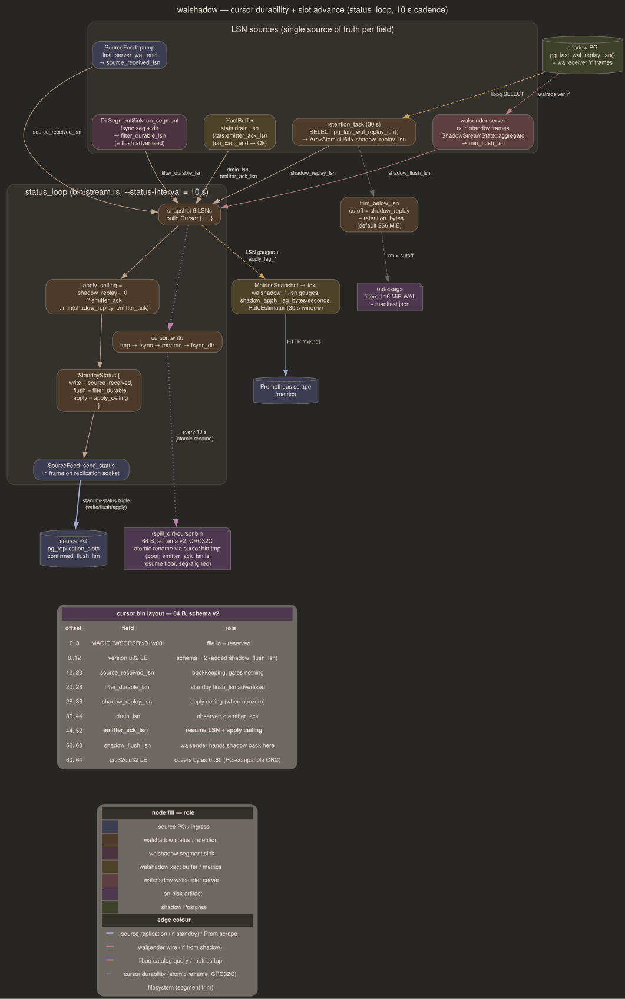

# durability and retention

User monitoring, pause, restart, WAL-retention, and recovery workflows live in
[`docs/operations.md`](../docs/operations.md). Metrics inventory and preflight
messages live in code

This note keeps two load-bearing design contracts: filtered-segment retention
must preserve shadow restartpoint, and persisted floor must never advance past
both ClickHouse acknowledgement and durable filtered WAL

## Filtered segment retention

Shadow `restore_command` copies each segment from filter output, so originals
need explicit reclamation

`trim_below_lsn(dir, cutoff_lsn)` removes a segment only when its end is at or
below cutoff. Segment containing cutoff remains, as do unknown files.
`.partial` files and manifest sidecars follow their owning segment

Sweeper reads shadow replay LSN and last restartpoint REDO LSN, then computes:

```text
cutoff = min(shadow_replay - retention_bytes, restartpoint_redo)
```

Replay position alone is insufficient because restarted shadow recovers from
restartpoint. Retention disabled with zero bytes leaves every segment in place

This cutoff belongs to shadow-recovery domain and remains separate from decode
floor below

## Manifest durability and slot advance

Status loop snapshots stream positions, persists manifest by atomic rename,
publishes persisted floor to pruners, then sends standby-status triple to
source. Publishing only after durable write makes every GC cut no newer than
restart position



## Standby-status triple

Source receives:

- `write_lsn = source_received_lsn`
- `flush_lsn = filter_durable_lsn`
- `apply_lsn = min(shadow_replay_lsn, emitter_ack_lsn)`

When shadow replay is zero because no shadow constraint is available, apply
uses emitter acknowledgement alone. Otherwise zero would freeze source slot
before first shadow poll

Each value names distinct evidence:

- source receive proves transport only
- filter durable proves sealed segment fsync
- shadow replay proves catalog side consumed WAL
- emitter acknowledgement proves every earlier ClickHouse sequence completed

Slot recycling therefore cannot pass either consumer

## Manifest

`{spill_dir}/manifest.toml` records one source identity, branch, six observed
positions, and one resolved floor

```toml
version = 2
floor = "0/6A000000"

[source]
system_id = 7334001234567890123
timeline = 1
timeline_begin = "0/0"

[wal]
stream_timeline = 1

[lsn]
source_received = "0/6A2B3C4D"
filter_durable = "0/6A000000"
shadow_replay = "0/69FF0120"
drain = "0/69FE0000"
emitter_ack = "0/69FD8000"
shadow_flush = "0/69FC0000"
```

Resolved floor is:

```text
align_down(emitter_ack).min(filter_durable)
```

`filter_durable` clamps floor to fsynced archive boundary. Restart resumes at
persisted floor, and every pruner cuts against that same value. Re-reading floor
window is safe because ClickHouse row versions carry source LSN

`system_id` gates nonvolatile spill artifacts. Timeline equality does not gate
restart because descendant timeline can continue same cluster. Instead,
timeline lineage and `timeline_begin` prove stored branch belongs to current
history

Manifest write uses write, fsync, rename, directory fsync. Crash leaves either
old complete file or new complete file. Missing manifest means greenfield;
corrupt or unsupported manifest fails closed unless explicit recovery flags
authorize discarding cursor

Write cadence follows status interval. Per-transaction persistence is rejected
because filesystem sync rate would scale with commit rate without strengthening
floor invariant

### TOAST retirement ledger

TOAST mirror retirement cannot key only on current mapping. A dropped or
rewritten relation may still be needed when restart replays pre-drop referrers

Retirement ledger persists intent before dropping transaction can advance
emitter acknowledgement. Mirror empties only after persisted floor passes drop
commit. Crash before ledger removal repeats idempotent truncate

Ledger uses source `system_id` for same artifact-identity gate as manifest

## Resume semantics

Normal restart chooses persisted floor, recreates volatile transaction spill,
then replays source WAL from floor. Durable ledgers survive; per-process queues
and open transaction buffers rebuild

Explicit `--start-lsn` or `--ignore-cursor` is a rewind/rebaseline decision,
not ordinary recovery. It may lower floor and bypass prior GC guarantee, so it
stays operator-authorized at process start

Source system-ID mismatch remains fatal even with cursor ignored because OIDs,
TOAST ledgers, descriptors, and ClickHouse row identity belong to original
cluster

## Cross-links

- [source](source.md), producers for receive and filter-durable positions
- [shadow](shadow.md), replay and flush positions
- [transaction buffer](xact.md), drain position
- [emitter](emitter.md), contiguous ClickHouse acknowledgement
- [TOAST](TOAST.md), replay-safe mirror retirement proof
- [timeline crossing](failover.md), branch-aware floor commit
