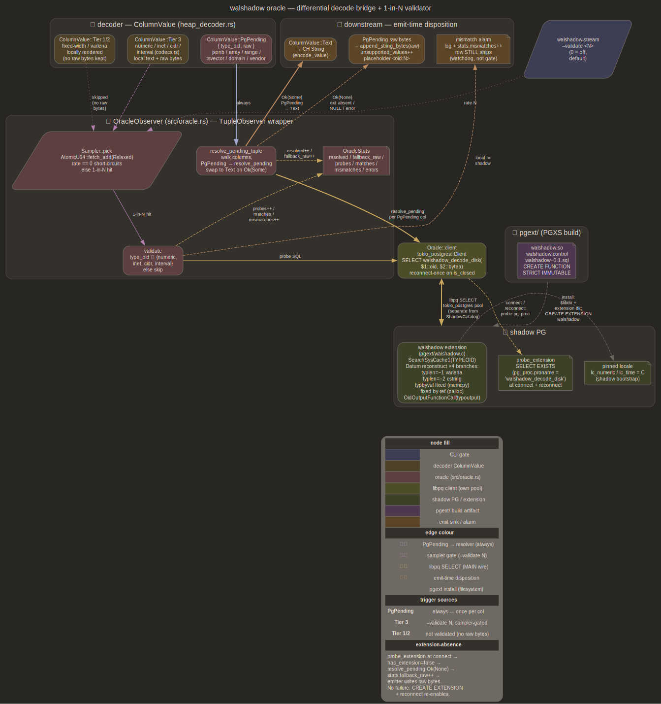

# oracle — PgPending resolver for Tier 3 types

[`src/oracle.rs`](../src/oracle.rs) plus [`pgext/`](../pgext/)



## Purpose

Tier 3 types are where in-tree decoders diverge from PG on edge cases:
on-disk varlena layouts shift between PG versions, `typoutput`
formatting carries locale baggage, custom typmod paths exist walshadow
doesn't reimplement. Ship known-stable types in-tree, route everything
else through shadow-PG bridge calling same `typoutput` PG itself would
call

Resolution is best-effort by policy: the oracle resolves post-plan, so
its answer reflects shadow's catalog state at resolve time, which may
lag the row's own catalog interval in DDL edge cases — accepted in
exchange for mostly supporting unknown types. Unresolved `PgPending`
ships raw on-disk bytes; unresolved `Unsupported` stays the
fail-closed backstop at encode

## In-tree Tier 3

`numeric`, `inet`, `cidr`, `interval`. Decoded by
[`src/codecs.rs`](../src/codecs.rs); see also [decoder.md](decoder.md)
for PgPending dispatch around them

Why these:

- stable wire format across PG versions walshadow targets
- mechanical conversion (no per-row libpq round-trip needed)
- locale-independent text rendering once `lc_numeric` is pinned

`numeric` carries NaN / ±Infinity sentinels; `inet` vs `cidr`
disambiguation lives at type-OID level not body bytes (on-disk vs wire
confusion surfaced here historically)

## Extension-routed Tier 3

`jsonb`, arrays, `tsvector`, ranges, domains. Heap decoder emits
[`ColumnValue::PgPending { type_oid, raw }`](../src/heap_decoder.rs);
[`resolve_pending_tuple`](../src/oracle.rs) walks tuple columns, calls
`walshadow_decode_disk(oid, bytea) -> text` on shadow, swaps `PgPending`
for `Text` on success

```sql
SELECT walshadow_decode_disk($1::oid, $2::bytea)
```

Extension is **optional**. Two alternatives considered (insert + select
round-trip; `SELECT $1::bytea::<typ>::text`) require reconstructing
wire format from on-disk format — same codec work the extension elides

## walshadow PG extension

Lives at [`pgext/`](../pgext/), built via PGXS. Single function:

```sql
walshadow_decode_disk(typoid oid, raw bytea) RETURNS text
STRICT IMMUTABLE
```

Reconstructs Datum from on-disk bytes per typlen / typbyval, runs
`OidOutputFunctionCall` on type's `typoutput`. Four branches in
[`pgext/walshadow.c`](../pgext/walshadow.c) — varlena / cstring /
typbyval fixed / fixed by-ref

Files:

- [`pgext/walshadow.c`](../pgext/walshadow.c) — C function (~125 LOC)
- [`pgext/walshadow.control`](../pgext/walshadow.control) — extension
  metadata, `default_version = '0.1'`, `relocatable = true`
- [`pgext/walshadow--0.1.sql`](../pgext/walshadow--0.1.sql) — DDL
  declaring C function `STRICT IMMUTABLE`
- [`pgext/Makefile`](../pgext/Makefile) — PGXS-driven, `REGRESS =
  walshadow` for pg_regress

Installed into **shadow PG**; stays shadow-only.

## Absence semantics

Resolver short-circuits `Ok(None)` when `probe_extension` returned
false at connect (or reconnect). `stats.fallback_raw` bumps, `PgPending`
stays put, emitter's `encode_value` calls `append_string_bytes(raw)`
so on-disk body lands verbatim in CH. No
failure, no operator action. `CREATE EXTENSION walshadow` on shadow
followed by daemon reconnect flips `has_extension=true` and text
rendering resumes. Stats surface as `walshadow_decode_{resolved,
fallback_raw,errors}_total`

## Pinning shadow locale

`lc_numeric` and `lc_time` pinned at shadow bootstrap. Without this,
`typoutput` on `numeric` and `interval` would diff against walshadow's
locale-independent rendering on deployments running non-`C` locales.
See [shadow.md](shadow.md) for bootstrap surface

## Cross-links

- [decoder.md](decoder.md) — `ColumnValue::PgPending` dispatch + Tier 3
  routing through `heap_decoder`
- [shadow.md](shadow.md) — extension install site,
  `try_load_oracle_extension`, lc_* pinning
