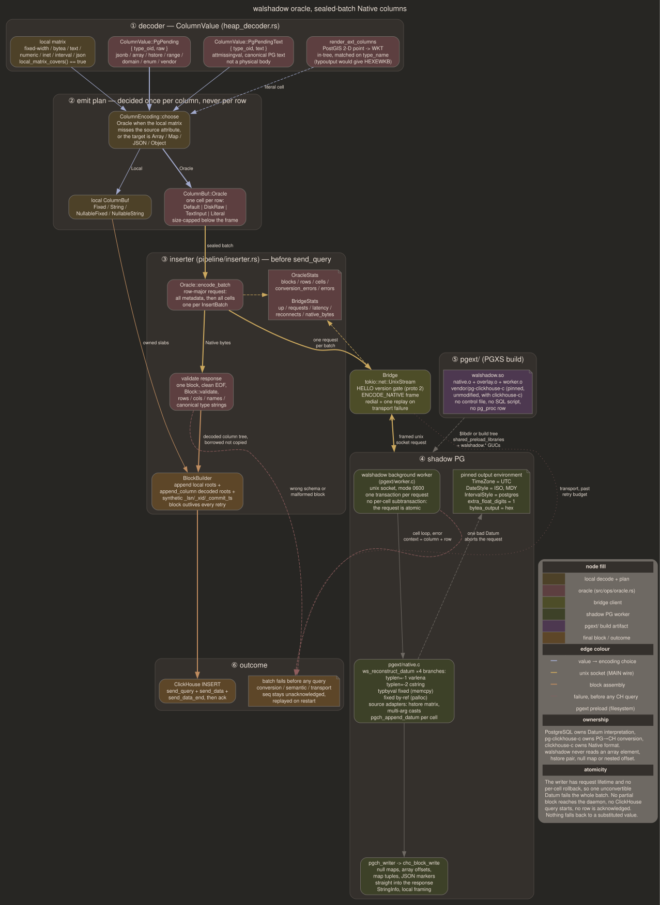

# oracle — PgPending resolver for Tier 3 types

[`src/oracle.rs`](../src/oracle.rs) plus [`pgext/`](../pgext/)

## Purpose

Tier 3 types are where in-tree decoders diverge from PG on edge cases:
on-disk varlena layouts shift between PG versions, `typoutput`
formatting carries locale baggage, custom typmod paths exist walshadow
doesn't reimplement. Ship known-stable types in-tree, route everything
else through the shadow-PG bridge calling the same `typoutput` PG itself
would call

Resolution is best-effort by policy: the oracle resolves post-plan, so
its answer reflects shadow's catalog state at resolve time, which may
lag the row's own catalog interval in DDL edge cases — accepted in
exchange for mostly supporting unknown types. Unresolved `PgPending`
ships raw on-disk bytes; unresolved `Unsupported` stays the
fail-closed backstop at encode

## In-tree Tier 3

`numeric`, `inet`, `cidr`, `interval`. Decoded by
[`src/codecs.rs`](../src/codecs.rs); see also [decoder.md](decoder.md)
for PgPending dispatch around them

Why these:

- stable wire format across PG versions walshadow targets
- mechanical conversion (no per-row libpq round-trip needed)
- locale-independent text rendering once `lc_numeric` is pinned

`numeric` carries NaN / ±Infinity sentinels; `inet` vs `cidr`
disambiguation lives at type-OID level not body bytes (on-disk vs wire
confusion surfaced here historically)

## In-tree extension types

PostGIS `geography`/`geometry` and pgvector `vector`/`halfvec` are rendered
in-tree from their on-disk bytes by `render_ext_columns` (`src/ops/oracle.rs`),
matched on `RelAttr.type_name` (dynamic OIDs). geography 2-D points →
WKT `POINT(x y)` (`gserialized_point_to_wkt`); vector → `[a,b,c]`
(`vector_to_text`). No bridge round-trip, so these resolve even where the
shadow worker is unavailable (e.g. greenfield bootstrap).

## Bridge-routed Tier 3

`jsonb`, arrays, `hstore`, `tsvector`, ranges, domains. Heap decoder emits
[`ColumnValue::PgPending { type_oid, raw }`](../src/heap_decoder.rs);
[`resolve_pending_tuple`](../src/oracle.rs) collects every pending column of a
tuple into one `DECODE` request to shadow's bridge worker, swaps `PgPending`
for `Text` on each item that rendered

## Shared resolve step

`resolve_decoded_heap(oracle, attrs, decoded)` runs `render_ext_columns` then
(if an oracle is present) `resolve_pending_tuple` over a heap's new/old tuples.
Both the live decode pool (`emit/pipeline/decode.rs`) and the object-store /
COPY backfill paths call it, so backfilled rows resolve identically to
streamed ones. **Greenfield bootstrap is the exception**: it runs before the
shadow/bridge exist, so bridge-routed types there resolve to nothing (in-tree
types still work) — the fix is
[future/greenfield_oracle.md](future/greenfield_oracle.md).

Two alternatives considered (insert + select round-trip;
`SELECT $1::bytea::<typ>::text`) require reconstructing wire format from
on-disk format — same codec work the worker elides

## walshadow PG module

Lives at [`pgext/`](../pgext/), built via PGXS. Not an extension: no control
file, no SQL script, no `pg_proc` row. Shadow's catalog is a read-only physical
copy of source's, so `CREATE EXTENSION` can never run there; the module is
reached only through `shared_preload_libraries`. Module is required on every
catalog shadow; walshadow writes preload settings into shadows it owns. See
[`pgext/walshadow.h`](../pgext/walshadow.h) for socket protocol definitions

`ws_decode_datum_text` reconstructs a Datum from on-disk bytes per typlen /
typbyval, then runs `OidOutputFunctionCall` on the type's `typoutput`. Four
branches: varlena / cstring / typbyval fixed / fixed by-ref

Files:

- [`pgext/decode.c`](../pgext/decode.c) — on-disk Datum → `typoutput` text
- [`pgext/overlay.c`](../pgext/overlay.c) — `SnapshotAny` catalog projections
- [`pgext/worker.c`](../pgext/worker.c) — worker registration, socket, framing
- [`pgext/Makefile`](../pgext/Makefile) — PGXS-driven, `MODULE_big` only

Loaded into **shadow PG**; stays shadow-only.

## Decode environment

`typoutput` is not a pure function of the bytes: `timestamptz` follows
`TimeZone`, dates `DateStyle`, `interval` `IntervalStyle`, `bytea`
`bytea_output`, floats `extra_float_digits`. The worker's connection would
otherwise inherit whatever database and role defaults replicated from source,
so it pins `UTC` / `ISO, MDY` / `postgres` / `1` / `hex` at startup under
`PGC_S_OVERRIDE`, which no reload or replicated `ALTER DATABASE ... SET` can
shift. Canonical output is what makes ClickHouse input deterministic; matching
the source session instead would need metadata WAL does not carry

## Catalog reads

`DECODE` is one of four ops the socket carries; `SCAN` is the other one with a
daemon consumer. It projects `pg_class`, `pg_attribute`, `pg_index`,
`pg_namespace` and `pg_type` under `SnapshotAny`, filtered to what one
transaction sees: rows it inserted are present, rows it deleted are not, and
another transaction's uncommitted rows are not. Values are each type's text
output form; `ShadowCatalog` assembles them into descriptors
([shadow.md](shadow.md))

Two arguments turn the same scan into the committed read the daemon captures at
a catalog commit. A top xid of `0` owns no transaction, so every in-progress
writer is foreign and the predicate degenerates to what an MVCC snapshot would
see. An empty oid list reads the whole catalog, which is the only mode
`pg_namespace` and `pg_type` ever had. One scan, so committed and uncommitted
descriptors cannot be built from different rules

The worker never opens the target relation — the replaying transaction holds
AccessExclusiveLock on it and `relation_open` would block against recovery.
Catalog `table_open` plus `systable_beginscan` is the whole surface, and
standby lock replay records AccessExclusiveLocks alone, so AccessShareLock on a
catalog cannot conflict with the DDL in flight. `walshadow.lock_timeout_ms`
bounds the one shape that argument misses: a replaying transaction holding
AccessExclusiveLock on a catalog itself

Which xids count as the requested transaction's is the hard part. Standby
`pg_subtrans` is only as complete as the `XLOG_XACT_ASSIGNMENT` records that
reached it, emitted past 64 cached subxids, so an ordinary savepoint leaves a
subxact with no recorded parent — indistinguishable from a foreign top-level
writer. A chain rooting elsewhere is proof of foreign; no recorded parent is
proof of nothing. Relation-scoped scans take the oid list as the lock argument
and trust an unresolvable writer as theirs, counting it in
`subtrans_mismatch`. Whole-catalog scans have no such argument and fail the
request as inconclusive, so an ok status always means every row returned is
bound to the requested transaction. Losing the oid list loses the lock argument
with it, which is why an empty list is only safe on the committed read — there
is no tree to misattribute a writer to

## Failure semantics

Daemon requires worker at startup. `--bridge-socket` defaults to
`<shadow-socket-dir>/walshadow-bridge.sock`; failure to connect within shadow
connect budget aborts startup. A worker whose `typoutput` raises for one item
bumps `stats.fallback_raw` and leaves that column raw, rest of batch stays
unaffected. Transport failure bumps `stats.errors` and client redials on next
request. Stats surface as
`walshadow_decode_{resolved,fallback_raw,errors}_total`

## Pinning shadow locale

`lc_numeric` and `lc_time` pinned at shadow bootstrap. Without this,
`typoutput` on `numeric` and `interval` would diff against walshadow's
locale-independent rendering on deployments running non-`C` locales.
See [shadow.md](shadow.md) for bootstrap surface

## Cross-links

- [decoder.md](decoder.md) — `ColumnValue::PgPending` dispatch + Tier 3
  routing through `heap_decoder`
- [shadow.md](shadow.md) — where the worker's GUCs get written, lc_* pinning
