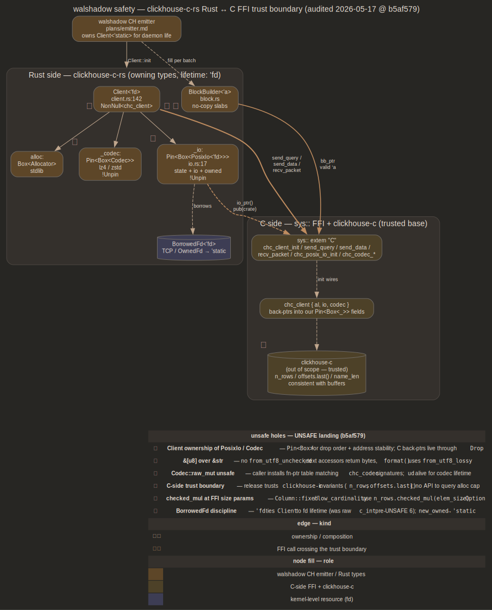

# safety — clickhouse-c-rs trust boundary

Soundness contract for FFI surface walshadow's CH emitter consumes.
Authoritative copy lives in
[`clickhouse-c-rs/README.md`](../clickhouse-c-rs/README.md) "Safety
model"; this doc summarizes for walshadow callers

## Purpose

[`clickhouse-c-rs`](../clickhouse-c-rs/) wraps ClickHouse's Native C
client. Public non-`unsafe` API must be sound under arbitrary safe-code
use, modulo one documented trust boundary at `clickhouse-c` itself.
walshadow's emitter ([emitter.md](emitter.md)) is only consumer today;
this doc enumerates invariants FFI side requires of Rust callers so
emitter changes don't silently re-open holes UNSAFE landing closed

## Trust boundary



Six unsafe holes audited 2026-05-17 at commit `b5af579`, attached to
owners in diagram above. Three structural rules summarize the rest:
owning handles' `Drop` runs matching C destructor with construction-time
allocator; borrowed views (`Column<'b>`, `TypeRef<'a>`,
`ExceptionRef<'e>`) are lifetime-bounded by their owners; text accessors
hand back `&[u8]` so UTF-8 stays at consumer. Detailed reasoning per
hole follows. See "Safety model" in
[`clickhouse-c-rs/README.md`](../clickhouse-c-rs/README.md) for full
statement

## `Client<'fd>`

[`src/client.rs:142-154`](../clickhouse-c-rs/src/client.rs)

```rust
pub struct Client<'fd> {
    raw: NonNull<sys::chc_client>,
    alloc: Box<Allocator>,
    _codec: Option<Pin<Box<Codec>>>,
    _io: Pin<Box<PosixIo<'fd>>>,
}
```

`chc_client_init` stashes raw `chc_io *` and `chc_codec *` into `c->io`
/ `c->codec` for connection lifetime, plus `c->al = al` into allocator
slot. `Client` owns `Pin<Box<...>>` so back-pointers stay valid through
`Drop`. `'fd` lifetime ties `Client` to borrowed fd through `PosixIo`

Why `Pin<Box<Codec>>` and `Pin<Box<PosixIo>>`: compression code calls
back into codec's function-pointer table by address; `chc_posix_io`
carries back-pointer into `chc_io` vtable it initialized. Both structs
are `!Unpin` so safe code cannot move them out of `Pin<Box<_>>`

`alloc: Box<Allocator>` — **not** pinned. UNSAFE 7c flagged original
`Pin<Box<Allocator>>` as theatre: `Allocator: Copy` so pinning doesn't
prevent C from operating on bit-identical copy, and `Packet::take_block`
already copies allocator value-wise. Current shape uses bare
`Box<Allocator>` because `chc_alloc_stdlib` allocator is value-stable
(null `ud`, static fn ptrs); Box gives heap-stable address for `c->al`
without lying about pin guarantees. If non-stdlib allocator ever lands,
comment at `client.rs:144` needs revisiting

## `PosixIo<'fd>`

[`src/io.rs:17-94`](../clickhouse-c-rs/src/io.rs)

Wraps `BorrowedFd<'fd>` (UNSAFE 6 — was `c_int`). Two constructors:

- `PosixIo::new(fd: BorrowedFd<'fd>) -> Pin<Box<Self>>` — borrowed-fd
  path; `Client<'fd>` ties to borrow
- `PosixIo::new_owned(fd: impl Into<OwnedFd>) -> Pin<Box<Self>>` —
  takes ownership, closes fd on drop. Returns
  `Pin<Box<PosixIo<'static>>>` so `Client<'static>` is achievable when
  fd is owned

`PhantomData<BorrowedFd<'fd>>` carries lifetime; `PhantomPinned` plus
structural pin keeps C-side back-pointer between `state` and `io` valid

`io_ptr()` is `pub(crate)` — handed only to `Client::init` and
`Block::read` inside crate

## `Codec::raw_mut`

[`src/codec.rs:83-85`](../clickhouse-c-rs/src/codec.rs)

```rust
pub unsafe fn raw_mut(self: Pin<&mut Self>) -> &mut sys::chc_codec
```

Marked `unsafe` in UNSAFE landing. Safety clause requires caller:

- install function pointers matching `chc_codec` field signatures
  exactly
- populate every field paired `Compression` will exercise
  (`Compression::Lz4` needs `lz4_compress` / `lz4_decompress` /
  `lz4_bound`; leaving them `None` is null call)
- keep any `ud` pointer alive for codec's lifetime and dereferenceable
  from every thread codec runs on

No internal call sites; pure API-marker change. walshadow uses
`Codec::lz4()` / `Codec::zstd()` factories exclusively

## Block column safety

[`src/block.rs`](../clickhouse-c-rs/src/block.rs)

- `column_name(i)` returns `Option<&[u8]>` — no `from_utf8_unchecked`,
  no UTF-8 assumption. Same for `TypeRef::{name, timezone, enum_at,
  tuple_field_name}`. `TypeRef::format` is one materializing site and
  uses `from_utf8_lossy` explicitly
- `Column::fixed` / `Column::low_cardinality` use
  `n_rows().checked_mul(elem_size)?` — overflow returns `None` rather
  than wrapping. Adversarial server (2^60-row column, elem_size=256)
  cannot trigger UB through length wraparound
- `Exception::cstr_bytes` carries `debug_assert!(len <= isize::MAX)`

## Walshadow consumption

CH emitter ([emitter.md](emitter.md)) uses `Client` +
`BlockBuilder<'a>`. Lifetime contract:

- per-batch slab buffers held in emitter outlive every `append_*` call
  into builder
- `Client::init` happens once per connection with `PosixIo::new_owned`
  wrap of TCP socket; emitter owns resulting `Client<'static>` for
  daemon's life
- batch flush: `client.send_query`, `client.send_data(Some(&bb))`,
  `client.send_data(None)`, `recv_packet` loop until `EndOfStream`

Pinning of `Allocator` removed when `Client` reshaped to own alloc
directly — field comment at
[`src/client.rs:144-150`](../clickhouse-c-rs/src/client.rs) documents
why bare `Box` is sufficient for stdlib allocator

Latent invariants (UNSAFE §7) walshadow must not break:

- `unsafe impl<'a> Send for BlockBuilder<'a>` is unconditional — sound
  iff every appended slab type is `Sync`. Adding non-`Sync` append type
  silently breaks it
- `unsafe impl Sync for Allocator` rides on `Allocator::stdlib` being
  the only constructor. A `with_raw(chc_alloc)` constructor must be
  `unsafe` and either drop `Sync` or scope it
