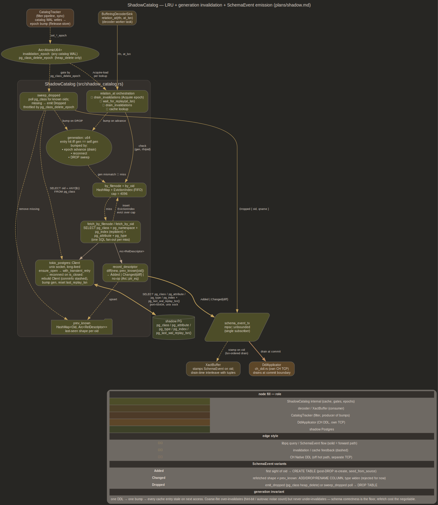

# shadow

## Purpose

walshadow runs co-located Postgres as schema-only catalog mirror &
decode oracle. Shadow replays catalog WAL via streaming replication
plus archive fallback; decoder queries its catalog over libpq. Shadow
never serves user-heap data, never gets DDL'd by walshadow, never
accepts writes from anywhere but source WAL feed

Two surfaces:

- **lifecycle** — process management (`initdb`, conf, `pg_ctl`),
  bootstrap restore, recovery-mode startup. Owned by `Shadow` in
  `src/shadow.rs`. Production daemon defers supervision to systemd
- **catalog API** — async libpq client + LRU + replay-LSN gate +
  schema-event channel. Owned by `ShadowCatalog` in
  `src/shadow_catalog.rs`. Consumed by heap decoder & CH DDL applicator

Lifecycle code is sync, shells out to PG binaries; catalog code is
async, drives `tokio-postgres`. They share data dir & port but
otherwise compose at daemon level

## Lifecycle

`Shadow` ([src/shadow.rs](../src/shadow.rs)) wraps `initdb`, `pg_ctl`,
`psql` plus on-disk plumbing (`postgresql.conf`, `standby.signal`,
`restore_command`, `primary_conninfo`) behind one struct. Bootstrap
order:

1. `initdb` — fresh empty cluster (~50 MiB, ~400 `pg_class` rows)
2. `write_base_conf` — append walshadow knobs (port, unix socket,
   `autovacuum = off`, `fsync = off`, `hot_standby = on`,
   `wal_level = replica`, `max_wal_senders = 0`,
   `listen_addresses = ''`)
3. schema-only restore — see [bootstrap.md](bootstrap.md). Two paths:
   `apply_schema_dump(sql)` pipes `pg_dump --schema-only` through
   `psql -f -`; `BASE_BACKUP` greenfield copies source's catalog files
   directly. `apply_schema_dump` takes `&str` payload, not source
   connection — outbound source connection management lives in daemon
4. `enable_standby_recovery(primary_conninfo)` — writes empty
   `standby.signal`,
   appends `primary_conninfo = '<walsender>'` + `restore_command =
   'cp <filter_dir>/%f %p'` + `recovery_target_timeline = 'latest'`.
   Standby (not recovery) signal: continuous-feed topology requires
   staying in recovery indefinitely
5. `start` — `pg_ctl -w start`, blocks until postmaster accepts
   connections (~600 ms on PG 18, standby mode)
6. `wait_for_replay(target, timeout)` — polls
   `pg_last_wal_replay_lsn() ≥ target`. `target = 0` waits for any
   non-NULL observation (post-startup catch-up)
7. `health` — recovery state + replay LSN + `pg_class` count +
   `pg_proc` lookup. Single-probe corruption canary

Probes route through `psql -tAXq -c` via `psql_one` helper. Real libpq
client lives in `ShadowCatalog`; mixing the two at this layer would
duplicate connection state for no measurable win. Production deploys
run shadow under systemd — walshadow does not babysit postmaster

## Three channels to shadow

See [architecture/shadow_communication.dot](../architecture/shadow_communication.dot)
for rendered diagram:

1. **libpq catalog queries** — `ShadowCatalog`'s tokio-postgres client.
   One long-lived connection over unix socket for `relation_at` /
   `relation_by_oid` / `wait_for_replay` / `sweep_dropped`. Hot path
   for decoder
2. **walsender wire** — `ShadowStreamSink` framing filtered-record
   bytes as `'w'` `XLogData` CopyData frames, listener accepts shadow's
   walreceiver (`primary_conninfo` in shadow's conf). Record-cadence
   WAL push, ms-scale. See [source.md](source.md) for source-side
   walsender walshadow itself consumes
3. **restore_command archive fallback** — `cp out/%f %p` pulls completed
   16 MiB segments from filter output dir. Segment-cadence, used by
   shadow's walreceiver when wire disconnects or shadow restarts past
   walshadow's segment-retention window

Channels (2) & (3) coexist by PG design: walreceiver tries
`primary_conninfo` first, falls back to `restore_command` on connect
error or end-of-WAL. Both feed shadow's startup recovery which advances
`pg_last_wal_replay_lsn()`; channel (1) reads that LSN as gate input

## ShadowCatalog

Async libpq client over shadow's unix socket. Key surfaces:

```rust
pub async fn relation_at(&mut self, rfn: RelFileNode, at_lsn: u64)
    -> Result<Arc<RelDescriptor>>;
pub async fn relation_by_oid(&mut self, oid: Oid)
    -> Result<Arc<RelDescriptor>>;
pub async fn wait_for_replay(&mut self, target: u64) -> Result<u64>;
pub fn invalidate(&mut self) -> u64;       // bump generation
pub fn subscribe(&mut self) -> mpsc::UnboundedReceiver<SchemaEvent>;
```



Cache: `by_filenode` + `by_oid` HashMaps over
`CacheEntry { generation, desc }`, capped at `max_entries` (default
4096), FIFO-evicted via `EvictionIndex` BTreeMap (O(log n) victim
select via `BTreeMap::pop_first`). Hits short-circuit before any I/O;
misses go through one SQL fan-out (`pg_class` + `pg_namespace` +
`pg_index` for replident + `pg_attribute` + `pg_type`). Filenode
resolution goes through `pg_relation_filenode(oid)` so mapped catalogs
(`pg_class`, `pg_attribute`, shared catalogs in `global/`) & regular
tables resolve uniformly. `at_lsn = 0` skips replay gate — used when
caller proved freshness or cache is driven from non-WAL source
(bootstrap seed, tests). Post-`wait_for_replay` re-drain is
load-bearing: DDL observed concurrently during the yield can have
bumped the epoch

Foreign-DB filenodes are rejected before the SQL fan-out:
`fetch_by_filenode` returns `CatalogError::ForeignDatabase` when
`rfn.db_node` is neither the connected shadow DB nor `0` (shared
catalog). Physical replication ships the whole cluster's WAL, and
relfilenodes are unique only within a database — a foreign `db_node`'s
`rel_node` can collide with a real local relation and resolve to the
wrong descriptor (`spc_node` need not match). The connected DB OID is
memoized in `current_db_oid` (fixed by `conninfo`, survives reconnect);
`foreign_db_skips` counts the rejections. Emitter folds the error into
a row skip (see [emitter.md](emitter.md))

## Catalog invalidation

Single `u64` generation counter; lazy eviction keeps `invalidate()`
O(1) regardless of cache size. Coarse-fire by design — see project
memory note on PG version WAL skew: any `pg_class` write triggers
invalidation, including hint-bit writes & autovacuum noise that don't
change schema. Decoder fidelity does not imply cache freshness; coarse
predicate over-invalidates but cannot under-invalidate. Fast-path
`rfn-may-be-stale` predicate deferred — streaming-fed shadow makes
post-bump refetch ms-cadence (see
[future/risks.md](future/risks.md))

DROP discovery is xid-keyed, not counter-keyed
(`catalog_tracker::PendingSweeps`): the decoder worker arms the xid of
each pg_class heap_delete record, commit sinks disarm + run
`sweep_dropped` only at that xact's own commit. A counter consumed at
whatever commit drained first swept while the dying tuple was still
MVCC-alive in shadow (interleaved commit before the DROP's commit
replayed) and lost the `Dropped` event. ADD COLUMN / CREATE INDEX
never arm, so pgbench-rate commits skip the SQL probe entirely;
aborts disarm without sweeping

## Reconnect resilience

`ShadowCatalog` stashes `conninfo` at construct time; diagram's
reconnect path triggers transparently on client close (shadow bounce,
OOM kill, systemd restart):

- `reconnect()` & `ensure_open()` are **private** async fns on
  `ShadowCatalog`. Earlier notes presented them as `pub` for
  illustration; implementation kept them internal because every
  external call routes through `query_*_retry` helpers which bracket
  SQL with `ensure_open` + one-shot retry on `client.is_closed()`
- `last_replay_lsn` resets on reconnect to avoid stale
  monotone-tracking shortcut against freshly-restarted standby
- `with_transient_retry(timeout, async-closure)` free function wraps
  any catalog op in exponential backoff (default 100 ms initial / 1 s
  ceiling, capped by `replay_timeout`). `is_transient` matches every
  `CatalogError::Pg(_)` variant — fine-grained classification is
  follow-up if a workload measures spurious retries

Single retry inside query helpers, multi-attempt budgeted retry
outside: keeps cache bookkeeping unaware of in-flight retries, keeps
backoff policy varyable per call site

## RelDescriptor

What catalog produces per relation:

- `rfn: RelFileNode`, `oid: Oid`, `namespace_oid`, `namespace_name`,
  `name`, `qualified_name: Arc<str>` (pre-formatted for hot-path
  routing)
- `kind` (`pg_class.relkind`: `'r'` table / `'p'` partitioned / etc),
  `persistence` (`'p'` / `'u'` / `'t'`)
- `replident: ReplIdent` — resolved from `pg_class.relreplident`
  through `pg_index`: `Default { pk_attnums }`, `Nothing`, `Full`,
  `UsingIndex { index_oid, key_attnums }`. Carries indexed-attnum list
  inline so old-tuple decode under `XLH_UPDATE_CONTAINS_OLD_KEY`
  resolves without a second round-trip
- `attributes: Vec<RelAttr>` — per column: `attnum`, `name`,
  `type_oid`, `typmod`, `not_null`, `dropped`, `type_name`,
  `type_byval`, `type_len`, `type_align`, `type_storage`,
  `missing_text` (PG 11+ fast-path `ADD COLUMN ... DEFAULT k`, carried
  as typoutput rendering)

Dropped columns stay in `attributes` (`dropped = true`) because
heap-tuple decoder needs them to walk null bitmap correctly; consumers
filter at use-site. See [decoder.md](decoder.md)

## ShadowStreamSink

Shadow-stream sink composing alongside `DirSegmentSink` &
`BufferingDecoderSink` on `WalStream`. Per-record dispatch:
`on_wire_chunk(start_lsn, bytes)` ships rewritten record bytes plus
page-header & inter-record padding bytes preceding them (walreceiver
rejects records arriving at non-page-aligned LSNs without their page
headers — "invalid magic 0000"). CopyData wrapping at enqueue via
`wrap_copy_data` so listener concatenates multiple frames in one
`write_all`

Per-connection state:
- `dispatched_lsn` (mirrors source's `write_lsn`)
- `flush_lsn`, `apply_lsn` (from inbound `'r'` standby status frames)
- `closing` (set on write error, drops slot on next sweep)

Aggregate view (`ShadowStreamState::aggregate() → AggregateLsn`)
exposes `min_flush_lsn`, `min_apply_lsn`, `active_connections`,
`dropped_total` for cursor write loop + metrics

Backpressure: per-connection send queue caps at `slow_threshold` bytes;
overflow drops socket & lets shadow reconnect via archive
(`restore_command`) path. `server_wal_end` advanced only to bytes
already enqueued — advertising higher value crashes PG 18's
walreceiver on still-zero page it tries to read

Segment cadence preserved on top of record cadence: `DirSegmentSink`
still writes one 16 MiB segment + manifest per boundary. Wire is hot
path, segments are archive fallback + durable artifact

## SchemaEvent channel

`ShadowCatalog::subscribe() -> mpsc::UnboundedReceiver<SchemaEvent>`.
Variants (see diagram legend for trigger → DDL mapping):

- `Added { desc }` — first sight of oid
- `Changed { old, new, diff: SchemaDiff }` — `SchemaDiff` carries
  `added_columns`, `dropped_columns`, `renamed_columns`, `type_changes`.
  Renames detected by attnum-match + name-diff heuristic; PG's `RENAME
  COLUMN` keeps attnum intact, natural case lands here
- `Dropped { oid, qualified_name }` — `emit_dropped(oid)` from
  `pg_class_decoder` heap_delete branch, or `sweep_dropped` poll (at
  the dropping xact's commit, `PendingSweeps`-gated) for catalogs with
  `relreplident = 'n'` where heap_delete carries no old tuple to
  extract oid from

`prev_known: HashMap<Oid, Arc<RelDescriptor>>` retains last-seen
descriptors across generation bumps so diff source-of-truth survives
invalidation. Channel consumed by CH DDL applicator inside worker task
— see [emitter.md](emitter.md)

## NOT shipped yet from namespace mapping

Channel is **unbounded** (`mpsc::unbounded_channel`); earlier plan
spoke of `mpsc::channel(64)` for back-pressure but implementation uses
unbounded send because applicator runs in same worker task as decoder,
back-pressure surfaces naturally as task-local await depth rather than
channel saturation

`NamespaceMapping` ([src/ch_emitter.rs](../src/ch_emitter.rs)) ships
`auto_create`, `target_database`, and `drop_table_strategy` (the latter
two resolved per-namespace in `DdlApplicator`). Plan additionally listed
`type_overrides`, `order_by_default`, `engine_default` — still missing.
The `watch::Receiver<Arc<ResolvedConfig>>` resolver substrate **landed**
([config.md](config.md)): CLI > TOML merge, SIGHUP republish, and the
DdlApplicator refreshes namespace config from it per apply. The decode
pool still reads `Arc<RwLock<HashMap>>` on the hot path, bridged from the
watch snapshot by a refresher task. The remaining precedence layer
(WAL-config between CLI and TOML) is
[future/runtime_config_from_pg.md](future/runtime_config_from_pg.md)

## Pitfalls

- **shadow vacuums by replay, never locally.** Shadow runs
  continuously in recovery with `autovacuum = off`; any local catalog
  write would diverge from source's offset-exact pages & PANIC on
  next replay (promote-vacuum-reattach is equally unsound: timeline
  bump, no rewind path against synthetic walsender). Vacuum still
  happens: filter keeps every catalog-touching
  prune/vacuum/freeze/index-cleanup record
  ([filter.md](filter.md) keep table), so source autovacuum on system
  catalogs replays & reclaims same bytes on shadow's mirror pages.
  Manual `VACUUM FULL` / `REINDEX` on source catalogs replay too,
  filenode rotation rides `RM_RELMAP_ID` + `pg_class` heap writes.
  Steady-state shadow catalog bloat = source catalog bloat + replay
  lag
- **wal_level = logical required on source.** Shadow needs full
  old-tuple bytes on user-heap UPDATE/DELETE to drive
  `XLH_UPDATE_CONTAINS_OLD_KEY` decode; `wal_level = replica`
  insufficient. Shadow itself runs at `wal_level = replica` because it
  never emits logical decoding
- **process supervision out of scope.** Production deploys run shadow
  under systemd, which owns crash recovery & restart policy.
  `Shadow::start` / `stop` are bootstrap & test helpers; daemon does
  not babysit postmaster. `ShadowCatalog`'s reconnect path absorbs
  supervisor-driven bounces transparently
- **PG version skew on cross-WAL replay.** Shadow's PG version must
  match (or exceed in compatible ways) source's. See PG 17 repro docker
  memory note for PG-17-specific repro layout
- **WAL struct alignment in body walker.** Body block-id sentinels
  255/254/253/252 must all be handled; missing 252 manifests as
  `BadBlockId` after SAVEPOINT writes. See wal-rus block-id sentinels
  memory note
- **cross-segment user-heap records.** Spanning records must
  NOOP-rewrite in both segments; otherwise shadow PG PANICs on missing
  pages. See cross-segment record memory note

## Cross-links

- [bootstrap.md](bootstrap.md) — initdb vs `BASE_BACKUP`,
  `apply_schema_dump` consumer, `seed_from_source` bootstrap fan-out
- [decoder.md](decoder.md) — `relation_at` consumer, heap-tuple decode
  against `RelDescriptor`
- [emitter.md](emitter.md) — `SchemaEvent` channel consumer
  (`ch_ddl::DdlApplicator`), barrier-fence ordering
- [source.md](source.md) — walsender walshadow consumes from source;
  symmetry with walsender walshadow exposes to shadow
- [future/risks.md](future/risks.md) — coarse-fire generation
  invalidation, deferred `rfn-may-be-stale` fast-path predicate
- [future/runtime_config_from_pg.md](future/runtime_config_from_pg.md)
  — `ResolvedConfig` + `watch` refactor sequencing
