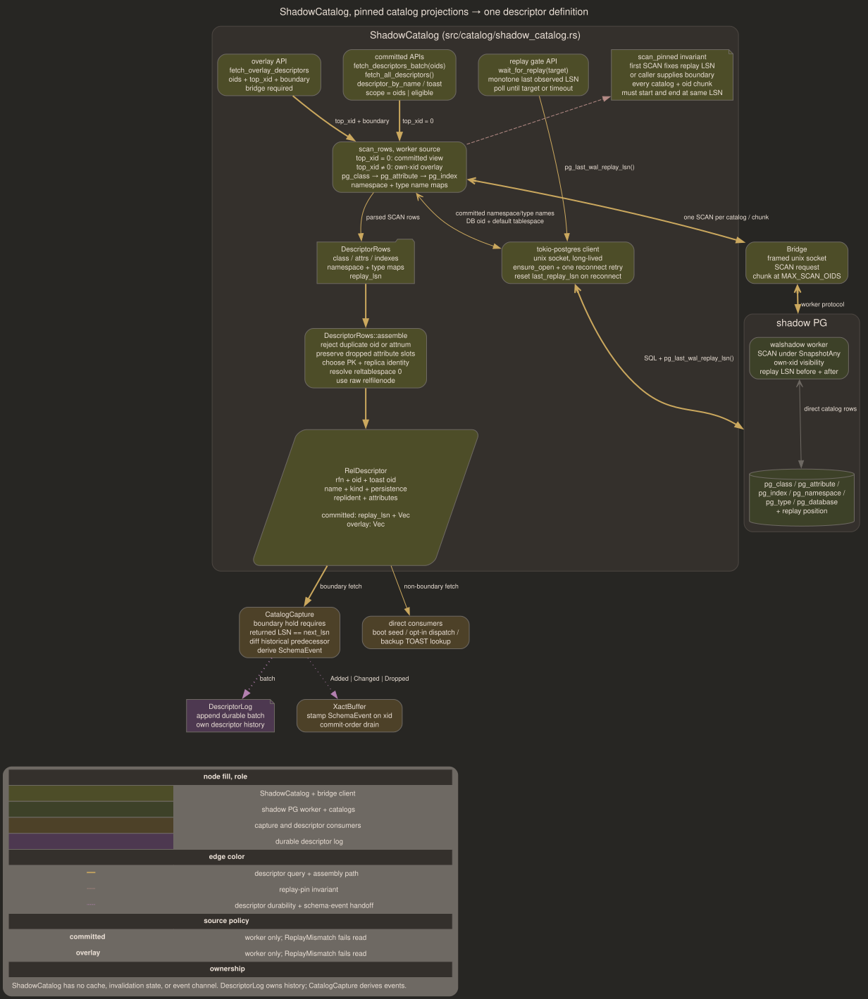

# shadow

## Purpose

walshadow runs co-located Postgres as schema-only catalog mirror &
decode oracle. Shadow replays catalog WAL via streaming replication
plus archive fallback; decoder queries its catalog over libpq. Shadow
never serves user-heap data, never gets DDL'd by walshadow, never
accepts writes from anywhere but source WAL feed

Two surfaces:

- **lifecycle** — process management (config, `pg_ctl`), bootstrap
  restore, recovery startup, supervision. `Shadow` in
  `src/catalog/shadow.rs` provides operations. Daemon owns full
  lifecycle whenever `--bootstrap-shadow-data-dir` is set
- **catalog API** — async libpq client: batched descriptor fetches for
  capture ([desc_log.md](desc_log.md)), name-keyed resolution for opt-in
  and backfill standup, replay-LSN gate. Owned by `ShadowCatalog` in
  `src/shadow_catalog.rs`. Decode never queries it

Lifecycle code is sync, shells out to PG binaries; catalog code is
async, drives `tokio-postgres`. They share data dir & port but
otherwise compose at daemon level

## Lifecycle

`Shadow` ([src/catalog/shadow.rs](../src/catalog/shadow.rs)) wraps
`initdb`, `pg_ctl`, `psql`, and config files (`postgresql.conf`,
`pg_hba.conf`, `standby.signal`, `restore_command`,
`primary_conninfo`) in one struct. Daemon boot order with
`--bootstrap-shadow-data-dir`:

1. Choose bootstrap or resume. Bootstrap only an empty data dir
   according to `--bootstrap-mode` (see [bootstrap.md](bootstrap.md)).
   Resume initialized cluster regardless of mode. If
   `walshadow_bootstrap.incomplete` exists, fail without changing data
   dir. Never turn standby recovery failure into automatic rebootstrap
2. Run `write_standby_signal`. Standby signal keeps shadow in recovery
   while it receives continuous WAL stream
3. Run `control_guc_floor` and `materialize_conf(floor, None)`. They
   read five minimum GUC values from shadow's `pg_control` with
   `pg_controldata`.
   `LC_ALL=C` keeps output labels stable. PostgreSQL
   checks these values against `pg_control`, so reading them locally
   matches WAL being replayed and avoids querying source. Current
   source settings can differ from values required by older WAL. For
   example, shadow with `max_connections = 100` cannot start when
   `pg_control` requires 500. Replace `postgresql.conf` with
   walshadow settings (port, unix socket,
   `autovacuum = off`, `fsync = on`, `hot_standby = on`,
   `wal_level = replica`, `listen_addresses = ''`),
   `restore_command = 'cp <filter_dir>/%f %p'`,
   and `recovery_target_timeline = 'latest'`. Omit `primary_conninfo`
   so shadow reads only archived WAL until step 5
   Empty `postgresql.auto.conf` to remove source
   `ALTER SYSTEM` settings included by BASE_BACKUP. Write
   socket-only `pg_hba.conf` using trust authentication and empty
   `pg_ident.conf`. Do not use config files from backup because Debian
   stores them outside data dir under
   `/etc/postgresql/<v>/<cluster>`
4. Run `clear_stale_pid`, then `start_with_floor_retry`.
   `pg_ctl -w start` waits for postmaster to accept connections
   (~600 ms on PG 18 in standby mode). WAL can raise required GUC
   values during startup. PostgreSQL first updates `pg_control`, then
   aborts startup. On failure, read new values and retry. Return error
   if values did not change. Include end of `startup.log` because
   `pg_ctl` only reports "could not start server" while log includes
   required value. After a fresh bootstrap, run
   `wait_for_replay(end_lsn, timeout)` against WAL included in backup
5. Once walsender listens, run `point_at_walsender(conninfo)` to append
   `primary_conninfo` and reload PostgreSQL. This avoids waiting for
   `wal_retrieve_retry_interval` after a failed connection
6. Call `is_running` every 2 s. If postmaster stops, restart it with
   backoff and read minimum GUC values again. Hot standby can pause
   replay when WAL requires higher value. Detect a pause with
   `pg_get_wal_replay_pause_state()`, then confirm the cause: a floor
   raise writes the higher value to `pg_control` before pausing, so a
   `control_guc_floor` above the running `current_setting` values marks
   it. Only then call `pg_wal_replay_resume()`; resume shuts server down,
   allowing restart with updated values. A pause with floor equal to
   running settings (operator `pg_wal_replay_pause`, recovery target)
   holds untouched. On daemon exit, run `pg_ctl stop -m fast` so data
   dir is ready for next startup
7. Run `health` to check recovery state, replay LSN, `pg_class` count,
   and `pg_proc` lookup in one corruption probe

After bootstrap marker clears, every later start is standby recovery.
WAL unavailability leaves recovery waiting or restarting against configured
WAL sources; it never invokes bootstrap or replaces data dir

Tests use `initdb` to create empty cluster (~50 MiB, ~400 `pg_class`
rows), call `write_base_conf`, restore schema with
`apply_schema_dump(sql)`, then call
`enable_standby_recovery(primary_conninfo)`. `apply_schema_dump` sends
`pg_dump --schema-only` output to `psql -f -` and accepts `&str`, not
source connection

Probes route through `psql -tAXq -c` via `psql_one` helper. Real libpq
client lives in `ShadowCatalog`; mixing the two at this layer would
duplicate connection state for no measurable win

## Three channels to shadow

See [architecture/shadow_communication.dot](../architecture/shadow_communication.dot)
for rendered diagram:

1. **libpq catalog queries** — `ShadowCatalog`'s tokio-postgres client.
   One long-lived connection over unix socket for descriptor capture's
   batched fetches, name-keyed resolution, and `wait_for_replay`.
   Boundary-rate, never per record: decode reads the descriptor log
2. **walsender wire** — `ShadowStreamSink` framing filtered-record
   bytes as `'w'` `XLogData` CopyData frames, listener accepts shadow's
   walreceiver (`primary_conninfo` in shadow's conf). Record-cadence
   WAL push, ms-scale. See [source.md](source.md) for source-side
   walsender walshadow itself consumes
3. **restore_command archive fallback** — `cp out/%f %p` copies
   completed 16 MiB segments from filter output dir. Startup recovery
   uses it after wire disconnects and while catching up after restart.
   Retention keeps segments back to shadow's last restartpoint, see
   [ops.md](ops.md). `<tli>.history` files land in the same dir and are
   never trimmed, so `recovery_target_timeline = 'latest'` discovery can
   select a branch the source forked onto ([failover.md](failover.md))

Channels (2) & (3) coexist by PG design: walreceiver tries
`primary_conninfo` first, falls back to `restore_command` on connect
error or end-of-WAL. Both feed shadow's startup recovery which advances
`pg_last_wal_replay_lsn()`; channel (1) reads that LSN as gate input

## ShadowCatalog

Async libpq client over shadow's unix socket. Key surfaces:

```rust
pub async fn fetch_descriptors_batch(&mut self, oids: &[Oid])
    -> Result<(u64, Vec<RelDescriptor>)>;   // + replay position
pub async fn fetch_all_descriptors(&mut self)
    -> Result<(u64, Vec<RelDescriptor>)>;   // capture-all / boot seed
pub async fn descriptor_by_name(&mut self, rel: &RelName)
    -> Result<Option<Arc<RelDescriptor>>>;  // opt-in dispatch
pub async fn wait_for_replay(&mut self, target: u64) -> Result<u64>;
pub async fn fetch_overlay_descriptors(&mut self,
    oids: &[Oid], top_xid: u32, boundary: u64)
    -> Result<Vec<RelDescriptor>>;          // uncommitted DDL, see below
```



No cache, no invalidation, no event channel: descriptor history lives
in the durable log ([desc_log.md](desc_log.md)); capture calls these
fetchers only at catalog boundaries with shadow already applied through
the boundary's `next_lsn`, so the snapshot is exactly the commit's
state. Foreign-db rejection likewise moved to the log's lookup surface
(`LookupResult::ForeignDb`). DROP discovery is capture-native: an oid
absent from a boundary's fetch with a Present predecessor tombstones +
emits `Dropped` — no polling sweep

## One descriptor definition

Every fetch above assembles its `RelDescriptor` in Rust from the catalog
projections bridge worker's `SCAN` op names ([oracle.md](oracle.md)):
`pg_class`, `pg_attribute`, `pg_index`, plus oid → name maps for
`pg_namespace` and `pg_type`. Committed reads pass top xid `0`, which owns no
transaction, so visibility predicate degenerates to committed view;
`fetch_all_descriptors` passes no oid list, which reads whole `pg_class` and
scopes remaining projections to returned relations. Oid lists longer than one
request may carry are chunked, every chunk pinned to one position

Committed reads have a second source: one SQL statement mirroring those
projections, carried as `(catalog id, text[])` rows so both reach the same
parsers, and one statement so one snapshot covers every projection. Values are
each type's text output form, which is `format('%s', v)` and not a `::text`
cast — the cast renders a boolean `true` where `boolout` says `t`, and takes
`int2vector` out of its space-separated form. It answers whenever the worker
cannot hold one replay position across a read

Physical columns come straight off `pg_attribute`
(`attbyval/attlen/attalign/attstorage`): `DROP COLUMN` zeroes `atttypid` but
preserves those, so a dropped slot keeps its layout and its `type_name` goes
empty for want of a `pg_type` row. Dropped slots stay in `attributes`, keeping
attnum-1 indexing exact. `reltablespace` arrives raw and the `0` =
database-default sentinel resolves against a memoized
`pg_database.dattablespace`. `relfilenode` is the column, not
`pg_relation_filenode()`, which reads through relcache and cannot see an
overlay; mapped relations therefore report `0`, and no user relation is ever
mapped. All `pg_index` rows for a relation come back and picking the primary
and replident rows is this side's.

### Uncommitted DDL

SQL sees committed rows only, so a transaction whose DDL is still open is
invisible to it. `fetch_overlay_descriptors` asks the worker for the same
projections under the requesting transaction's own view: its inserts present,
its deletes applied.

Caller parks replay at a boundary LSN and passes it; both replay positions the
worker samples must equal it, or the read fails rather than describing a
different point in WAL. A committed read has no boundary of its own and takes
the first scan's position, pinning the rest to it — a replay move mid-read
would otherwise tear the descriptor across two points in WAL, since
`SnapshotAny` gives the worker nothing to hold still against.

Replay only sits still inside the publication hold; away from one it moves
between requests and no sequence of scans answers for a single position, so a
committed read redoes itself on the mirroring statement. An overlay read fails
instead: the caller holds the boundary the question is about, and an MVCC
snapshot cannot see the rows it asks for. Movement increments
`walshadow_bridge_scan_replay_moved_total`, which reads two ways — expected off
a boundary, a boundary-hold bug during capture

Namespace and type names resolve against the committed catalog first. The
whole-catalog scan behind them has no oid list and so no relation-lock
argument, and refuses to answer while any foreign writer is mid-DDL, so it runs
only for oids the committed read did not have, ie ones this transaction
created.

Two rows for one oid, or for one `(attrelid, attnum)`, fail the read: that is a
superseded row version surviving the worker's visibility predicate, which would
shift every later column.

## Reconnect resilience

`ShadowCatalog` stashes `conninfo` at construct time; diagram's
reconnect path triggers transparently on client close (shadow bounce,
OOM kill, supervisor restart):

- `reconnect()` & `ensure_open()` are **private** async fns on
  `ShadowCatalog`. Earlier notes presented them as `pub` for
  illustration; implementation kept them internal because every
  external call routes through `query_*_retry` helpers which bracket
  SQL with `ensure_open` + one-shot retry on `client.is_closed()`
- `last_replay_lsn` resets on reconnect to avoid stale
  monotone-tracking shortcut against freshly-restarted standby
- `with_transient_retry(timeout, async-closure)` free function wraps
  any catalog op in exponential backoff (default 100 ms initial / 1 s
  ceiling, capped by `replay_timeout`). `is_transient` matches every
  `CatalogError::Pg(_)` variant — fine-grained classification is
  follow-up if a workload measures spurious retries

Single retry inside query helpers, multi-attempt budgeted retry
outside: keeps cache bookkeeping unaware of in-flight retries, keeps
backoff policy varyable per call site

## RelDescriptor

What catalog produces per relation:

- `rfn: RelFileNode`, `oid: Oid`, `namespace_oid`, `rel_name: RelName`
  (structured `{ namespace, name }` pair, `Arc<str>` parts for hot-path
  routing; joined only at SQL interpolation / `Display`)
- `kind` (`pg_class.relkind`: `'r'` table / `'p'` partitioned / etc),
  `persistence` (`'p'` / `'u'` / `'t'`)
- `replident: ReplIdent` — resolved from `pg_class.relreplident`
  through `pg_index`: `Default { pk_attnums }`, `Nothing`, `Full`,
  `UsingIndex { index_oid, key_attnums }`. Carries indexed-attnum list
  inline so old-tuple decode under `XLH_UPDATE_CONTAINS_OLD_KEY`
  resolves without a second round-trip
- `attributes: Vec<RelAttr>` — per column: `attnum`, `name`,
  `type_oid`, `typmod`, `not_null`, `dropped`, `type_name`,
  `type_byval`, `type_len`, `type_align`, `type_storage`,
  `missing_text` (PG 11+ fast-path `ADD COLUMN ... DEFAULT k`, carried
  as typoutput rendering)

Dropped columns stay in `attributes` (`dropped = true`) because
heap-tuple decoder needs them to walk null bitmap correctly; consumers
filter at use-site. See [decoder.md](decoder.md)

## ShadowStreamSink

Shadow-stream sink composing alongside `DirSegmentSink` &
`BufferingDecoderSink` on `WalStream`. Per-record dispatch:
`on_wire_chunk(start_lsn, bytes)` ships rewritten record bytes plus
page-header & inter-record padding bytes preceding them (walreceiver
rejects records arriving at non-page-aligned LSNs without their page
headers — "invalid magic 0000"). CopyData wrapping at enqueue via
`wrap_copy_data` so listener concatenates multiple frames in one
`write_all`

Per-connection state:
- `dispatched_lsn` (mirrors source's `write_lsn`)
- `flush_lsn`, `apply_lsn` (from inbound `'r'` standby status frames)
- `closing` (set on write error, drops slot on next sweep)

Aggregate view (`ShadowStreamState::aggregate() → AggregateLsn`)
exposes `min_flush_lsn`, `min_apply_lsn`, `active_connections`,
`dropped_total` for status loop + metrics

Writes ride a batching tick, with `request_status` waking the listener
for the one path that cannot wait one out — the publication hold, which
needs its queued WAL at shadow before the reply it prods for can mean
anything ([source.md](source.md))

Backpressure: per-connection send queue caps at `slow_threshold` bytes;
overflow drops socket & lets shadow reconnect — completed segments via
archive (`restore_command`), in-progress segment via `wire_buf`
backfill at register (else reconnect strands on an unappliable gap at
segment boundary). Listener injects `'k'` keepalive past 10 s idle so
walreceiver flushes & replies without fresh WAL. `server_wal_end`
advanced only to bytes already enqueued — advertising higher value
crashes PG 18's walreceiver on still-zero page it tries to read

Segment cadence preserved on top of record cadence: `DirSegmentSink`
still writes one 16 MiB segment + manifest per boundary. Wire is hot
path, segments are archive fallback + durable artifact

## SchemaEvents

Produced solely by descriptor capture as log diffs
([desc_log.md](desc_log.md)); they enter the xact buffer as drain
entries keyed `(drain_xid, valid_from)` and apply inside the reorder
barrier. Variants (see diagram legend for trigger → DDL mapping):

- `Added { desc }` — no log predecessor (CREATE, or a rel entering an
  existing log via capture-all discovery); boot re-applies `Added` for
  the active Present set each start (idempotent CH DDL)
- `Changed { old, new, diff: SchemaDiff }` — `SchemaDiff` carries
  `added_columns`, `dropped_columns`, `renamed_columns`, `type_changes`.
  Renames detected by attnum-match + name-diff heuristic; PG's `RENAME
  COLUMN` keeps attnum intact, natural case lands here
- `Dropped { oid, rel_name }` — oid absent from a boundary's capture
  with a Present predecessor; works for `relreplident = 'n'` catalogs
  too (no old-tuple decode needed — enumeration comes from commit-record
  relcache invals)

## Namespace mapping gaps

`NamespaceMapping` ([src/emit/ch_emitter.rs](../src/emit/ch_emitter.rs)) carries
`auto_create`, `target_database`, and `drop_table_strategy` (the latter two
resolved per-namespace in `DdlApplicator`); `type_overrides`,
`order_by_default`, and `engine_default` are not covered. The
`watch::Receiver<Arc<ResolvedConfig>>` resolver substrate in
[`src/config.rs`](../src/config.rs) merges CLI > PG-row > TOML with SIGHUP republish, and
the DdlApplicator refreshes namespace config from it per apply. The decode pool
reads `Arc<RwLock<HashMap>>` on the hot path, bridged from the watch snapshot by
a refresher task. The source-PG-driven work (signal channel, per-table opt-in +
backfill, net-new knobs) is
[future/runtime_config_from_pg.md](future/runtime_config_from_pg.md)

## Pitfalls

- **shadow vacuums by replay, never locally.** Shadow runs
  continuously in recovery with `autovacuum = off`; any local catalog
  write would diverge from source's offset-exact pages & PANIC on
  next replay (promote-vacuum-reattach is equally unsound: timeline
  bump, no rewind path against synthetic walsender). Vacuum still
  happens: filter keeps every catalog-touching
  prune/vacuum/freeze/index-cleanup record
  ([filter.md](filter.md) keep table), so source autovacuum on system
  catalogs replays & reclaims same bytes on shadow's mirror pages.
  Manual `VACUUM FULL` / `REINDEX` on source catalogs replay too,
  filenode rotation rides `RM_RELMAP_ID` + `pg_class` heap writes.
  Steady-state shadow catalog bloat = source catalog bloat + replay
  lag
- **wal_level = logical required on source.** Shadow needs full
  old-tuple bytes on user-heap UPDATE/DELETE to drive
  `XLH_UPDATE_CONTAINS_OLD_KEY` decode; `wal_level = replica`
  insufficient. Shadow itself runs at `wal_level = replica` because it
  never emits logical decoding
- **daemon supervises process.** With
  `--bootstrap-shadow-data-dir` set the daemon starts, probes, and
  restarts postmaster with capped backoff, then stops it on exit.
  Initialized standby always resumes; daemon never replaces it with a
  new base backup. `ShadowCatalog` reconnects after each restart.
  Without flag, shadow runs as external process such as k8s sidecar,
  and another supervisor owns it
- **PG version skew on cross-WAL replay.** Shadow's PG version must
  match (or exceed in compatible ways) source's. See PG 17 repro docker
  memory note for PG-17-specific repro layout
- **WAL struct alignment in body walker.** Body block-id sentinels
  255/254/253/252 must all be handled; missing 252 manifests as
  `BadBlockId` after SAVEPOINT writes. See wal-rus block-id sentinels
  memory note
- **cross-segment user-heap records.** Spanning records must
  NOOP-rewrite in both segments; otherwise shadow PG PANICs on missing
  pages. See cross-segment record memory note

## Cross-links

- [bootstrap.md](bootstrap.md) — initdb vs `BASE_BACKUP`,
  `apply_schema_dump` consumer, `seed_from_source` bootstrap fan-out
- [decoder.md](decoder.md) — descriptor-log consumer, heap-tuple decode
  against `RelDescriptor`
- [emitter.md](emitter.md) — `SchemaEvent` channel consumer
  (`ch_ddl::DdlApplicator`), barrier-fence ordering
- [oracle.md](oracle.md) — bridge worker behind the overlay read: socket,
  framing, and the `SnapshotAny` projections `SCAN` returns
- [source.md](source.md) — walsender walshadow consumes from source;
  symmetry with walsender walshadow exposes to shadow
- [future/risks.md](future/risks.md) — coarse-fire generation
  invalidation, deferred `rfn-may-be-stale` fast-path predicate
- [future/runtime_config_from_pg.md](future/runtime_config_from_pg.md)
  — `ResolvedConfig` + `watch` refactor sequencing
