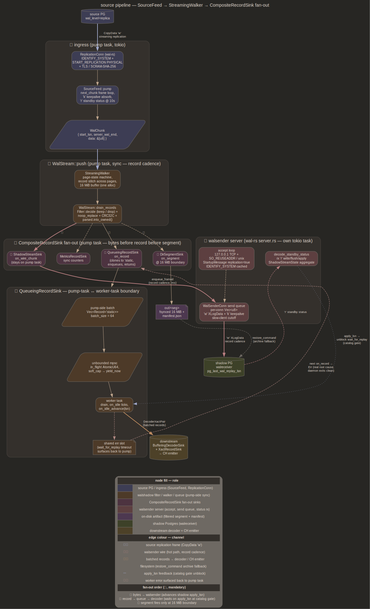

# source — physical WAL ingestion

Pump bytes off source PG, walk pages into records at page cadence,
dispatch each record through a fan-out sink chain. One ingress site
([`SourceFeed`](../src/source_feed.rs)), one walker
([`StreamingWalker`](../src/streaming_walker.rs)), one record-cadence
dispatch point ([`WalStream::push`](../src/wal_stream.rs)). Filter
rewrite into shadow's `pg_wal/`, heap decode into CH Native blocks,
xact buffering, oracle all hang off
[`RecordSink`](../src/wal_stream.rs) +
[`RecordBytesSink`](../src/wal_stream.rs) traits with no second walk
of bytes



## Purpose

Source PG's `pg_wal/` is the only external source of truth for committed
data. Source component splits into two streams: (1) byte stream
identical to source's WAL minus user-data records, shipped to shadow PG
via walshadow's homemade walsender so shadow stays a valid hot standby
of source's catalog state; (2) parsed-record stream the heap decoder +
xact buffer consume to build CH Native blocks

Same parse, same walk, same byte ranges. Filter decision (Keep / Drop)
computed once per record, broadcast to both consumers via
[`CompositeRecordSink`](../src/wal_stream.rs). Drop path NOOP-rewrites
bytes in place inside walker buffer so segment-cadence disk output
([`DirSegmentSink`](../src/wal_stream.rs)) and record-cadence shadow
wire ([`ShadowStreamSink`](../src/shadow_stream.rs)) ship the same
rewrite

## SourceFeed

[`src/source_feed.rs`](../src/source_feed.rs). Wraps wal-rus's
`walrus::pg::replication::conn::ReplicationConn`:
`IDENTIFY_SYSTEM` → `START_REPLICATION PHYSICAL <slot>? <lsn>
TIMELINE <tli>` → `next_chunk` loop returning
[`WalChunk { start_lsn, server_wal_end, data }`](../src/source_feed.rs)
per `CopyData('w')` frame. `next_chunk` blocks on one server message;
WAL data returns to caller, keepalives absorbed transparently,
`reply_requested` echoes `'r'` status update inline.
[`StandbyStatus { write_lsn, flush_lsn, apply_lsn }`](../src/source_feed.rs)
passes in per call; `send_status` clamps each field to its own monotonic
high-water (`StatusFloors` via `clamp_status`) — PG treats flush/apply
regression as a protocol violation and force-disconnects. Per-field
floors, not one shared high-water: a leading `write` must not lift
`flush`/`apply`, which would claim durability the filter and CH emitter
have not reached and let source recycle un-filtered WAL. Cadence
[`DEFAULT_STATUS_INTERVAL = 10s`](../src/source_feed.rs); source's
`wal_sender_timeout` default 60s gives 6× headroom

`slot: Option<&str>` on `start_physical_replication`: Some = bind
permanent physical slot, pins source's `pg_wal/`; None = slotless, source
recycles on `wal_keep_size` schedule. Slot caps catch-up, slotless caps
source disk burn. Slot name comes from config (`[source] slot` →
`EmitterConfig.source_slot`), with a `--slot` CLI override applied at parse
time (CLI > TOML, boot-only — same idiom as `--ch-flush-timeout-ms`).
`SourceFeed::ensure_physical_slot(name)` creates it idempotently with
immediate WAL reservation (`pg_create_physical_replication_slot(name,
true)`), run before pre-flight (which requires the slot to exist). A
physical slot's `restart_lsn` tracks the reported **flush** LSN, so the
pump caps `flush_lsn` at `apply_ceiling = min(shadow_replay, emitter_ack)`
(see [ops.md](ops.md)): the source retains WAL until CH has durably
ingested it, not merely until walshadow fsynced its filter output.

`SourceFeed::reconnect(cfg, slot, resume_lsn, timeline, interval)`
re-establishes a dropped replication connection (e.g. source
`wal_sender_timeout` fired during a CH-stall backpressure) and resumes at
`resume_lsn = stream.next_lsn()` — the byte-contiguous resume point, never
`dispatched_lsn` (which lags by any buffered in-progress record →
misaligned push). `reconnect` is one attempt; the caller (`SourceRecovery::recover`) is
source-first: a plain (transient) drop retries the source once at
`stream.next_lsn()` before touching the archive, and a recycled-segment error
skips straight to the archive. Archive segments then replay through the same
`WalStream` + sinks (contiguous filter, shadow, CH state), each fetched as the
full segment sliced to begin at the resume LSN (`next_lsn` is byte- not
segment-aligned); once the archive lacks the next segment, `backon`
exponential-backoff reconnect resumes the source at the exact handoff. A
recycled segment (SQLSTATE `58P01`, classified by `is_wal_segment_removed` on
code, not locale-dependent message → typed `WalSegmentRemoved`) that the
archive can't cover exits without re-bootstrap; operator decides whether to
refresh from base backup. Slot + `flush_lsn` cap make this path an edge (slot
`lost` / dropped / source disk full), not normal CH-stall path. See
[bootstrap.md](bootstrap.md) restart contract.

TLS / SCRAM via wal-rus's
`walrus::pg::replication::tls`: modes `disable / allow
/ prefer / require / verify-ca / verify-full`, verify-* consults
`PGSSLROOTCERT` or webpki. TLS skipped on unix sockets (PG refuses,
matching libpq). Auth: trust / cleartext / SCRAM-SHA-256. Sidecar
`tokio_postgres::Client` for non-replication queries opens lazily via
`sql_client()`; same `PgConfig`, same TLS wrap, runs through
`connect_raw` with `SslMode::Disable` so it never double-negotiates

Walshadow's walsender server (other side, feeding shadow) is
trust-over-loopback only, no TLS, no SCRAM. Listener binds `127.0.0.1`
or colocated unix socket; cross-host shadow needs TLS + SCRAM-SHA-256,
see [future/parked.md](future/parked.md). Throttle: wal-rus ships
`walrus::throttle` as token-bucket `AsyncRead`
adapter, not wired today (queueing sink's backpressure paces the
daemon), but the hook exists

## WalStream::push

[`src/wal_stream.rs`](../src/wal_stream.rs). Page-cadence record entry
point. Owns [`StreamingWalker`](../src/streaming_walker.rs), long-lived
[`Filter`](../src/filter.rs), per-segment manifest accumulator,
optional `RecordBytesSink` for shadow wire

```rust
pub async fn push(
    &mut self,
    lsn: u64,
    bytes: &[u8],
    record_sink: &mut dyn RecordSink,
    segment_sink: &mut dyn SegmentSink,
) -> Result<u64, WalStreamError>
```

`lsn` must equal `self.next_lsn()` (misalignment errors); `start_lsn` at
`WalStream::new(timeline, seg_size, start_lsn)` must be segment-aligned
(`UnalignedBase` otherwise); `bytes` may span any chunking. Per-record
dispatch fires the moment a record's last byte lands:
`bytes_sink.on_wire_chunk(start_lsn, buf[wire_offset..record_end])` →
`record_sink.on_record(&Record)`. Order matters: bytes ship first so
shadow's apply LSN advances before the catalog gate inside
`BufferingDecoderSink::on_record` checks it. Segment dispatch fires
when walker buffer crosses 16 MiB; records straddling the boundary hold
the flush until the spanning record completes, rewrite then lands
uniformly across both segs

Each `Record` carries two positions. `source_lsn` is record start — row
version and ordering key. `next_lsn` is PG `XLogReaderState::EndRecPtr`
(xlogreader.c arithmetic: single-page advances `MAXALIGN(xl_tot_len)`;
page/segment-spanning advances last continuation page's data start +
`MAXALIGN(rem_len)`; `XLOG_SWITCH` extends to segment end) — the value
`pg_last_wal_replay_lsn()` reports once shadow applies the record, so
every replay comparison uses it, never the last physical wire byte.
`Filter::decide_record` additionally stamps `catalog_boundary` on
commit records of catalog-mutating xacts: the filter marks xids dirty
when a record touches a catalog relation (bootstrap `< 16384` rule,
tracker-promoted filenodes, relmap updates) and drains marks at that
xact's commit/abort — commit record subxact lists and prepared xids
included, aborts clear without a boundary

Poisoned flag: any error returned to `push` (sink Err, walker
BadPageMagic, parse failure, rewrite failure) sets `self.poisoned =
true`; subsequent `push` calls short-circuit with
`WalStreamError::Poisoned`. Mid-segment sink failure leaves byte /
manifest / shadow-wire / decoder state out of sync; recovery requires
fresh `WalStream` + fresh upstream connection at durable
`dispatched_lsn`

## StreamingWalker

[`src/streaming_walker.rs`](../src/streaming_walker.rs). Stateful page
walker driven by `WalStream::push` as bytes arrive. Carries page-cursor
+ `Pending` cross-page stitcher + 16 MiB segment-accumulating buffer
across calls

[`StreamingWalker::buffer() -> &[u8]`](../src/streaming_walker.rs)
returns live segment buffer; `WalStream::flush_segment` hands it to
`SegmentSink::on_segment` without `Vec` allocation, `reset_segment()`
`buf.clear()`s in place. One 16 MiB allocation across the whole pump,
not one per segment

`try_next() -> Option<Result<CompletedRecord, _>>` yields next finalised
record. [`CompletedRecord`](../src/streaming_walker.rs) carries
`byte_ranges`, `start_offset`, `page_magic`, `stitched_bytes:
Option<Vec<u8>>`: `None` for single-page records (overwhelmingly common,
caller reads via `completed.logical_bytes(walker.buffer())` borrowing
into segment buffer); `Some(Vec)` for cross-page records where
`Pending::materialise` assembled bytes across `byte_ranges` at
completion. `Pending` dropped old `accumulated: Vec<u8>` for
`byte_ranges` + `accumulated_len: usize` — bytes live only in walker
buf during stitch. Owned-struct + `logical_bytes(walker_buf)` helper
sidesteps the NLL trap that bit `CompletedRecord<'a>` borrowing into
`self.buf` while `try_next`'s loop reborrows `&mut self.buf`

`rewrite_record(byte_ranges, bytes)` scatters post-`noop_replace` bytes
into walker buffer. Mutates `&mut self.buf`, so parsed record's borrows
into the same buffer must release first —
[`WalStream::drain_records`](../src/wal_stream.rs) materialises
`parsed.into_owned()` between filter decide and rewrite

Walker rejects pre-PG-15 magic
(`walrus::pg::walparser::XLP_PAGE_MAGIC_PG15`), emits
`BadPageMagic` / `UnsupportedSourceVersion`. Zero `xl_tot_len` or
`xl_tot_len < X_LOG_RECORD_HEADER_SIZE` fail at page state machine,
not parser

## CompositeRecordSink fan-out

[`src/wal_stream.rs`](../src/wal_stream.rs). Single dispatch site in
`WalStream::push`, fan-out via
[`CompositeRecordSink`](../src/wal_stream.rs) — `inner: Vec<Box<dyn
RecordSink + Send>>`, push sees single `&mut dyn RecordSink`

`MetricsRecordSink` runs on pump task — counter bumps only, no await,
status line reads same struct directly. `QueueingRecordSink` (next
section) wraps decoder/xact pair so its `wait_for_replay` waits don't
park pump

Byte path lives separately on `RecordBytesSink::on_wire_chunk`, not on
`RecordSink`. Filter's NOOP rewrite for dropped records fires inside
`drain_records` before either sink sees bytes, so both shadow's wire
and shadow's archive ([`DirSegmentSink`](../src/wal_stream.rs)) ship
rewritten sequence. See [filter.md](filter.md) for filter rules + NOOP
rewrite contract

[`BufferingDecoderSink`](../src/xact_buffer.rs) sits as second sink in
queued chain. Sees every `Decision::Drop` record on `RM_HEAP_ID` /
`RM_HEAP2_ID` (user-data records filter has already byte-rewritten to
NOOP for shadow's benefit). Pre-rewrite parse carried on
`Record.parsed`, decoder sees canonical pre-NOOP tuple bytes. See
[decoder.md](decoder.md)

## QueueingRecordSink

[`src/queueing_record_sink.rs`](../src/queueing_record_sink.rs).
Decouples decoder's `ShadowCatalog::wait_for_replay` from pump task

Wire ordering fires `RecordBytesSink::on_wire_chunk` before
`RecordSink::on_record` per record, so the catalog gate always targets
bytes already handed to the wire; it clears once shadow applies them
(walsender queue → walreceiver flush → startup replay → poll), a chain
independent of pump. Steady workload: gate resolves in ms. Sustained
DDL: gate takes seconds — awaited inline on pump it freezes wire
delivery for each full apply round-trip and couples wire pacing to
decode, turning any delivery path that needs fresh pump bytes into a
deadlock

`QueueingRecordSink::spawn` takes inner `RecordSink + Send + 'static`,
`batch_size`, `max_records`. Pump-side `on_record` clones record to
`'static` via `record.parsed.clone().into_owned()`, pushes onto local
`Vec`, ships when `len >= batch_size` onto a **bounded**
`mpsc::Sender<Vec<Record<'static>>>` sized `max_records / batch_size`.
Worker drains at its own pace through inner sink

Backpressure hard. `flush_buf`'s `tx.send().await` blocks the pump when
the channel is full, so a CH-slower-than-WAL run parks the pump on the
source socket (→ the physical slot holds WAL on source disk) instead of
growing walshadow RAM. Deadlock-safe despite the wire/record lockstep
above: `on_wire_chunk` fires before `on_record`, and the walsender feeds
shadow on an independent per-connection task (+keepalive-on-idle), so a
parked pump only withholds *future* wire — never the ≤`resume` bytes any
pending `wait_for_replay` needs (bytes lead the wait target). See
[future/pipeline_backpressure_and_scaling.md](future/pipeline_backpressure_and_scaling.md)

Worker uses `tokio::time::timeout(idle_interval, rx.recv())`. On timeout
calls `inner.on_idle()`; channel close fires `inner.on_close()` for one
last flush. `on_idle_advance(lsn)` runs after every batch carrying max
`source_lsn`; it advances `emitter_ack_lsn` past trailing non-commit WAL
(checkpoint, RUNNING_XACTS) when no xact is in flight. Pipeline path:
`ReorderSink::on_idle_advance` routes through the ack collector's
`Trailing` event, which advances only when every registered seq is done.
Serial path: xact buffer caps the nudge at the observer's
`idle_ack_ceiling(lsn)`. Without the idle advance source's slot pins
WAL at last COMMIT, kill-restart idle catchup never resolves

## Catalog-boundary publication hold

[`src/boundary_hold.rs`](../src/boundary_hold.rs). At a
`catalog_boundary` commit the pump must not publish successor bytes
until shadow replays through the commit's `next_lsn` — the seam
descriptor capture samples shadow at ([desc_log.md](desc_log.md))

[`BoundaryHoldSink`](../src/boundary_hold.rs) wraps
`QueueingRecordSink` in the daemon's sink chain and blocks inside
`on_record`: `WalStream` dispatches wire bytes for record N, then
awaits the record sink before framing N+1, so parking there withholds
every successor byte from both the shadow wire and the archive segment
sink (segment flush follows record drain; `restore_command` never
observes unreleased bytes). At the boundary it first force-flushes the
pump-side batch so the commit cannot strand in the accumulator, then
parks in [`CatalogBoundaryGate::hold`](../src/boundary_hold.rs) until
the aggregate walreceiver apply LSN reaches `next_lsn`. DML-only
commits never park; hold cost is DDL-rate

Shadow keeps applying while the pump parks: the walsender listener
flushes already-queued frames on its own task. Walreceivers report
apply progress only when flush advances or on
`wal_receiver_status_interval`, so the gate prods each poll tick with a
reply-requested `'k'` keepalive (`ShadowStreamState::request_status`)
and observes apply at poll cadence (ms). Waiter is result-bearing:
decoder-worker death (`QueueingRecordSink::worker_alive`, channel
closed on fatal error or panic; parked root cause preferred over the
generic hold error), walreceiver loss past the deadline, and
`--catalog-hold-timeout` expiry (default 30s, keep under source's
`wal_sender_timeout`) wake it with `Err`, poisoning the stream and
terminating the pump. Walreceiver loss mid-hold is tolerated until the
deadline — a reconnect backfills the in-progress segment from
`wire_buf` and replay resumes. Never waits on ClickHouse, committed
drains, or queued barrier work — only shadow replay of shipped bytes

Metrics: `walshadow_catalog_boundary_holds_total`,
`_hold_failures_total`, `_hold_seconds_total`; each release logs an
info line with held duration at target `walshadow::boundary_hold`

## DecoderSink

Per-record decoder dispatch lives in
[`BufferingDecoderSink`](../src/xact_buffer.rs). `decoder_sink` module
([`src/decoder_sink.rs`](../src/decoder_sink.rs)) carries shared types:
[`TupleObserver`](../src/decoder_sink.rs),
[`DecoderStats`](../src/decoder_sink.rs),
[`DecoderSinkError`](../src/decoder_sink.rs).
[`MetricsTupleObserver`](../src/decoder_sink.rs) hosts
[`DecoderStats`](../src/decoder_sink.rs) counter;
[`CollectingTupleObserver`](../src/decoder_sink.rs) is test collector.
`TupleObserver` is the greenfield-bootstrap page-walk drain destination
(`drain_backfill`); WAL commit drain feeds the pipeline's reorder
coordinator instead ([emitter.md](emitter.md))

Record stats on `DecoderStats`: `toast_chunks_buffered` (TOAST chunks
routed into xact buffer's chunk slot, distinct from `inserts` for
user-table writes); `toast_chunks_malformed` (TOAST inserts decoder
couldn't reinterpret as chunk — missing `chunk_id`/`seq`/`data`, type
mismatch — surfaces corrupt catalog as counter, not silent loss);
`catalog_not_found` (heap record whose descriptor-log lookup answered
a tombstone / uncovered interval, counted not retried); `skipped_no_block` (`record.parsed.blocks` empty:
LOCK, INPLACE, TRUNCATE)

`on_xact_end` signature:

```rust
fn on_xact_end<'a>(
    &'a mut self,
    commit_lsn: u64,
) -> Pin<Box<dyn Future<Output = Result<u64, DecoderSinkError>> + Send + 'a>>
```

Returns highest commit_lsn now known durable on observer (CH server
acked, MergeTree part finalized). Callers advance ack ceiling from
returned value, not from `commit_lsn` — a buffering observer can
report ack lag without breaking slot-advance gate. Default impl
returns `commit_lsn` (instant ack). See [xact.md](xact.md) for where
committed tuples land

Two idle-path hooks pair with it: `on_idle() -> Result<u64>` returns the
commit LSN a deadline-triggered close just made durable (`0` when
nothing promoted), and `idle_ack_ceiling(lsn) -> u64` caps an idle
advance at the observer's durable horizon. Defaults are `Ok(0)` and
`lsn`; today's observers (metrics, collectors, oracle wrapper) keep
them — the serial CH emitter that overrode both was replaced by the
pipeline, whose durability tracking lives in the ack collector
([emitter.md](emitter.md))

## Zero-copy framing

Hot-path allocation profile shaped so a single-page record
(overwhelmingly common) travels from socket to sink without heap
allocation for its bytes

`XLogRecord<'a>` and `XLogRecordBlock<'a>` carry `main_data`, per-block
`image`, per-block `data` as `Cow<'a, [u8]>` in
`walrus::pg::walparser::types`.
Parser populates `Cow::Borrowed(slice)` straight off input — every
`head.to_vec()` is gone. Defaults to `Cow::Borrowed(&[])` so
`XLogRecord::default()` stays allocation-free. Test sinks call
`record.parsed.clone().into_owned()` for `Record<'static>`; production
sinks consume inside one `on_record` future, never store

`StreamingWalker::buffer() -> &[u8]` returns segment buffer directly;
`WalStream::flush_segment` hands slice to `SegmentSink::on_segment` and
calls `reset_segment()` after. No 16 MiB-per-segment churn.
`CompletedRecord.stitched_bytes: Option<Vec<u8>>` materialises only on
cross-page record completion via `Pending::materialise(buf)`;
`logical_bytes(walker_buf)` hides borrowed-vs-owned distinction

`walrus::pg::replication::stream` exposes
`encode_wal_data_frame_into(&mut Vec<u8>, ...)` and
`encode_keepalive_frame_into(&mut Vec<u8>, ...)`.
[`ShadowStreamSink`](../src/shadow_stream.rs) writes CopyData envelope
(`'d'` tag + u32 BE length placeholder + body + back-patch) straight
into each connection's send queue Vec. One Vec per (record ×
connection), not three

Drop-path materialisation: `WalStream::drain_records` calls
`parsed.into_owned()` between filter decide and `walker.rewrite_record`
— rewrite mutates walker buffer at same ranges `parsed`'s slices view.
Cost lands once per dispatched record at trait boundary;
parser-internal `to_vec`s the audit eliminated never fire. Keep-path
records on non-storing sink stay zero-copy through

Future zero-copy: `XLogRecord.blocks` smallvec migration, single-pass
header-walk merge in `parse.rs`. See `future/parked.md`

## Walshadow walsender server

`walrus::pg::replication::server`.
Server side of physical-replication protocol, pairs with
`walrus::pg::replication::conn`'s client so wal-rus
plays either role

Why homemade: naive approach is "shadow `restore_command` from
walshadow's filtered segment dir". That's archive-only, sits on segment
cadence — shadow's `pg_last_wal_replay_lsn` advances only when shadow
finds a new segment file. Catalog gate `wait_for_replay(at_lsn)` inside
[`BufferingDecoderSink::on_record`](../src/xact_buffer.rs) therefore
stalls for entire segment (up to 16 MiB / source's write rate, plus
`archive_timeout`) on every cache miss. Source UPDATE → CH FINAL latency
bottoms out at segment cadence

Streaming-fed shadow flips it: walshadow becomes shadow's primary,
`primary_conninfo` points at walsender, filtered WAL flows
record-by-record over streaming-replication protocol. Shadow's replay
LSN advances at network + apply cadence (ms), catalog gate clears in ms

Surface: `StartupMessage` with `replication=true` → `AuthenticationOk` +
ParameterStatus burst + `BackendKeyData` + `ReadyForQuery`.
`IDENTIFY_SYSTEM` returns `(systemid, timeline, xlogpos, dbname)` row
cached from source's reply at startup. `TIMELINE_HISTORY <tli>` returns
single-timeline empty body. `START_REPLICATION [SLOT _] PHYSICAL <lsn>
[TIMELINE <n>]` returns `CopyBothResponse` then `'w'` XLogData frames.
`BASE_BACKUP` unsupported (shadow basebackup'd from source at bootstrap)

`'w'` + `'k'` encoders sit in
`walrus::pg::replication::stream` alongside existing
decoders. Inbound `'r'` standby status via
`server::decode_standby_status`. `'h'` hot-standby-feedback ignored —
walshadow holds no source-side slot, no horizon to propagate

Transport: 127.0.0.1 TCP with `SO_REUSEADDR` via
`TcpSocket::set_reuseaddr` (`TcpListener::bind` doesn't set it,
TIME_WAIT bites daemon-restart bind cycle), or unix socket for
colocated containers. `--walsender-bind` picks address; port-0 +
`--walsender-port-file` lets supervisors learn the picked port. Boot
barrier on `--walsender-connect-timeout` waits for shadow's walreceiver
to attach before pump starts — `ShadowStreamSink::on_wire_chunk` drops
bytes pushed before any connection registers, missed gap is
unrecoverable. Attachment is a startup requirement, not best-effort:
zero timeout is rejected and expiry without a connection fails boot.
Catalog-boundary holds need a live wire — whole archive segments cannot
stop publication at a mid-segment commit, so archive-only operation is
not startable

Sink: `ShadowStreamSink` composes via
[`WalStream::set_bytes_sink`](../src/wal_stream.rs). Per-connection
`dispatched_lsn` / `flush_lsn` / `apply_lsn` tracked in
[`ShadowStreamState`](../src/shadow_stream.rs) behind one
`Arc<Mutex>`. Slow-client cutoff drops socket past
`walsender_slow_threshold` queued bytes; shadow catches up via
`restore_command` from `out/` plus in-segment `wire_buf` backfill on
reconnect. See [shadow.md](shadow.md)

## Binary

[`src/bin/stream.rs`](../src/bin/stream.rs). `walshadow-stream` daemon
entry point. Boots in order: args + pre-flight validators
([`preflight.rs`](../src/preflight.rs)); bootstrap empty shadow or resume
initialized shadow when `--bootstrap-shadow-data-dir` is set; bootstrap
from direct `BASE_BACKUP` or wal-g-compatible object store backup
([shadow.md](shadow.md)); connect `SourceFeed`; run `IDENTIFY_SYSTEM`;
derive `start_lsn` from bootstrap `end_lsn`, manifest, `--start-lsn`, or
source `xlogpos`; align it down and limit it to sealed archive end
([ops.md](ops.md));
`ShadowCatalog` + `XactBuffer` + `schema_events` subscription; bind
walsender listener before shadow's walreceiver attaches; construct
[`DaemonSinks`](../src/bin/stream.rs) (`MetricsRecordSink` +
`QueueingRecordSink::spawn(DecoderXactPair { decoder, xact_drain },
batch_size, capacity)`); open `WalStream` + `DirSegmentSink`, attach
`ShadowStreamSink` via `set_bytes_sink`; spawn metrics endpoint, SIGHUP
handler, retention sweeper, status loop; ensure the configured physical slot before pre-flight; wait for walsender
connect barrier; pump loop: `feed.next_chunk()` → `stream.push(lsn,
bytes, &mut record_sink, &mut segment_sink)` → manifest advance → status
update → repeat. A `next_chunk` error routes through `SourceRecovery::recover`,
source-first: retry `SourceFeed::reconnect` at `stream.next_lsn()`, then replay
the `[backup]` archive when the source can't serve the resume LSN (`58P01`),
then back to the source at the handoff. Missing WAL in both sources exits for
operator resolution, never an automatic base backup

`DecoderXactPair` order is fixed: decoder absorbs heap record into xact
buffer *before* xact_drain flushes matching commit/abort.
Multi-statement xact whose COMMIT lands in same dispatch batch as its
heap writes would otherwise miss latest writes. See [ops.md](ops.md)
for manifest advance, metrics endpoint, SIGHUP semantics, retention
sweeper

## Cross-links

- [filter.md](filter.md) — record-filter sink (catalog whitelist,
  classify, rewrite)
- [decoder.md](decoder.md) — heap-decoder sink + FPI decompress + TOAST
  chunk routing
- [shadow.md](shadow.md) — walsender-fed shadow lifecycle,
  `primary_conninfo` + `restore_command` dual-source
- [xact.md](xact.md) — xact buffer, TOAST reassembly, where committed
  tuples land
- [ops.md](ops.md) — manifest advance, metrics, SIGHUP, retention

## Out of scope

Future zero-copy work, `XLogRecord.blocks` smallvec migration,
single-pass header walk merge in `walrus::pg::walparser::parse`,
parked in [future/parked.md](future/parked.md). TLS / SCRAM on
walsender server also parked there
