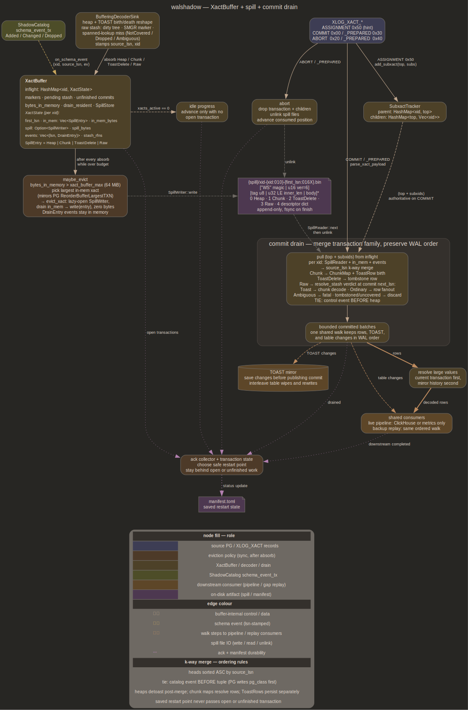

# xact — per-xid buffer, spill backend, subxact tracker

Lives in [`src/xact_buffer.rs`](../src/xact_buffer.rs) +
[`src/spill.rs`](../src/spill.rs). Sits between decoder fan-out (see
[decoder.md](decoder.md)) and commit-drain observer (see
[emitter.md](emitter.md)). Source record stream: see [source.md](source.md)

## Purpose

Buffer every decoded heap tuple + reassembled TOAST chunk per xid from
first heap touch until matching `XLOG_XACT_COMMIT` / `_PREPARED` drains
it; abort discards. Mirrors PG `ReorderBuffer` shape for the same
problem in logical decoding, minus snapshot building (catalog state
already lives in shadow PG, see [shadow.md](shadow.md))

Three responsibilities collapse into one struct:

- per-xid sub-buffer for heaps + chunks, ordered by `source_lsn`
- spill-to-local-disk backend when in-memory budget breaches
- subxact tracker hinting early eviction & funneling commit drain
  across `top + subxids`

Catalog access is lazy: only heaps where any column is
`ColumnValue::ExternalToast` hit `ShadowCatalog::relation_at`, and only
at drain. Per-xact descriptor cache was tried then removed — duplicated
shadow's own LRU surface



## Buffer shape

`XactBuffer { config, store, inflight: HashMap<u32, XactState>,
bytes_in_memory, stats }`. One `XactState` per inflight xid:

```text
XactState {
    first_lsn,                              // sticky filename anchor
    in_mem: Vec<SpillEntry>,                // pending memory→spill, WAL order
    in_mem_bytes,                           // approximate accounting
    spill: Option<SpillWriter>,             // None until first eviction
    spill_bytes,                            // mirrors writer.byte_count()
    catalog_events: Vec<(u64, SchemaEvent)>, // lsn-stamped
}
```

Spill collapses heaps + chunks into one per-xid file because PG's
`toast_save_datum` writes chunks in the same xact as the referring
tuple — cross-xact chunk references don't exist outside `streaming=on`
mode walshadow doesn't implement

`commit_ts` parsed off `xl_xact_commit.xact_time` at head of `main_data`
(i64 le)

## Eviction policy

64 MiB default matches PG's `logical_decoding_work_mem`. Largest-first
is correct because:

- small xacts evicted would bounce back on next record, freeing nothing
- heaviest xact frees most bytes per file write
- policy is xid-keyed, so a subxact's buffer evicts independently of
  its parent — long-lived tops with many subxacts shed memory evenly
  across the family

Catalog events are *not* spilled. Spilling would require encoding
`RelDescriptor` snapshots which duplicates [decoder.md](decoder.md)
shape; practical case is a handful of DDL events per xact

`inflight_snapshot` is the diagnostic surface for "a commit for this
xid never arrived" investigations — heap / chunk / event / spill
counters per xid

## TOAST reassembly

Decoder sink ([decoder.md](decoder.md)'s `BufferingDecoderSink`)
recognises INSERTs into `pg_toast.pg_toast_<rel>` (three-column shape:
`chunk_id oid, chunk_seq int4, chunk_data bytea`) and reshapes them
into `ToastChunk` keyed on toast relation's *pg_class OID* (not
relfilenode — `va_toastrelid` on referring `ToastPointer` is an OID,
the two diverge after `VACUUM FULL` / `CLUSTER`)

Chunks ride same `XactState.in_mem` deque as heaps. At drain, k-way
merge accumulates them into `HashMap<(toast_relid, value_id),
BTreeMap<chunk_seq, Vec<u8>>>`; `reassemble` walks BTreeMap checking
`seq == expected`, concatenates. Compression decoded inline:
`TOAST_COMPRESSION_PGLZ` via `pglz::decompress_into`,
`TOAST_COMPRESSION_LZ4` via `lz4_flex::decompress`. Method tag lives in
top bits of `va_extinfo` past `VARLENA_EXTSIZE_BITS = 30`

Missing chunk surfaces as
`XactBufferError::MissingToastChunk { toast_relid, value_id, missing }`
rather than silent loss. Malformed chunk shape (wrong column count,
wrong types) bumps `DecoderStats.toast_chunks_malformed`; malformed
counter wired into decoder fan-out so silent toast loss is visible on
status line

## Subxact tracker

`SubxactTracker { parent: HashMap<u32, u32>, children: HashMap<u32,
Vec<u32>> }`. Both directions kept so `forget_tree(top_xid)` runs O(k)
over actual children rather than scanning every `parent` entry

Populated from `XLOG_XACT_ASSIGNMENT` (info `0x50`) via
`parse_xact_assignment` reading `(xtop: u32, nsub: i32, xsub[nsub])`
off `main_data`. Tracker is a HINT — PG batches first
`PGPROC_MAX_CACHED_SUBXIDS` (= 64) subxacts under the top without
emitting an explicit ASSIGNMENT. Authoritative subxact list arrives
inline on commit / abort record itself

`parse_xact_payload(info, main_data)` walks tail in PG-source order
matching `xactdesc.c::ParseCommitRecord` / `ParseAbortRecord`:

```text
xact_time (i64)
[xinfo (u32) if info & XLOG_XACT_HAS_INFO]      // 0x80
dbinfo  (8 bytes)   if xinfo & HAS_DBINFO       // 1<<0
subxacts (i32 n + n×u32)
                    if xinfo & HAS_SUBXACTS     // 1<<1
relfilelocators (i32 n + n×12)
                    if xinfo & HAS_RELFILELOCATORS  // 1<<2
dropped_stats (i32 n + n×16)
                    if xinfo & HAS_DROPPED_STATS   // 1<<8
invals (i32 n + n×16) if xinfo & HAS_INVALS        // 1<<3
twophase (u32 xid)  if xinfo & HAS_TWOPHASE        // 1<<4
gid (cstr, NUL term) if xinfo & HAS_GID            // 1<<7
origin (8+8)        if xinfo & HAS_ORIGIN          // 1<<5
```

Short-read at any tail position degrades to
`XactCommitPayload::default()` (xact_time + no subxacts), so decoder
doesn't poison the stream over one bad record

Standalone subxact rollback for a sub of a still-open top: top's
pre-savepoint entries stay keyed on top_xid in `inflight` and flush at
top's COMMIT — drain-time merge across `top + remaining_subxids`
produces correct survivor set

## Spill backend

[`src/spill.rs`](../src/spill.rs). File name
`xid-{xid:010}-{first_lsn:016X}.bin` mirrors PG's
`pg_replslot/<slot>/xid-*.snap` shape; without LSN suffix, two streams
that picked up same xid value after a slot rebuild or post-restart
could collide

File layout:

```text
[2 bytes "WS" magic = SPILL_MAGIC]
[u16 LE version = SPILL_VERSION = 2]
repeating:
  [u8 tag]
  [u32 LE inner_len]
  [body of inner_len bytes]
    tag=0 → SpillEntry::Heap   (encoded DecodedHeap)
    tag=1 → SpillEntry::Chunk  (encoded ToastChunk)
```

`SpillReader::check_header()` runs lazily on first `next()`: rejects
wrong magic with `SpillError::Format { offset: 0, detail: "bad
magic …" }`, wrong version with same shape at offset 2. Reader is
fail-fast — a corrupt body's inner_len lets caller skip it on principle,
but v1 propagates as `SpillError::Format` because the xact is
unrecoverable anyway

`HeapOp` encodes as `0=Insert, 1=Update, 2=HotUpdate, 3=Delete,
4=Truncate`. **`HeapOp::Truncate` tag-4 was added without bumping
`SPILL_VERSION`** — academic because resume contract wipes spill dir on
startup ([`SpillStore::clear`]) and cursor file guarantees on-disk
state is always "drained into CH" or "replayable from `decoder_lsn`".
Documented in [future/parked.md](future/parked.md) for a future bump

`spill_backend` config knob was reserved at design time for
CH-as-scratch v2; the enum + config surface were NOT shipped in v1.
ClickHouse-as-scratch path was rejected on three grounds:

- commit-drain latency: ms × n_toast per round trip vs µs sequential
  read
- 2× wire bandwidth: same TOAST bytes ingress CH twice
- MergeTree hygiene: short-lived staging is canonical anti-pattern

`src/spill_ch.rs` placeholder was never created. Future diskless
operator wanting this gets a fresh config-surface decision

## Drain shape

`drain_lsn` advances BEFORE `on_xact_end` ack so an observer failure
leaves `drain_lsn > emitter_ack_lsn`, exactly the gap cursor file
surfaces. `emitter_ack_lsn` lags whenever CH emitter holds rows in open
INSERTs under `flush_timeout > 0`. Both snapshot back into cursor file
maintained by [ops.md](ops.md)

`XactBufferStats::summary` renders `xact_active`, `bytes_in_mem`,
`spill_active`, `spill_bytes`, `commit`, `abort` always; appends
`evictions`, `commit_unk`, `abort_unk` only when non-zero. Matches
[decoder.md](decoder.md)'s `DecoderStats::summary` convention

## DrainEntry::{Tuple, Catalog}

Catalog events arrive via `BufferingDecoderSink::drain_schema_events`
after every `relation_at` and via
`XactRecordSink::route_pending_schema_events` after every
`ShadowCatalog::sweep_dropped`. Both push into
`XactState.catalog_events` keyed on same `(xid, source_lsn)` the
triggering record carried

Tie-break rule (catalog before tuple) matters because when decoder
stamps a schema event with triggering heap's `source_lsn` (catalog
refetch is lazy), the two share an LSN; routing catalog first lands
applicator's `ALTER` on CH before dependent INSERT encodes against
post-DDL shape

Drain implementation: collect catalog event positions as
`(heap_index_event_sorts_before, SchemaEvent)`; main dispatch loop
flushes pending events via `observer.on_schema_event(&ev)` before each
`observer.on_tuple(&committed)` whose index it sorts in front of;
trailing events (no heap after) flush at tail

Cross-link: [shadow.md](shadow.md) `SchemaEvent` channel, fed by
`ShadowCatalog` on Added / Changed / Dropped catalog state

## Two-phase commit

`XLOG_XACT_PREPARE` is ignored. Sink leaves it untouched; xact buffer
keeps its state alive until `XLOG_XACT_COMMIT_PREPARED` (info `0x30`)
or `XLOG_XACT_ABORT_PREPARED` (info `0x40`) arrives, both route through
same `parse_xact_payload` + drain / discard path as plain COMMIT / ABORT

Gap: `PREPARE` followed by daemon restart loses prepared writes —
buffer state is process-local, `clear_spill_dir` wipes inflight spill
on boot, no replay-from-WAL reconstruction of prepared xacts exists.
Operator-visible 2PC users (XA transaction managers, distributed-commit
drivers) will silently lose prepared writes across walshadow restart
between `PREPARE` and `COMMIT PREPARED`. Cross-link
[future/two_phase_commit.md](future/two_phase_commit.md)

`XactRecordSink` does process `COMMIT_PREPARED` / `ABORT_PREPARED`
inline today — the gap is only cross-restart

## Cross-links

- [decoder.md](decoder.md) — `DecodedHeap` producer + `BufferingDecoderSink`
- [source.md](source.md) — `Record` stream entry, classifier
- [emitter.md](emitter.md) — `TupleObserver` impl consuming commit drain
- [shadow.md](shadow.md) — `ShadowCatalog`, `SchemaEvent` channel
- [ops.md](ops.md) — `--spill-dir`, cursor file `(drain_lsn,
  emitter_ack_lsn)`
- [future/two_phase_commit.md](future/two_phase_commit.md) — PREPARE ↔
  COMMIT PREPARED across restart
- [future/parked.md](future/parked.md) — `SPILL_VERSION` bump for
  HeapOp::Truncate tag-4
